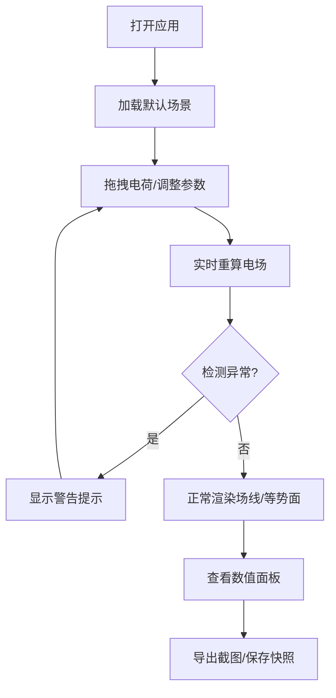

## 1. 产品概述

电磁场线实验台是一款面向高中物理教学的Web3D交互应用，让学生通过拖动点电荷直观观察电场线和等势面的变化规律。

- **目标用户**：高中物理教师、高中理科学生
- **核心价值**：将抽象的电磁场概念可视化，支持实时交互与实验记录
- **解决问题**：传统教学中电磁场线难以直观展示，学生缺乏动手探索的机会

## 2. 核心功能

### 2.1 用户角色

| 角色 | 核心权限 |
|------|----------|
| 教师/学生 | 创建实验场景、编辑电荷参数、导出截图、查看数值 |

### 2.2 功能模块

1. **3D实验场景**：点电荷渲染、电场线实时绘制、等势面叠加显示
2. **电荷控制面板**：添加/删除电荷、调整电量、选择正/负电荷、电偶极子预设
3. **交互操作**：拖拽移动电荷、旋转视角、缩放、重置
4. **数值面板**：实时显示电场强度、电势、电荷位置坐标
5. **记录导出**：课堂截图保存、参数快照、操作历史记录
6. **异常提示**：同号电荷重叠告警、采样发散警告、等势面颜色图例说明

### 2.3 页面详情

| 页面名称 | 模块名称 | 功能描述 |
|----------|----------|----------|
| 实验台主页 | 3D场景视图 | Three.js渲染点电荷、电场线、等势面，支持鼠标拖拽电荷 |
| 实验台主页 | 左侧控制面板 | 电荷列表、添加/删除、电量调整、正/负切换 |
| 实验台主页 | 右侧数值面板 | 选中位置的电场强度、电势值、梯度方向 |
| 实验台主页 | 顶部工具栏 | 视角切换、显示/隐藏场线、显示/隐藏等势面、截图导出 |
| 实验台主页 | 底部历史面板 | 操作历史记录、参数快照、撤销/重做 |
| 实验台主页 | 异常提示浮层 | 同号重叠警告、采样发散提示、等势面颜色图例 |

## 3. 核心流程

学生打开应用 → 系统加载默认电偶极子场景 → 学生可拖拽电荷位置 → 实时更新场线和等势面 → 查看数值面板 → 可导出截图或保存参数快照 → 异常状态自动提示

## 4. 用户界面设计

### 4.1 设计风格
- **主题色调**：深空蓝背景 (#0a1628)，电场线用青蓝色渐变，正电荷暖色光晕，负电荷冷色光晕
- **按钮风格**：圆角矩形，半透明玻璃质感，带微妙发光边框
- **字体**：系统无衬线字体，标题稍大，数值面板等宽字体
- **布局**：左侧控制面板、中央3D场景、右侧数值面板、底部历史记录
- **图标**：使用 lucide-react 图标库

### 4.2 页面设计概览

| 页面名称 | 模块名称 | UI元素 |
|----------|----------|----------|
| 实验台主页 | 3D场景 | 深空背景、网格地面、电荷球体带辉光、场线TubeGeometry、等势面半透明曲面 |
| 实验台主页 | 控制面板 | 卡片式电荷列表、滑块调整电量、颜色标签区分正负 |
| 实验台主页 | 数值面板 | 实时刷新的数字、电场矢量箭头指示 |
| 实验台主页 | 工具栏 | 图标按钮、下拉菜单、切换开关 |

### 4.3 响应式
桌面端优先设计，横向布局。窄屏时控制面板折叠为抽屉。

### 4.4 3D场景设计
- **环境**：深空渐变背景，微弱环境光
- **光照**：点光源跟随电荷位置，营造辉光效果
- **相机**：PerspectiveCamera，支持OrbitControls轨道控制
- **交互**：DragControls拖拽电荷，Raycaster射线拾取
- **后期处理**：Bloom辉光效果增强电荷视觉效果
