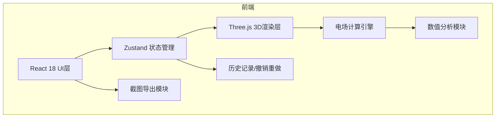
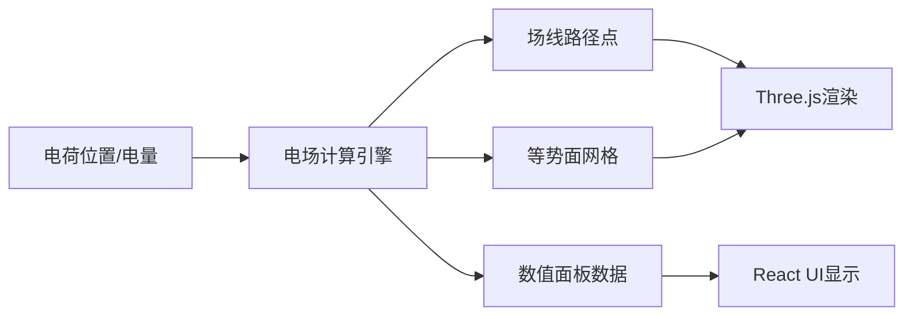

## 1. 架构设计



## 2. 技术说明

- **前端框架**：React 18 + TypeScript
- **构建工具**：Vite 6
- **样式方案**：Tailwind CSS 3
- **状态管理**：Zustand
- **3D渲染**：Three.js + @react-three/fiber + @react-three/drei + @react-three/postprocessing
- **路由**：react-router-dom
- **图标**：lucide-react

## 3. 路由定义

| 路由 | 用途 |
|------|------|
| / | 电磁场线实验台主页 |

## 4. 数据模型

### 4.1 电荷数据结构

```typescript
interface Charge {
  id: string;
  position: { x: number; y: number; z: number };
  charge: number; // 电量，正值为正电荷，负值为负电荷
  color: string;
  preset?: 'monopole' | 'dipole' | null;
}

interface ExperimentState {
  charges: Charge[];
  showFieldLines: boolean;
  showEquipotential: boolean;
  selectedChargeId: string | null;
  cameraPosition: { x: number; y: number; z: number };
}

interface Snapshot {
  id: string;
  timestamp: number;
  state: ExperimentState;
  name: string;
  note: string;
}

interface FieldValue {
  position: { x: number; y: number; z: number };
  electricField: { x: number; y: number; z: number };
  potential: number;
  fieldMagnitude: number;
}

interface Warning {
  id: string;
  type: 'overlap' | 'divergence' | 'color_warning';
  message: string;
  timestamp: number;
  dismissed: boolean;
}
```

### 4.2 数据流向



## 5. 核心计算模块

### 5.1 电场强度计算
- 库仑定律：E = k * q / r² * r̂
- 多电荷叠加：E_total = Σ E_i
- k = 8.99e9 N·m²/C²（可简化为1.0以适配可视化尺度）

### 5.2 场线生成算法
- 从电荷表面均匀发射种子点
- 沿电场方向步进积分（欧拉法或RK4）
- 边界检测与终止条件（离开场景、接近异号电荷）
- 防止场线穿过同号电荷

### 5.3 等势面生成
- 三维网格采样
- Marching Cubes算法提取等值面
- 按电势值映射颜色

### 5.4 异常检测
- 电荷间距检测：距离 < 阈值时警告
- 电场强度发散检测：|E| > 阈值时警告
- 等势面颜色与图例一致性校验
