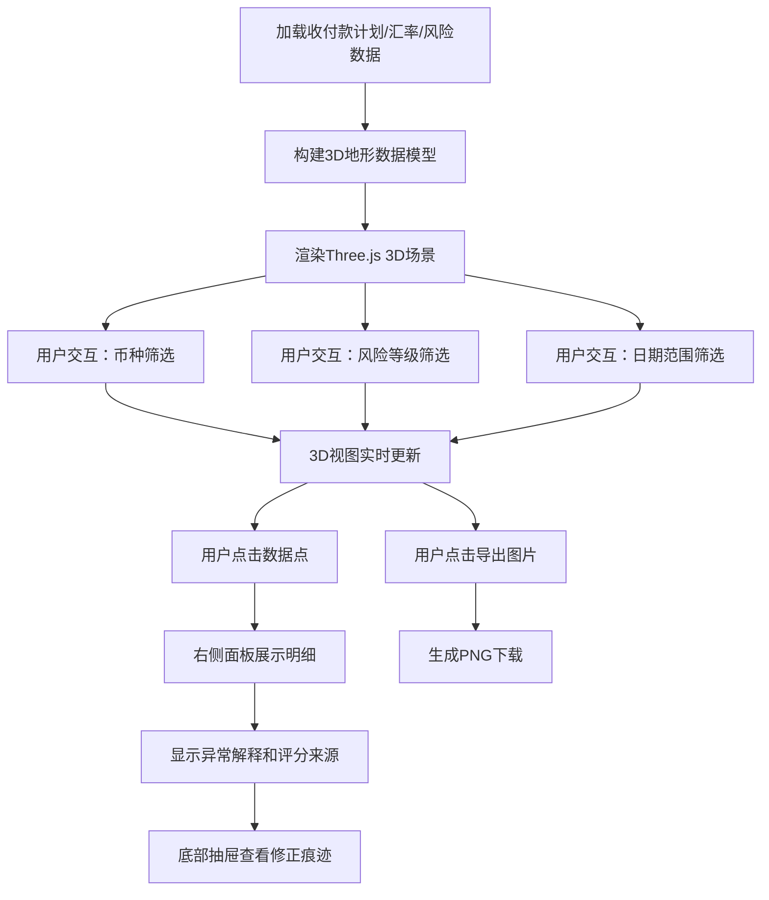

## 1. 产品概述

多币种现金流地形图是一个面向跨境财务团队的交互式3D可视化工具，将未来现金流按币种、日期和风险等级构建为3D地形图，帮助财务人员快速识别汇率缺口、日期错层、负现金流等异常情况。

- 核心目标：解决跨境财务中多币种现金流规划不透明的问题，提供一目了然的3D全景视图
- 目标用户：跨境财务团队、资金管理者、风控人员
- 产品价值：减少决策盲点，将汇率缺口、日期错层、负现金流等潜在风险显性化

## 2. 核心功能

### 2.1 功能模块

1. **3D地形主视图**：基于 Three.js 的现金流三维地形图
2. **币种筛选面板**：左侧边栏，按币种切换/筛选显示
3. **明细钻取面板**：右侧边栏，点击地形点查看完整明细
4. **异常指示器**：顶部状态栏，高亮显示汇率缺口、日期错层、负现金流
5. **修正痕迹追踪**：底部抽屉，展示每条数据的来源和修改历史
6. **导出工具**：工具栏，支持导出当前视图为PNG图片

### 2.2 页面详情

| 页面名称 | 模块名称 | 功能描述 |
|---------|---------|---------|
| 主视图 | 3D地形渲染 | 以X轴为日期、Y轴为币种、Z轴为金额构建3D高度图，颜色映射风险等级；支持鼠标拖拽旋转、滚轮缩放、平移 |
| 主视图 | 币种类轴 | Y轴每个币种独立一行，可点击展开/折叠，币种标签悬停显示汇率信息 |
| 主视图 | 风险颜色映射 | 低风险(绿) → 中低(浅绿) → 中(黄) → 中高(橙) → 高(红)，色阶带glow效果 |
| 主视图 | 异常高亮 | 负现金流(负值)以深蓝色半透明柱体显示并加警示边框；汇率缺口点闪烁红光；日期错层点加虚线边框 |
| 左侧面板 | 币种筛选列表 | 可勾选/取消勾选币种；全选/全不选；按币种筛选后3D视图动态更新 |
| 左侧面板 | 风险等级筛选 | 滑块或多选，按风险等级区间筛选；与币种筛选联动 |
| 左侧面板 | 日期范围筛选 | 起止日期选择器，动态裁剪地形 |
| 右侧面板 | 明细钻取卡片 | 点击地形任意数据点，右侧展示：金额、币种、日期、风险等级、客户名称、来源文档、备注 |
| 右侧面板 | 异常解释 | 若该数据点存在异常，显示异常类型和原因说明（如"汇率缺口：当前汇率7.12，计划汇率6.95，缺口0.17"） |
| 右侧面板 | 评分来源 | 风险评分的计算依据（如客户信用等级、历史回款记录、合同条款等） |
| 顶部栏 | 异常汇总指示器 | 显示当前视图范围内的异常数量：汇率缺口数、日期错层数、负现金流数 |
| 顶部栏 | 数据来源标签 | 显示当前加载的数据源名称（如"2026Q2收付款计划+USD/EUR汇率表"） |
| 底部抽屉 | 修正痕迹时间线 | 展示每条数据的修正历史：原始值→第1次修正→第2次修正，含修正人、时间、理由 |
| 底部抽屉 | 来源追溯 | 展示每条数据的原始来源文件、行号、导入时间 |
| 工具栏 | 视图切换 | 地形图/热力图/数据表格三种视图切换 |
| 工具栏 | 导出图片 | 一键导出当前3D视图为PNG，含时间戳和数据源标记 |
| 工具栏 | 刷新/重新加载 | 重新加载数据源 |

## 3. 核心流程

用户打开应用 → 系统加载收付款计划、汇率表等数据源 → 构建3D地形图 → 用户通过币种/风险/日期筛选交互 → 3D视图实时更新 → 用户点击数据点钻取明细 → 查看异常解释和评分来源 → 查看修正痕迹 → 导出当前视图

## 4. 用户界面设计

### 4.1 设计风格

- **主色调**：深空蓝（#0a1628）作为背景，营造专业金融仪表盘氛围
- **风险色阶**：翠绿(#10b981) → 青绿(#34d399) → 琥珀(#fbbf24) → 橙(#f97316) → 红(#ef4444)
- **异常警示色**：深蓝紫(#6366f1)用于负现金流，闪烁红(#dc2626)用于汇率缺口
- **辅助色**：金色(#eab308)用于高亮选中状态，青蓝(#06b6d4)用于数据标签
- **按钮风格**：微3D圆角按钮，带微妙投影，hover时浮起
- **字体**：标题使用 Serif 字体（如 Playfair Display）增加专业感，正文使用 Inter 等现代无衬线字体
- **布局风格**：深色沉浸式仪表盘，三栏布局（左筛选|中3D|右明细），底部可展开抽屉

### 4.2 页面设计概览

| 页面名称 | 模块名称 | UI元素 |
|---------|---------|--------|
| 主视图 | 3D地形场景 | 深色雾效背景，环境光+方向光+点光源组合，地形柱体带金属质感，选中柱体发出金色光晕 |
| 主视图 | 币种类轴 | 左侧Y轴标签，等宽字体，悬停弹出汇率卡片 |
| 主视图 | 日期轴 | X轴底部日期刻度，可拖拽平移 |
| 左侧面板 | 币种筛选 | 可折叠卡片列表，checkbox带自定义样式，选中项高亮边框 |
| 左侧面板 | 风险筛选 | 色阶滑块，两端锚点可拖动，中间区域渐变色 |
| 右侧面板 | 明细卡片 | 毛玻璃效果(backdrop-blur)，圆角，关键数据大号字体，异常信息红色标注 |
| 右侧面板 | 评分来源 | 进度条组，每条评分依据一行，带图标 |
| 顶部栏 | 异常指示器 | 胶囊形状badge，数字+图标，hover显示详情列表 |
| 底部抽屉 | 修正痕迹 | 时间线样式，每个节点有修正人、时间、变更前后对比 |
| 工具栏 | 操作按钮 | 图标按钮组，分隔符分隔，active状态高亮 |

### 4.3 响应式

- 桌面端优先（1440px及以上），三栏布局
- 1024-1439px：三栏压缩，明细面板宽度减小
- 768-1023px：左右面板变为抽屉式，点击展开
- 768px以下：3D视图全屏，所有面板变为底部/侧边抽屉

### 4.4 3D场景指引

- **环境/HDRI**：深色渐变背景，加微弱星点/网格效果营造"数据宇宙"感
- **光照**：环境光(0.3强度) + 主方向光(暖色，0.8) + 地面反射光(0.2)，形成层次分明的体积光
- **相机**：PerspectiveCamera，初始角度45°俯视，支持轨道控制器(OrbitControls)
- **构图**：地形居中，底部加参考网格平面，边缘加淡入淡出雾效
- **交互动画**：筛选变化时地形柱体有生长/收缩动画；选中数据点有弹性放大+发光脉冲
- **后处理**：Bloom效果让发光柱体有辉光感，SSAO增加深度感
- **性能**：使用InstancedMesh批量渲染柱体，LOD策略，移动端降低细节