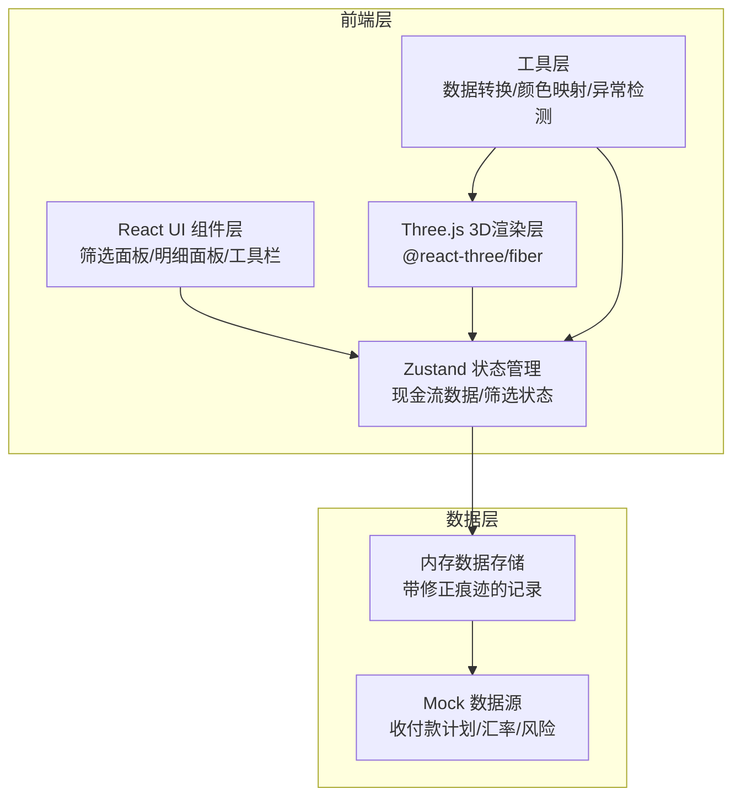
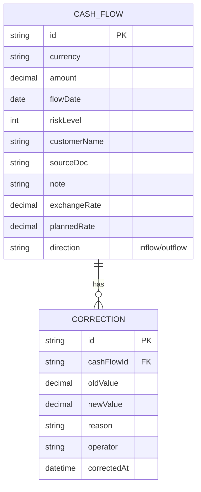

## 1. 架构设计



## 2. 技术说明

- **前端框架**: React 18 + TypeScript + Vite
- **3D渲染**: three @0.160, @react-three/fiber @8, @react-three/drei @9, @react-three/postprocessing @2
- **状态管理**: zustand @4
- **样式**: Tailwind CSS 3
- **图表辅助**: 自定义 Canvas/SVG 叠加层
- **图标**: lucide-react
- **后端**: 无后端，纯前端 Mock 数据
- **数据库**: 无数据库，数据存储在内存中

## 3. 路由定义

| 路由 | 用途 |
|------|------|
| `/` | 主视图 - 3D地形图 + 筛选面板 + 明细面板 |

## 4. 数据模型

### 4.1 数据模型定义



### 4.2 TypeScript 类型定义

```typescript
interface CashFlowRecord {
  id: string;
  currency: string;
  amount: number;
  flowDate: string;
  riskLevel: 1 | 2 | 3 | 4 | 5;
  customerName: string;
  sourceDoc: string;
  note: string;
  exchangeRate: number;
  plannedRate: number;
  direction: 'inflow' | 'outflow';
  corrections: CorrectionEntry[];
}

interface CorrectionEntry {
  id: string;
  oldValue: number;
  newValue: number;
  reason: string;
  operator: string;
  correctedAt: string;
}

interface Anomaly {
  type: 'rate_gap' | 'date_misalignment' | 'negative_flow';
  severity: 'warning' | 'critical';
  description: string;
  details: Record<string, unknown>;
}
```

### 4.3 Mock 数据结构

应用启动时从 mock 数据生成器加载数据：

- 5种币种：USD、EUR、GBP、JPY、CNY
- 日期范围：2026-06-01 至 2026-12-31
- 约 120 条现金流记录
- 含预设的异常场景：3条汇率缺口、2条日期错层、5条负现金流
- 每条记录含 0-3 条修正痕迹

## 5. 项目目录结构

```
src/
├── components/
│   ├── terrain/
│   │   ├── TerrainScene.tsx        # 3D场景主组件
│   │   ├── TerrainBars.tsx         # 地形柱体(InstancedMesh)
│   │   ├── TerrainAxes.tsx         # 坐标轴渲染
│   │   └── SelectionGlow.tsx       # 选中发光效果
│   ├── panels/
│   │   ├── CurrencyFilter.tsx      # 币种筛选面板
│   │   ├── RiskFilter.tsx          # 风险等级筛选
│   │   ├── DateRangeFilter.tsx     # 日期范围筛选
│   │   ├── DetailPanel.tsx         # 明细钻取面板
│   │   ├── AnomalyBadges.tsx       # 异常指示器
│   │   └── CorrectionTimeline.tsx  # 修正痕迹时间线
│   ├── layout/
│   │   ├── AppHeader.tsx           # 顶部栏
│   │   ├── AppSidebar.tsx          # 左侧边栏
│   │   ├── AppMain.tsx             # 中部3D视图容器
│   │   ├── AppDetail.tsx           # 右侧明细容器
│   │   └── AppToolbar.tsx          # 工具栏
│   └── ui/
│       ├── FilterCard.tsx          # 筛选卡片通用组件
│       ├── Badge.tsx               # 徽章组件
│       └── Drawer.tsx              # 抽屉组件
├── hooks/
│   ├── useCashFlowStore.ts         # Zustand store
│   ├── useAnomalyDetection.ts      # 异常检测 hook
│   ├── useColorMapping.ts          # 颜色映射 hook
│   └── useExportImage.ts           # 导出图片 hook
├── data/
│   └── mockData.ts                 # Mock 数据生成
├── utils/
│   ├── colorMapper.ts              # 风险等级→颜色
│   ├── anomalyDetector.ts          # 异常检测逻辑
│   ├── dataTransformer.ts          # 数据格式转换
│   └── geometryBuilder.ts          # 3D几何构建
├── types/
│   └── index.ts                    # 全局类型定义
├── pages/
│   └── Home.tsx                    # 主页
├── App.tsx
├── main.tsx
└── index.css
```

## 6. 核心组件交互流程

1. **App.tsx** 初始化 Zustand store，加载 mock 数据
2. **TerrainScene** 从 store 读取筛选后的数据，构建 InstancedMesh
3. 用户在 **CurrencyFilter/RiskFilter/DateRangeFilter** 操作 → 更新 store → TerrainScene 响应更新
4. 用户点击地形柱体 → store 记录选中ID → **DetailPanel** 展示该记录详情
5. **AnomalyBadges** 从 store 计算异常数量并展示
6. 用户点击导出 → **useExportImage** 捕获 canvas → 触发下载