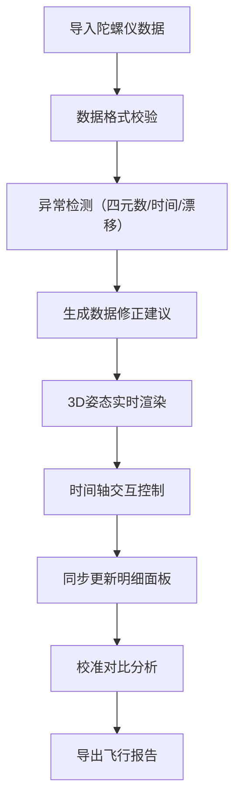

## 1. 产品概述

航天器姿态可视化交互分析平台，为航模队提供陀螺仪数据的3D可视化展示与深度分析。解决姿态数据导入后翻滚、漂移等异常难以直观识别的问题，帮助工程师快速定位问题、完成校准对比并生成专业报告。

- **目标用户**：航模队工程师、航天爱好者、无人机开发者
- **核心价值**：将抽象的四元数数据转化为直观的3D姿态演示，自动检测异常并保留完整修正痕迹

## 2. 核心功能

### 2.1 用户角色

| 角色 | 注册方式 | 核心权限 |
|------|----------|----------|
| 工程师 | 本地应用（无需注册） | 数据导入、姿态分析、校准对比、报告导出 |

### 2.2 功能模块

1. **数据导入与校验**：支持多格式数据导入，自动检测四元数未归一、时间乱序、漂移等异常
2. **3D姿态可视化**：实时展示航天器姿态变化，支持交互式旋转、缩放
3. **时间轴控制**：拖动播放、逐帧查看、区间筛选，同步更新3D视图与侧边明细
4. **异常检测与标记**：自动识别数据异常，高亮标记并提供详细说明
5. **校准对比**：支持校准前后数据对比，展示修正效果
6. **数据明细面板**：展示时间戳、四元数、角速度、传感器状态、校准备注等完整信息
7. **报告导出**：生成包含分析结果、异常说明、校准记录的完整飞行报告

### 2.3 页面详情

| 页面名称 | 模块名称 | 功能描述 |
|----------|----------|----------|
| 主工作台 | 3D视图区 | 航天器模型实时姿态演示，支持鼠标交互 |
| 主工作台 | 时间轴控制区 | 播放控制、进度拖动、区间选择、异常标记点 |
| 主工作台 | 数据明细面板 | 逐帧数据展示，包含四元数、角速度、传感器状态 |
| 主工作台 | 异常分析面板 | 异常列表、严重程度分级、修正建议 |
| 主工作台 | 校准对比面板 | 校准前后姿态对比曲线、修正量统计 |
| 主工作台 | 报告导出区 | 报告预览、PDF/JSON导出、数据溯源信息 |

## 3. 核心流程

## 4. 界面设计

### 4.1 设计风格

- **主色调**：深空蓝 (#0a1628) 作为主背景，科技感青色 (#00d4ff) 作为主强调色，警告橙 (#ff9500) 和错误红 (#ff3b30) 标记异常
- **按钮风格**：圆角 4px，微立体边框，hover 时发光效果
- **字体**：显示字体使用 Orbitron（航天科技感），正文字体使用 JetBrains Mono（等宽易读，适合数据展示）
- **布局风格**：深色科技仪表盘风格，三栏布局（左侧3D视图 + 右侧数据面板 + 底部时间轴）
- **图标风格**：线性细线条图标，配合发光描边效果

### 4.2 页面设计概览

| 页面名称 | 模块名称 | UI 元素 |
|----------|----------|----------|
| 主工作台 | 3D视图区 | 网格地面、航天器模型、坐标轴指示器、姿态角数值浮窗 |
| 主工作台 | 时间轴控制区 | 播放/暂停按钮、进度条、异常标记点、区间选择手柄、时间刻度 |
| 主工作台 | 数据明细面板 | 卡片式数据块、四元数归一化状态指示灯、角速度曲线图 |
| 主工作台 | 异常分析面板 | 异常时间线、严重程度标签、修正操作按钮 |
| 主工作台 | 校准对比面板 | 双Y轴对比图表、修正量统计卡片 |
| 主工作台 | 顶部工具栏 | 数据导入按钮、校准模式切换、报告导出、设置菜单 |

### 4.3 响应式设计

- 桌面端（≥1280px）：三栏完整布局，3D视图占比 60%
- 平板端（768px-1279px）：上下布局，3D视图在上，数据面板在下
- 移动端（<768px）：单页流式布局，核心功能精简展示

### 4.4 3D场景指导

- **环境与氛围**：深空黑色背景，星空粒子背景，柔和环境光
- **灯光设置**：主光源从右上方 45° 照射，补光从左下方，营造立体感
- **相机设置**：透视相机，初始距离 5 单位，可围绕模型旋转，支持自动旋转模式
- **构图与焦点**：航天器模型位于视图中心，底部半透明网格地面，右上角小地图显示整体姿态
- **交互与动画**：鼠标拖动旋转视角，滚轮缩放，双击重置视角；姿态变化平滑过渡动画
- **后处理效果**：轻微泛光效果，模型轮廓描边，异常状态时红色外发光
- **资源来源**：使用 Three.js 内置几何体组合航天器模型，无需外部资源
