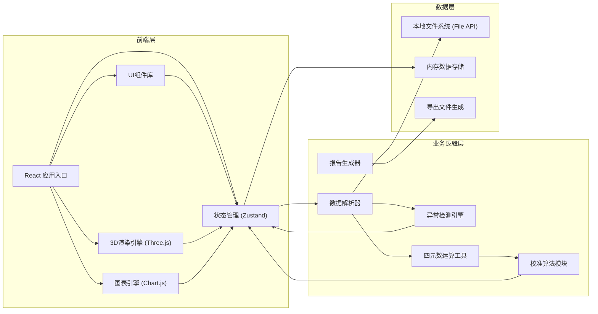

## 1. 架构设计



## 2. 技术选型

- **前端框架**: React@18 + TypeScript
- **构建工具**: Vite@5
- **样式方案**: TailwindCSS@3
- **3D渲染**: Three.js + @react-three/fiber + @react-three/drei
- **图表展示**: Chart.js + react-chartjs-2
- **状态管理**: Zustand（轻量级，适合数据密集型应用）
- **图标库**: Lucide React
- **后端**: 纯前端应用，无后端依赖
- **数据存储**: 浏览器内存 + 本地文件导入/导出

## 3. 路由定义

| 路由 | 用途 |
|------|------|
| / | 主工作台（唯一页面，单页应用） |

## 4. 数据模型

### 4.1 核心数据结构

```typescript
// 陀螺仪数据帧
interface GyroFrame {
  timestamp: number;           // 时间戳 (ms)
  quaternion: [number, number, number, number];  // 四元数 [w, x, y, z]
  angularVelocity: [number, number, number];     // 角速度 [x, y, z] rad/s
  sensorStatus: SensorStatus;  // 传感器状态
  calibrationNote?: string;    // 校准备注
  source: string;              // 数据来源
}

// 传感器状态
interface SensorStatus {
  temperature: number;         // 温度
  voltage: number;             // 电压
  signalQuality: number;       // 信号质量 0-100
  isCalibrated: boolean;       // 是否已校准
}

// 异常检测结果
interface Anomaly {
  id: string;
  type: 'quaternion_not_normalized' | 'timestamp_out_of_order' | 'drift_detected' | 'sensor_abnormal';
  severity: 'warning' | 'error' | 'critical';
  frameIndex: number;
  timestamp: number;
  description: string;
  correction?: CorrectionRecord;
}

// 修正记录
interface CorrectionRecord {
  id: string;
  anomalyId: string;
  type: string;
  originalValue: any;
  correctedValue: any;
  operator: string;
  timestamp: number;
  note?: string;
}

// 飞行报告
interface FlightReport {
  id: string;
  startTime: number;
  endTime: number;
  totalFrames: number;
  anomalyCount: {
    warning: number;
    error: number;
    critical: number;
  };
  calibrationRecords: CorrectionRecord[];
  summary: string;
  dataSource: string;
  exportTime: number;
}
```

### 4.2 状态管理结构

```typescript
interface AppState {
  // 数据
  frames: GyroFrame[];
  anomalies: Anomaly[];
  corrections: CorrectionRecord[];
  
  // 播放控制
  currentFrameIndex: number;
  isPlaying: boolean;
  playbackSpeed: number;
  selectedTimeRange: [number, number] | null;
  
  // UI状态
  activePanel: 'details' | 'anomalies' | 'calibration' | 'report';
  selectedAnomalyId: string | null;
  
  // 视图控制
  showGrid: boolean;
  showAxes: boolean;
  cameraAutoRotate: boolean;
}
```

## 5. 模块目录结构

```
src/
├── components/
│   ├── ThreeDView/          # 3D视图组件
│   ├── Timeline/            # 时间轴组件
│   ├── DataPanel/           # 数据明细面板
│   ├── AnomalyPanel/        # 异常分析面板
│   ├── CalibrationPanel/    # 校准对比面板
│   ├── ReportPanel/         # 报告导出面板
│   └── Toolbar/             # 顶部工具栏
├── hooks/
│   ├── useGyroData.ts       # 陀螺仪数据处理hook
│   ├── useAnomalyDetector.ts # 异常检测hook
│   └── usePlayback.ts       # 播放控制hook
├── store/
│   └── useAppStore.ts       # Zustand状态管理
├── utils/
│   ├── quaternion.ts        # 四元数运算工具
│   ├── anomalyDetector.ts   # 异常检测算法
│   ├── dataParser.ts        # 数据解析器
│   └── reportGenerator.ts   # 报告生成器
├── types/
│   └── index.ts             # TypeScript类型定义
├── App.tsx
├── main.tsx
└── index.css
```

## 6. 核心算法说明

### 6.1 四元数归一化检测
```
对于每个四元数 q = [w, x, y, z]，计算模长:
norm = sqrt(w² + x² + y² + z²)
若 |norm - 1| > 阈值 (默认 0.01)，标记为未归一
```

### 6.2 时间乱序检测
```
遍历所有帧，若 frame[i].timestamp <= frame[i-1].timestamp
标记为时间乱序异常
```

### 6.3 漂移检测
```
使用滑动窗口计算角速度积分，与四元数导出的姿态变化对比
若差值超过阈值，标记为漂移异常
```

### 6.4 四元数转欧拉角
```
使用标准 ZYX 顺序转换为 roll, pitch, yaw 角度
用于3D模型姿态控制和数据展示
```
