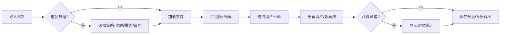

## 1. 产品概述
一款面向数学教学的Web3D交互式工具，帮助学生通过调节参数直观探索二次曲面的几何特性，实现平面切片与等高线的同步可视化，支持课堂题目导入和截图导出。
- 解决传统数学教学中抽象几何概念难以理解的问题
- 目标用户：数学教师、中学生、大学生
- 产品价值：将抽象的数学方程转化为可交互的3D可视化，提升教学效果

## 2. 核心功能

### 2.1 用户角色
| 角色 | 注册方式 | 核心权限 |
|------|----------|----------|
| 教师用户 | 无需注册 | 导入题目、保存预设、导出截图 |
| 学生用户 | 无需注册 | 调节参数、探索曲面、查看信息 |

### 2.2 功能模块
1. **3D曲面展示区**：实时渲染二次曲面，支持旋转、缩放、平移
2. **参数控制面板**：调节曲面方程参数、切片平面参数、采样精度
3. **切片与等高线联动**：拖拽切片平面，实时显示截面和等高线
4. **材料导入系统**：支持导入曲面方程、参数、题目、截图，处理重复数据
5. **预设管理**：保存和加载常用参数配置
6. **异常检测与提示**：参数奇异、采样空洞、切片断裂等情况的可视化提示
7. **悬浮信息**：鼠标悬停显示坐标值、法向量等数学信息
8. **截图导出**：导出当前3D视图为图片

### 2.3 页面详情
| 页面名称 | 模块名称 | 功能描述 |
|---------|----------|----------|
| 主页面 | 3D视口 | 渲染二次曲面、切片平面、等高线，支持鼠标交互 |
| 主页面 | 参数面板 | 曲面方程参数调节、切片平面控制、采样精度设置 |
| 主页面 | 材料导入区 | 导入/导出数据、选择处理策略（忽略/覆盖/追加） |
| 主页面 | 预设管理 | 保存、加载、删除参数预设 |
| 主页面 | 异常提示区 | 显示计算异常信息，提供修正建议 |
| 主页面 | 悬浮信息 | 实时显示鼠标位置的数学属性 |

## 3. 核心流程

用户导入教学材料 → 选择数据处理策略 → 系统加载曲面参数 → 3D视口渲染曲面 → 用户拖拽切片平面 → 实时更新切片与等高线 → 系统检测计算异常并提示 → 保存满意的参数预设 → 导出截图用于课堂教学

## 4. 用户界面设计

### 4.1 设计风格
- **主色调**：深空蓝 (#0a1628) - 体现数学的严谨与深度
- **辅助色**：科技青 (#00d4ff) - 高亮交互元素和重要信息
- **警示色**：暖橙 (#ff9500) - 异常提示；深红 (#ff3b30) - 严重错误
- **中性色**：深灰 (#1a2a4a)、中灰 (#3a4a6a)、浅灰 (#8a9aba)
- **按钮风格**：玻璃拟态效果，圆角12px，悬停发光效果
- **字体**：展示字体用 Space Grotesk（数学科技感），正文字体用 Inter（清晰易读）
- **布局风格**：三栏布局 - 左侧参数面板、中央3D视口、右侧信息面板
- **图标风格**：线性图标，线条粗细2px，科技感风格

### 4.2 页面设计概述
| 页面名称 | 模块名称 | UI元素 |
|---------|----------|--------|
| 主页面 | 3D视口 | 暗色背景、网格辅助线、坐标轴指示、曲面半透明渲染、切片平面高亮边框、等高线渐变色 |
| 主页面 | 参数面板 | 卡片式分组、滑块控件、数值输入框、实时计算反馈 |
| 主页面 | 材料导入区 | 拖拽上传区域、文件选择按钮、策略选择下拉框、来源信息展示 |
| 主页面 | 异常提示区 | 警示图标、错误信息文字、修正建议链接、可折叠展开 |
| 主页面 | 悬浮信息 | 跟随鼠标的浮动卡片、半透明背景、数学公式渲染 |

### 4.3 响应式
- 桌面端优先（1920px+）：三栏完整布局
- 平板端（768px-1200px）：左右面板可折叠收起
- 移动端（<768px）：垂直堆叠布局，3D视口全屏，参数面板折叠

### 4.4 3D场景指引
- **环境**：纯深色背景 + 微弱网格地面，突出数学曲面
- **光照**：三点光源系统 - 主光源（冷白）、补光（暖调）、环境光（弱）
- **相机**：透视相机，初始距离适中，支持轨道控制
- **交互**：轨道控制（旋转/缩放/平移）、切片平面拖拽、点选查询
- **后处理**：轻微泛光效果、抗锯齿、曲线调色
- **性能预算**：曲面采样点≤10000，帧率≥30fps
