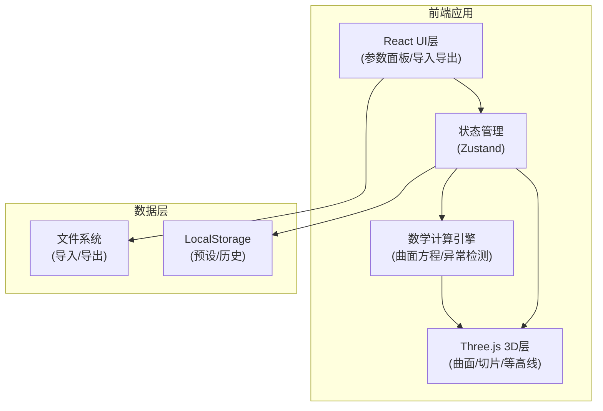

## 1. 架构设计



## 2. 技术描述

- **前端框架**: React@18 + TypeScript + Vite
- **3D渲染**: Three.js + @react-three/fiber + @react-three/drei
- **状态管理**: Zustand (轻量级，适合数学计算场景)
- **样式方案**: TailwindCSS@3 + CSS变量
- **数学计算**: 自定义计算引擎 (支持二次曲面通用方程)
- **截图导出**: html2canvas + three.js renderer截图
- **图标**: Lucide React (线性图标库)

## 3. 核心数据结构

### 3.1 曲面参数类型
```typescript
interface QuadricSurfaceParams {
  id: string;
  name: string;
  source?: string;
  equation: {
    A: number;  // x²
    B: number;  // y²
    C: number;  // z²
    D: number;  // xy
    E: number;  // yz
    F: number;  // zx
    G: number;  // x
    H: number;  // y
    I: number;  // z
    J: number;  // 常数项
  };
  bounds: {
    xMin: number; xMax: number;
    yMin: number; yMax: number;
    zMin: number; zMax: number;
  };
  sampleDensity: number;
}
```

### 3.2 切片平面类型
```typescript
interface SlicePlane {
  normal: { x: number; y: number; z: number };
  distance: number;
  visible: boolean;
  showContours: boolean;
}
```

### 3.3 预设类型
```typescript
interface Preset {
  id: string;
  name: string;
  createdAt: string;
  modifiedAt: string;
  source?: string;
  surface: QuadricSurfaceParams;
  slicePlane: SlicePlane;
  camera: { position: number[]; target: number[] };
}
```

### 3.4 异常检测类型
```typescript
interface ComputationWarning {
  type: 'singularity' | 'sampling_gap' | 'slice_break' | 'degenerate';
  severity: 'warning' | 'error';
  message: string;
  location?: { x: number; y: number; z: number };
  suggestion: string;
}
```

## 4. 核心模块说明

### 4.1 数学计算引擎
- **曲面采样器**: 使用参数化方法或隐式函数采样生成网格
- **平面求交器**: 计算曲面与切片平面的交线
- **等高线生成器**: Marching Squares算法生成等高线
- **异常检测器**: 
  - 参数奇异检测 (行列式为0)
  - 采样空洞检测 (法向量突变)
  - 切片断裂检测 (交线不连续)

### 4.2 3D渲染层
- **曲面渲染**: BufferGeometry + 自定义着色器
- **切片平面**: 可拖拽的半透明平面
- **交线渲染**: TubeGeometry + 渐变色
- **坐标轴/网格**: drei 辅助组件

### 4.3 交互系统
- **轨道控制**: OrbitControls (旋转/缩放/平移)
- **平面拖拽**: 射线检测 + 平面约束移动
- **点选查询**: 射线拾取 + 悬浮信息显示

## 5. 导入导出规范

### 5.1 支持的导入格式
- **JSON格式**: 完整预设数据
- **数学公式**: LaTeX/文本格式的二次曲面方程
- **图片**: 参考截图 (用于对比)

### 5.2 重复数据处理策略
| 策略 | 行为 |
|------|------|
| 忽略 | 保留现有数据，跳过重复项 |
| 覆盖 | 用新数据替换现有数据，记录修改痕迹 |
| 追加 | 添加为新条目，自动重命名 (name_2, name_3...) |

### 5.3 数据溯源
每条数据记录以下信息：
- `source`: 导入来源 (文件名/手动输入)
- `createdAt`: 创建时间
- `modifiedAt`: 最后修改时间
- `modificationHistory`: 修改历史记录

## 6. 目录结构

```
src/
├── components/
│   ├── Canvas3D/          # 3D视口组件
│   ├── ControlPanel/      # 参数控制面板
│   ├── ImportExport/      # 导入导出组件
│   ├── PresetManager/     # 预设管理
│   ├── WarningPanel/      # 异常提示面板
│   └── Tooltip/           # 悬浮信息
├── store/
│   └── useStore.ts        # Zustand 状态管理
├── math/
│   ├── quadric.ts         # 二次曲面计算
│   ├── slicer.ts          # 切片计算
│   ├── contour.ts         # 等高线生成
│   └── validator.ts       # 异常检测
├── types/
│   └── index.ts           # TypeScript 类型定义
├── utils/
│   ├── export.ts          # 截图导出
│   └── import.ts          # 数据导入解析
├── App.tsx
├── main.tsx
└── index.css
```

## 7. 性能优化策略

1. **网格LOD**: 根据相机距离调整曲面细分精度
2. **WebWorker**: 复杂数学计算放在Worker线程
3. **节流防抖**: 参数调节时防抖计算，避免频繁重绘
4. **资源复用**: 几何体和材质缓存池
5. **帧率控制**: 非交互时降低渲染帧率
