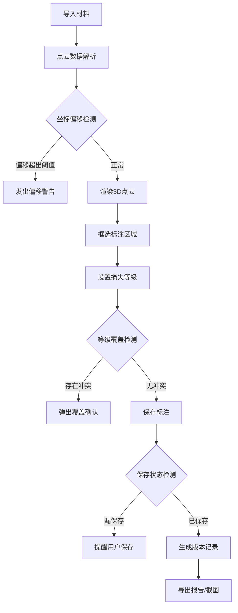

## 1. 产品概述
保险灾损三维标注工具 - 面向农险查勘员的Web3D点云标注平台
- 核心问题：农险查勘员需要将无人机拍摄的果园灾损转化为3D点云标注，用于理赔定损
- 目标用户：农险查勘员、理赔定损专员
- 产品价值：提供从点云导入、标注、筛选到报告导出的一站式工具，支持版本追踪和异常检测

## 2. 核心功能

### 2.1 功能模块
1. **主标注页面**：3D点云渲染、框选标注、等级筛选、历史版本、报告导出
2. **数据导入模块**：地块点云、灾损照片、树行编号、损失等级、查勘备注、理赔报告导入
3. **异常检测模块**：坐标偏移检测、等级覆盖检测、标注漏保存检测
4. **版本管理模块**：历史版本回滚、版本对比、修正痕迹保留

### 2.2 页面详情
| 页面名称 | 模块名称 | 功能描述 |
|----------|----------|----------|
| 主标注页面 | 3D点云视口 | 渲染点云数据、支持旋转/缩放/平移、框选标注区域 |
| 主标注页面 | 左侧工具栏 | 导入材料、切换标注模式、损失等级筛选 |
| 主标注页面 | 右侧信息面板 | 悬浮信息展示、查勘备注编辑、理赔报告预览 |
| 主标注页面 | 底部状态栏 | 坐标偏移提示、数据状态显示、操作记录 |
| 主标注页面 | 版本历史面板 | 版本列表、版本切换、修正痕迹查看 |
| 主标注页面 | 导出对话框 | 截图导出、报告生成、格式选择 |

## 3. 核心流程

## 4. 用户界面设计

### 4.1 设计风格
- 主色调：深蓝色 (#0F172A) 作为专业感基底
- 强调色：翡翠绿 (#10B981) 表示正常状态、琥珀黄 (#F59E0B) 表示警告、红色 (#EF4444) 表示严重错误
- 按钮风格：直角扁平化按钮，1px边框，悬停状态有微妙背景变化
- 字体：JetBrains Mono（数据/代码）、系统默认（UI文本）
- 布局：左右双面板 + 中央3D视口 + 底部状态栏

### 4.2 页面设计概览
| 页面名称 | 模块名称 | UI元素 |
|----------|----------|--------|
| 主标注页面 | 3D点云视口 | 深色背景、点云按等级着色、框选框高亮 |
| 主标注页面 | 左侧工具栏 | 图标按钮组、导入区域、筛选器 |
| 主标注页面 | 右侧信息面板 | 卡片式信息、表单输入、标签展示 |
| 主标注页面 | 版本历史面板 | 时间线列表、版本标签、操作按钮 |
| 主标注页面 | 底部状态栏 | 状态指示灯、坐标显示、消息提示区 |

### 4.3 响应式
- 桌面端优先设计（≥1280px）
- 平板端自适应（768-1280px）：面板可折叠
- 触摸屏支持：点云支持触摸操作

### 4.4 3D场景指导
- 环境：深色背景 (#0A0F1C)，无HDRI以保持专业感
- 光照：AmbientLight + DirectionalLight，柔和均匀
- 相机：PerspectiveCamera，初始视角45度俯视
- 交互：OrbitControls（旋转/缩放/平移）、框选模式
- 后处理：BloomEffect（标注高亮）
