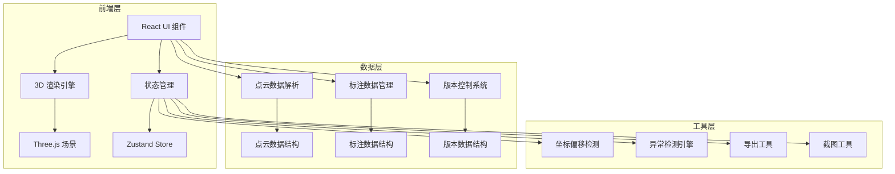
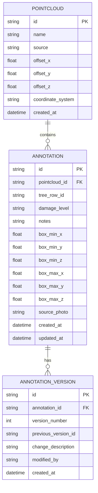

## 1. 架构设计



## 2. 技术描述
- 前端：React@18 + TypeScript + Vite
- 3D渲染：three@0.160 + @react-three/fiber@8 + @react-three/drei@9 + @react-three/postprocessing@2
- 状态管理：zustand@4
- 样式：tailwindcss@3
- 数据处理：内置解析器（LAS/PLY格式）
- 导出：html2canvas（截图）、jsPDF（报告）

## 3. 路由定义
| 路由 | 用途 |
|------|------|
| / | 主标注页面，包含所有功能模块 |

## 4. 数据模型

### 4.1 数据模型定义



### 4.2 Zustand Store结构

```typescript
interface AppStore {
  // 点云数据
  pointclouds: PointCloudData[];
  activePointcloudId: string | null;
  
  // 标注数据
  annotations: Annotation[];
  selectedAnnotationId: string | null;
  
  // 筛选状态
  damageLevelFilter: string[];
  treeRowFilter: string | null;
  
  // 交互状态
  selectionMode: 'view' | 'box-select' | 'edit';
  cameraPosition: [number, number, number];
  
  // 版本历史
  versions: VersionRecord[];
  
  // 异常状态
  coordinateOffsetWarning: boolean;
  unsavedChanges: boolean;
  levelOverlapWarning: boolean;
  
  // 操作方法
  importPointcloud: (data: PointCloudData) => void;
  createAnnotation: (annotation: Omit<Annotation, 'id'>) => void;
  updateAnnotation: (id: string, changes: Partial<Annotation>) => void;
  deleteAnnotation: (id: string) => void;
  setDamageLevelFilter: (levels: string[]) => void;
  saveVersion: () => void;
  exportReport: () => void;
  exportScreenshot: () => void;
  detectCoordinateOffset: () => boolean;
  checkLevelOverlap: () => boolean;
}
```

## 5. 核心组件结构

```
src/
├── components/
│   ├── viewer/
│   │   ├── PointCloudViewer.tsx      # 3D点云渲染主组件
│   │   ├── BoxSelectionTool.tsx      # 框选标注工具
│   │   └── AnnotationOverlay.tsx     # 标注覆盖层
│   ├── panels/
│   │   ├── ToolbarPanel.tsx          # 左侧工具栏
│   │   ├── InfoPanel.tsx             # 右侧信息面板
│   │   ├── StatusBar.tsx             # 底部状态栏
│   │   └── VersionPanel.tsx          # 版本历史面板
│   ├── dialogs/
│   │   ├── ImportDialog.tsx          # 导入对话框
│   │   ├── ExportDialog.tsx          # 导出对话框
│   │   ├── ConflictDialog.tsx        # 冲突确认对话框
│   │   └── WarningDialog.tsx         # 警告对话框
│   └── common/
│       ├── DamageLevelBadge.tsx      # 损失等级徽章
│       └── CoordinateDisplay.tsx     # 坐标显示组件
├── hooks/
│   ├── usePointCloud.ts              # 点云数据处理hook
│   ├── useAnnotation.ts              # 标注操作hook
│   ├── useVersionControl.ts          # 版本控制hook
│   └── useAnomalyDetection.ts        # 异常检测hook
├── store/
│   └── useAppStore.ts                # Zustand状态管理
├── utils/
│   ├── pointcloudParser.ts           # 点云数据解析
│   ├── coordinateUtils.ts            # 坐标计算工具
│   ├── exportUtils.ts                # 导出工具
│   └── constants.ts                  # 常量定义
├── types/
│   └── index.ts                      # TypeScript类型定义
└── pages/
    └── AnnotationPage.tsx            # 主标注页面
```

## 6. 异常检测规则

### 6.1 坐标偏移检测
- 阈值：相邻点云之间偏移超过1米
- 检测时机：导入新点云时、渲染前
- 处理方式：发出警告但不阻止操作

### 6.2 等级覆盖检测
- 检测：新标注框与已有标注框重叠超过50%
- 处理：弹出确认对话框，说明覆盖范围和影响

### 6.3 标注漏保存检测
- 检测：标注数据变更后超过30秒未保存
- 处理：底部状态栏闪烁提醒，保存按钮高亮

### 6.4 重复导入处理
- 相同ID数据：提供"忽略/覆盖/追加"三个选项
- 默认：追加模式（保留历史数据）
