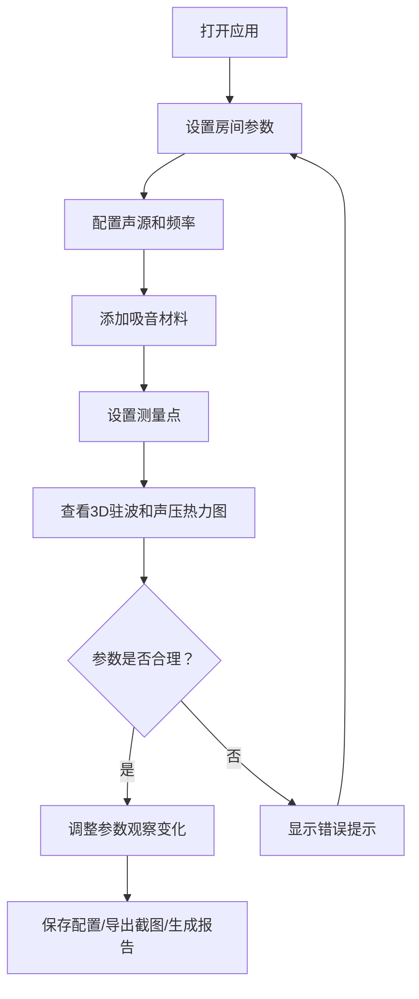

## 1. 产品概述

声学驻波房间模型是一个交互式3D声学可视化工具，帮助音乐教师和声学设计师在教室装修前，直观地展示房间驻波分布、声压热力图和吸音板位置。通过可视化的方式替代传统的表格和截图，让声学分析更直观易懂。

- **核心目的**：将抽象的声学公式转化为可交互的3D可视化，辅助音乐教室装修决策
- **目标用户**：音乐教师、声学设计师、教室装修规划人员
- **产品价值**：降低声学分析门槛，提高装修决策效率，避免声学设计失误

## 2. 核心功能

### 2.1 用户角色
| 角色 | 注册方式 | 核心权限 |
|------|----------|----------|
| 普通用户 | 无需注册 | 完整使用所有功能，导入/导出参数，保存截图 |

### 2.2 功能模块
1. **3D房间可视化**：可旋转、缩放的3D房间模型，展示驻波节点和吸音板位置
2. **参数控制面板**：房间尺寸、声源位置、频率、吸音材料、测点位置等参数调节
3. **声压热力图**：实时显示房间内声压分布的热力可视化
4. **测点曲线**：展示特定测点的声压频率响应曲线
5. **数据管理**：参数导入/导出，材料库管理，保留修改痕迹
6. **报告导出**：声场报告生成，截图导出

### 2.3 页面详情
| 页面名称 | 模块名称 | 功能描述 |
|-----------|-------------|---------------------|
| 主界面 | 3D视口 | 可交互3D房间模型，支持旋转/缩放/平移，显示驻波、吸音板、测点 |
| 主界面 | 参数面板 | 滑块+数值输入控制房间尺寸、频率、声源位置，实时更新3D视图 |
| 主界面 | 材料管理 | 吸音材料库，支持导入/导出/编辑材料参数，重复导入处理提示 |
| 主界面 | 热力图 | 声压分布彩色热力图，可切换显示平面/立体模式 |
| 主界面 | 测点曲线 | 2D图表显示选定点的频率响应曲线 |
| 主界面 | 错误提示 | 频率越界、参数缺失等异常情况的醒目提示，不混入正常结果 |
| 主界面 | 导出功能 | 截图保存，参数配置导出，声场报告生成 |

## 3. 核心流程

用户打开应用 → 配置房间参数（尺寸/频率/声源）→ 添加吸音材料 → 设置测点 → 查看驻波分布和声压热力图 → 调整参数观察变化 → 保存参数配置/导出截图/生成报告

## 4. 用户界面设计

### 4.1 设计风格
- **主色调**：深蓝渐变背景 (#0a1628 → #1a2d4a)，科技感专业风格
- **强调色**：青色 (#00d4ff) 用于交互元素，橙色 (#ff6b35) 用于警告提示
- **热力图色阶**：深蓝→青→黄→橙→红，标准声学热力配色
- **按钮风格**：扁平带微阴影，圆角8px，悬停有轻微上浮动画
- **字体**：标题使用 Orbitron（科技感），正文使用 Roboto Mono（数据可读性）
- **布局风格**：左侧参数面板，中间3D主视口，右侧信息/图表面板，三栏布局
- **图标风格**：线性简约图标，统一24px尺寸

### 4.2 页面设计概述
| 页面名称 | 模块名称 | UI元素 |
|-----------|-------------|-------------|
| 主界面 | 3D视口 | 深色背景，网格地板，半透明墙体，可拖动视角，鼠标悬停提示 |
| 主界面 | 参数面板 | 分组折叠面板，滑块+数值输入组合，实时更新反馈 |
| 主界面 | 材料管理 | 卡片式材料列表，导入/导出按钮，重复导入处理弹窗 |
| 主界面 | 热力图 | 色阶图例，透明度调节，显示/隐藏切换 |
| 主界面 | 测点曲线 | 可拖拽2D图表，坐标轴标注，数据点悬停提示 |
| 主界面 | 错误提示 | 顶部红色横幅，详细错误信息，修复建议链接 |

### 4.3 响应式设计
- **桌面优先**：1920px 以上为最佳体验，三栏完整布局
- **平板适配**：1024px-1920px，面板可折叠收起
- **触屏优化**：支持双指缩放、单指旋转3D视角

### 4.4 3D场景指导
- **环境**：深色科技感背景，柔和环境光，突出3D房间模型
- **光照**：主方向光 + 环境光，确保房间各面都清晰可见，无过暗区域
- **相机**：初始透视视角，支持轨道控制器，限制合理观察距离
- **动画**：驻波有缓慢呼吸动画，参数变化时有平滑过渡效果
- **交互**：点击墙体可添加/编辑吸音板，点击空间可添加测点
- **性能**：动态减少离屏渲染，保持60fps流畅度
