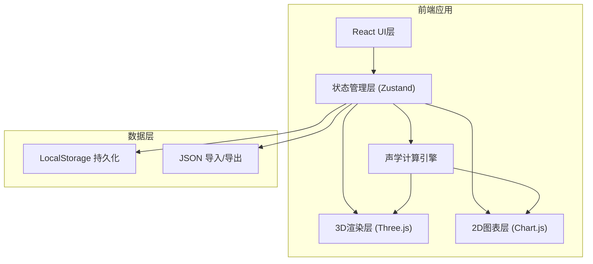
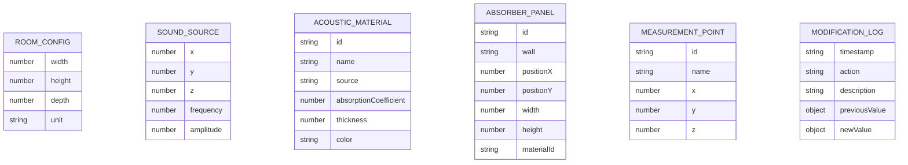

## 1. 架构设计



## 2. 技术描述

- **前端框架**: React@18 + TypeScript
- **构建工具**: Vite
- **样式方案**: TailwindCSS@3
- **3D引擎**: Three.js + @react-three/fiber + @react-three/drei
- **2D图表**: Chart.js + react-chartjs-2
- **状态管理**: Zustand
- **图标库**: Lucide React
- **数据持久化**: LocalStorage + JSON 文件导入导出
- **无后端**: 纯前端应用，所有计算在浏览器端完成

## 3. 技术选型理由

- **Three.js + React Three Fiber**: 提供声明式3D开发体验，便于组件化管理复杂3D场景
- **Zustand**: 轻量级状态管理，适合需要频繁更新3D场景的应用
- **TypeScript**: 确保声学计算的类型安全，减少参数错误
- **TailwindCSS**: 快速构建专业科技感UI

## 4. 核心目录结构

```
src/
├── components/
│   ├── ui/              # 基础UI组件
│   ├── panels/          # 面板组件（参数、材料、图表）
│   ├── three/           # 3D场景组件
│   └── modals/          # 弹窗组件
├── store/               # Zustand 状态管理
├── hooks/               # 自定义 Hooks
├── utils/
│   ├── acoustics.ts     # 声学计算核心
│   ├── validation.ts    # 参数验证
│   └── export.ts        # 导出工具
├── types/               # TypeScript 类型定义
├── data/                # 默认材料数据
└── App.tsx
```

## 5. 路由定义

| 路由 | 用途 |
|-------|---------|
| / | 主应用界面，包含3D视口和所有控制面板 |

## 6. 数据模型

### 6.1 核心数据结构



### 6.2 类型定义 (TypeScript)

```typescript
interface RoomConfig {
  width: number;
  height: number;
  depth: number;
  unit: 'm' | 'cm';
}

interface SoundSource {
  x: number;
  y: number;
  z: number;
  frequency: number;
  amplitude: number;
}

interface AcousticMaterial {
  id: string;
  name: string;
  source: string;
  absorptionCoefficient: Record<number, number>;
  thickness: number;
  color: string;
  createdAt: string;
  modifiedAt: string;
  version: number;
}

interface AbsorberPanel {
  id: string;
  wall: 'front' | 'back' | 'left' | 'right' | 'floor' | 'ceiling';
  positionX: number;
  positionY: number;
  width: number;
  height: number;
  materialId: string;
}

interface MeasurementPoint {
  id: string;
  name: string;
  x: number;
  y: number;
  z: number;
}

interface ValidationError {
  type: 'frequency' | 'parameter' | 'material';
  severity: 'error' | 'warning';
  message: string;
  suggestion: string;
  affectedField?: string;
}

interface ModificationLog {
  id: string;
  timestamp: string;
  action: 'create' | 'update' | 'delete' | 'import';
  target: string;
  description: string;
  previousValue?: any;
  newValue?: any;
  source?: string;
}

interface AppState {
  room: RoomConfig;
  soundSource: SoundSource;
  materials: AcousticMaterial[];
  absorberPanels: AbsorberPanel[];
  measurementPoints: MeasurementPoint[];
  selectedPointId: string | null;
  errors: ValidationError[];
  modificationHistory: ModificationLog[];
  importMode: 'ignore' | 'overwrite' | 'append';
}
```

## 7. 声学计算核心算法

### 7.1 驻波计算
- 矩形房间三轴驻波频率公式：f = (c/2) * √((p/L)² + (q/W)² + (r/H)²)
- c = 声速 (~343 m/s)
- p, q, r = 各轴向谐波次数

### 7.2 声压分布计算
- 基于有限差分法简化模型
- 考虑吸音材料边界条件影响
- 实时计算房间各点声压级

### 7.3 频率响应计算
- 在指定测点计算扫频响应
- 生成频率-声压级曲线

## 8. 错误处理策略

| 错误类型 | 检测条件 | 处理方式 |
|---------|---------|---------|
| 频率越界 | f < 20Hz 或 f > 20000Hz | 红色警告提示，禁用计算，显示建议范围 |
| 房间尺寸异常 | 任一维度 < 0.5m 或 > 50m | 橙色警告，仍可计算但标注结果参考价值有限 |
| 材料参数缺失 | 吸音材料缺少关键频段吸声系数 | 红色错误，该材料效果不计入计算 |
| 声源位置越界 | 声源坐标超出房间范围 | 自动修正到边界，记录警告日志 |
| 测点位置越界 | 测点坐标超出房间范围 | 红色错误，该测点不参与计算 |
