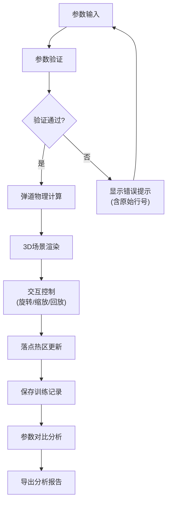

## 1. 产品概述
高尔夫弹道分析器是一款面向高尔夫教练和学员的3D可视化工具，通过实时弹道模拟帮助理解击球参数与落点之间的关系，解决当前训练中反复出现的单位混用、风向错误、落点超界等问题。

- **核心目标**：将球速、仰角、旋转等抽象参数转化为直观的3D弹道，让学员清晰理解落点差异
- **目标用户**：高尔夫教练、进阶学员
- **核心价值**：减少训练错误，加速技术理解，保留训练记录和修正痕迹

## 2. 核心功能

### 2.1 用户角色
| 角色 | 注册方式 | 核心权限 |
|------|----------|----------|
| 教练/学员 | 本地使用 | 弹道模拟、参数调整、训练记录、报告导出 |

### 2.2 功能模块
1. **3D弹道可视化**：实时渲染高尔夫球飞行轨迹，支持多角度交互查看
2. **参数输入与验证**：球速、发射角、侧旋、风速等参数输入，带严格单位验证
3. **落点热区分析**：多次击球落点的热力图展示
4. **参数对比功能**：多组弹道参数的并排对比分析
5. **回放控制系统**：弹道飞行过程的逐帧回放和速度控制
6. **训练记录管理**：保存每次击球数据，保留来源和修正痕迹
7. **报告导出**：导出分析报告（PDF/图片格式）
8. **错误提示系统**：单位混用、风向反了、落点超界等异常的明确提示，保留原始行号

### 2.3 页面详情
| 页面名称 | 模块名称 | 功能描述 |
|----------|----------|----------|
| 主界面 | 3D场景区域 | Three.js渲染的高尔夫球场和弹道可视化，支持鼠标旋转、缩放、平移 |
| 主界面 | 参数控制面板 | 球速、发射角、仰角、侧旋、风速、风向的输入控件，带单位选择 |
| 主界面 | 回放控制条 | 播放/暂停、进度拖动、速度调节（0.25x-4x） |
| 主界面 | 落点热区 | 2D俯视图形式展示多次击球的落点分布热力图 |
| 主界面 | 训练记录列表 | 历史记录展示，显示来源、时间、修正痕迹 |
| 主界面 | 参数对比面板 | 最多4组弹道参数的对比展示，颜色区分 |
| 主界面 | 错误提示栏 | 异常数据的高亮提示，显示原始行号和问题描述 |

## 3. 核心流程

用户输入击球参数 → 系统验证参数合法性 → 计算弹道轨迹 → 3D渲染展示 → 用户回放/调整 → 保存记录/导出报告

## 4. 用户界面设计

### 4.1 设计风格
- **主色调**：深青绿（#0D7377）代表高尔夫球场，搭配草地绿（#32E0C4）和深灰（#071A1E）
- **辅助色**：弹道轨迹使用渐变色（起飞黄→飞行蓝→落地红）
- **按钮风格**：圆角矩形，微立体阴影，hover时有轻微上浮效果
- **字体**：标题使用 Montserrat 粗体，正文使用 Inter 常规
- **布局风格**：深色科技风，左侧参数面板 + 中央3D场景 + 右侧记录面板
- **图标风格**：线性图标，统一2px线条，绿色系

### 4.2 页面设计概览
| 页面名称 | 模块名称 | UI元素 |
|----------|----------|--------|
| 主界面 | 3D场景区域 | 深色背景、草地地面、网格参考线、弹道轨迹渐变、高尔夫球模型 |
| 主界面 | 参数控制面板 | 分组卡片、滑块+数值输入、单位下拉、实时验证反馈 |
| 主界面 | 回放控制条 | 播放按钮组、进度条、速度选择器、时间显示 |
| 主界面 | 错误提示栏 | 红色边框、错误图标、原始行号显示、修正建议 |
| 主界面 | 训练记录 | 列表卡片、时间戳、来源标记、修正痕迹高亮 |

### 4.3 响应式设计
- **桌面端（>1200px）**：三栏布局（左参数-中场景-右记录）
- **平板端（768-1200px）**：双栏布局（参数/记录可切换）
- **移动端（<768px）**：单栏布局，场景优先，参数和记录使用抽屉式

### 4.4 3D场景设计
- **环境**：室内训练场风格，柔和顶光，避免HDRI过度反射
- **光照**：主方向光 + 环境光 + 弹道轨迹自发光
- **相机**：默认45度俯视角，支持轨道控制，预设多个观察视角
- **交互**：鼠标拖拽旋转、滚轮缩放、右键平移、双击重置
- **动画**：弹道渐进式绘制、球飞行跟随、落点弹跳效果
- **后处理**：轻微泛光效果增强轨迹可见度，FXAA抗锯齿
- **性能**：单条弹道≤500个顶点，场景总面数控制在5万以内

