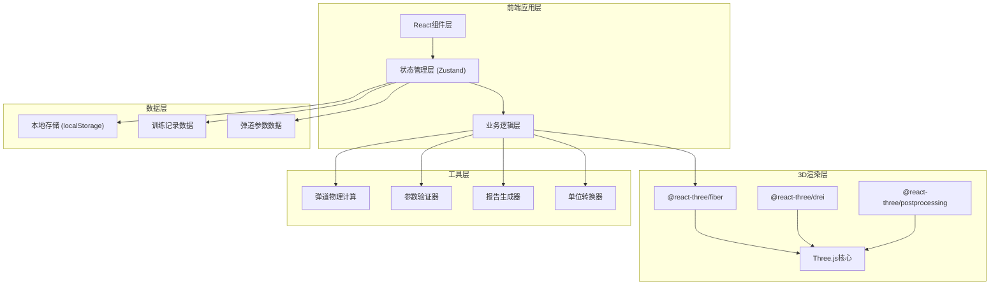

## 1. 架构设计



## 2. 技术描述

- **前端框架**：React@18 + TypeScript
- **构建工具**：Vite@5
- **样式方案**：TailwindCSS@3
- **3D渲染**：Three.js@0.160 + @react-three/fiber@8 + @react-three/drei@9
- **后处理效果**：@react-three/postprocessing@2
- **状态管理**：Zustand@4
- **图表可视化**：@nivo/heatmap@0.84
- **报告导出**：html2canvas@1 + jspdf@2
- **图标库**：lucide-react@0.294
- **本地存储**：localStorage + indexedDB（用于大量训练记录）

## 3. 目录结构

```
src/
├── components/
│   ├── Scene3D/              # 3D场景组件
│   │   ├── GolfCourse.tsx    # 高尔夫球场
│   │   ├── TrajectoryLine.tsx # 弹道轨迹线
│   │   ├── GolfBall.tsx      # 高尔夫球
│   │   └── CameraControls.tsx # 相机控制
│   ├── ControlPanel/         # 参数控制面板
│   │   ├── ParameterInput.tsx # 参数输入组件
│   │   ├── UnitSelector.tsx  # 单位选择器
│   │   └── ValidationAlert.tsx # 验证提示
│   ├── PlaybackControl/      # 回放控制
│   │   ├── Playbar.tsx       # 播放条
│   │   └── SpeedControl.tsx  # 速度控制
│   ├── Heatmap/              # 落点热区
│   │   └── LandingHeatmap.tsx
│   ├── RecordList/           # 训练记录
│   │   └── TrainingRecords.tsx
│   ├── ComparePanel/         # 参数对比
│   │   └── TrajectoryCompare.tsx
│   └── ExportPanel/          # 导出面板
│       └── ReportExporter.tsx
├── store/                    # 状态管理
│   ├── useTrajectoryStore.ts # 弹道状态
│   ├── useRecordStore.ts     # 记录状态
│   └── useCompareStore.ts    # 对比状态
├── physics/                  # 物理计算
│   ├── trajectory.ts         # 弹道计算核心
│   └── constants.ts          # 物理常量
├── utils/                    # 工具函数
│   ├── validator.ts          # 参数验证
│   ├── unitConverter.ts      # 单位转换
│   ├── errorFormatter.ts     # 错误格式化（含行号）
│   └── reportGenerator.ts    # 报告生成
├── types/                    # TypeScript类型
│   ├── trajectory.ts
│   ├── record.ts
│   └── error.ts
├── hooks/                    # 自定义Hooks
│   ├── useAnimationFrame.ts
│   └── useLocalStorage.ts
├── App.tsx
├── main.tsx
└── index.css
```

## 4. 核心数据模型

### 4.1 弹道参数模型
```typescript
interface TrajectoryParams {
  id: string;
  source: {
    type: 'manual' | 'import' | 'record';
    origin?: string;
    lineNumber?: number;
  };
  timestamp: number;
  
  // 击球参数
  ballSpeed: number;       // 球速
  ballSpeedUnit: 'm/s' | 'km/h' | 'mph';
  launchAngle: number;     // 发射角（度）
  launchDirection: number; // 发射方向（度，0为正前方）
  backspin: number;        // 后旋（rpm）
  sidespin: number;        // 侧旋（rpm）
  
  // 环境参数
  windSpeed: number;       // 风速
  windSpeedUnit: 'm/s' | 'km/h' | 'mph';
  windDirection: number;   // 风向（度，0为从左到右）
  temperature: number;     // 温度（摄氏度）
  humidity: number;        // 湿度（%）
  altitude: number;        // 海拔（米）
}

interface TrajectoryPoint {
  x: number;  // 横向距离（米）
  y: number;  // 高度（米）
  z: number;  // 纵向距离（米）
  t: number;  // 时间（秒）
  vx: number; // X方向速度
  vy: number; // Y方向速度
  vz: number; // Z方向速度
}

interface TrajectoryResult {
  params: TrajectoryParams;
  points: TrajectoryPoint[];
  landing: {
    x: number;
    z: number;
    distance: number;  // 总距离（米）
    carry: number;     // 飞行距离（米）
    roll: number;      // 滚动距离（米）
  };
  apex: {
    height: number;
    distance: number;
  };
  calculationTime: number;
  validation: ValidationResult;
}
```

### 4.2 错误验证模型
```typescript
interface ValidationError {
  code: string;
  message: string;
  severity: 'warning' | 'error' | 'critical';
  source: {
    field: string;
    value: any;
    lineNumber?: number;
    origin?: string;
  };
  suggestion: string;
}

interface ValidationResult {
  valid: boolean;
  errors: ValidationError[];
  warnings: ValidationError[];
}
```

### 4.3 训练记录模型
```typescript
interface TrainingRecord {
  id: string;
  sessionId: string;
  timestamp: number;
  params: TrajectoryParams;
  result: TrajectoryResult;
  notes: string;
  modifications: ModificationTrace[];
  tags: string[];
}

interface ModificationTrace {
  timestamp: number;
  field: string;
  oldValue: any;
  newValue: any;
  reason: string;
  source: string;
}
```

## 5. 核心算法

### 5.1 弹道物理计算
- 考虑重力、空气阻力、马格努斯效应（旋转影响）
- 使用四阶龙格-库塔法(RK4)进行数值积分
- 时间步长：0.01秒，自适应精度控制

### 5.2 参数验证规则
```
球速：
  - 范围：20-100 m/s (72-360 km/h)
  - 单位转换：1 m/s = 3.6 km/h = 2.23694 mph

发射角：
  - 范围：0-45 度
  - 警告：>30度可能影响距离

侧旋：
  - 范围：-3000 到 3000 rpm
  - 警告：绝对值>2000 rpm过度侧旋

风速：
  - 范围：0-30 m/s (0-108 km/h)
  - 风向验证：确保角度在0-360度范围

落点检查：
  - 边界：X方向±50米，Z方向0-400米
  - 超界标记：超出范围时高亮并提示
```

## 6. 状态管理设计

### 6.1 弹道状态 (useTrajectoryStore)
```typescript
{
  currentParams: TrajectoryParams;
  currentResult: TrajectoryResult | null;
  playbackProgress: number;  // 0-1
  playbackSpeed: number;     // 0.25, 0.5, 1, 2, 4
  isPlaying: boolean;
  validation: ValidationResult;
  setParams: (params: Partial<TrajectoryParams>) => void;
  calculate: () => Promise<void>;
  setPlaybackProgress: (progress: number) => void;
  togglePlay: () => void;
}
```

### 6.2 记录状态 (useRecordStore)
```typescript
{
  records: TrainingRecord[];
  selectedRecordId: string | null;
  saveRecord: (result: TrajectoryResult, notes?: string) => void;
  deleteRecord: (id: string) => void;
  exportRecords: (format: 'json' | 'csv') => Blob;
}
```

## 7. 错误处理规范

### 7.1 错误信息格式
```
[来源: 第X行] [错误级别] 字段名: 具体错误信息
建议: 修正建议
```

### 7.2 典型错误示例
```
[来源: 导入数据第15行] [警告] 球速: 数值 15 m/s 超出正常范围 (20-100 m/s)
建议: 请检查是否为正确的高尔夫球速，职业选手平均球速约70 m/s

[来源: 手动输入] [错误] 风向: 风向角度 450 超出有效范围 (0-360)
建议: 风向应为0-360度，0度表示从左侧吹来的风

[来源: 计算结果] [严重] 落点: 横向落点 62米 超出场地边界 (±50米)
提示: 弹道已标记为超界，实际飞行距离可能受限
```

