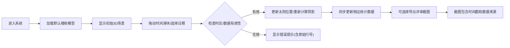

## 1. 产品概述

城市光照阴影沙盘是一个Web3D交互可视化工具，用于建筑方案评审阶段的日照分析。通过实时3D渲染展示不同时间楼栋阴影变化，对比儿童活动场地等关键区域的日照情况，为建筑师和评审专家提供直观的决策依据。

- 核心目标：解决建筑方案评审中日照分析不直观的问题
- 目标用户：建筑师、规划师、评审专家、现场同事
- 核心价值：将专业日照分析数据转化为可交互的3D可视化体验

## 2. 核心功能

### 2.1 用户角色

| 角色 | 注册方式 | 核心权限 |
|------|----------|----------|
| 评审用户 | 无需注册 | 查看3D场景、调整时间、导出截图、查看统计 |
| 数据管理员 | 无需注册 | 导入楼栋模型、配置场地参数、标记问题区域 |

### 2.2 功能模块

1. **3D主视图**：楼栋模型渲染、实时阴影计算、太阳位置可视化
2. **时间控制**：时间滑块、日期选择、时区设置、动画播放
3. **侧边明细面板**：场地列表、日照统计、错误提示、数据来源追踪
4. **阴影叠加**：多时段阴影叠加对比、透明度调节
5. **统计面板**：日照时长统计、达标情况分析、时段漏检提示
6. **截图导出**：带标注的评审截图、批量导出

### 2.3 页面详情

| 页面名称 | 模块名称 | 功能描述 |
|-----------|-------------|---------------------|
| 主工作台 | 3D场景视图 | Three.js渲染楼栋、地面、活动场地；支持旋转缩放；实时阴影更新 |
| 主工作台 | 时间控制栏 | 滑块拖动调整时间；日期选择器；播放/暂停动画；时区设置 |
| 主工作台 | 侧边面板 | 场地筛选；日照时长明细；错误警告；数据来源记录 |
| 主工作台 | 统计面板 | 各场地日照时长柱状图；达标率；时段覆盖情况 |
| 主工作台 | 导出工具栏 | 截图导出；添加标注；批量导出设置 |

## 3. 核心流程

## 4. 用户界面设计

### 4.1 设计风格

- **主色调**：深邃科技蓝 (#165DFF)，体现专业感和科技感
- **辅助色**：警示橙 (#FF7D00) 用于错误提示，成功绿 (#00B42A) 用于达标标识
- **中性色**：深灰背景 (#1D2129) 配合浅色文字，降低视觉疲劳
- **按钮风格**：圆角8px，悬停有轻微上浮和阴影变化
- **字体**：标题使用 Space Grotesk，正文使用 Inter，数字使用等宽字体
- **布局风格**：左侧固定3D视图(70%宽度)，右侧可折叠面板(30%宽度)
- **图标风格**：线性图标，统一24px尺寸

### 4.2 页面设计概述

| 页面名称 | 模块名称 | UI元素 |
|-----------|-------------|-------------|
| 主工作台 | 3D场景视图 | 深蓝色环境光、动态太阳光源、柔和阴影、轨道控制器、网格地面 |
| 主工作台 | 时间控制栏 | 渐变滑块、时间刻度、播放按钮组、时区下拉、日期选择器 |
| 主工作台 | 侧边面板 | 卡片式布局、可折叠分区、错误警示标签、来源追溯链接 |
| 主工作台 | 统计面板 | 彩色柱状图、进度条、达标徽章、时段热力图 |
| 主工作台 | 导出工具栏 | 悬浮按钮、标注画笔、预览弹窗 |

### 4.3 响应性

- Desktop-first设计，主视图最小宽度1200px
- 平板端：侧边面板改为底部抽屉
- 移动端：保留核心3D视图功能，简化控制

### 4.4 3D场景指导

- **环境**：深蓝色渐变天空盒，HDRI环境光营造真实感
- **光照设置**：主光源模拟太阳(可调节位置)，环境光补充暗部，阴影贴图分辨率2048px
- **相机设置**：PerspectiveCamera，初始俯视角45度，支持轨道控制
- **交互**：鼠标左键旋转、滚轮缩放、右键平移，双击重置视角
- **动画**：太阳位置平滑过渡，阴影软过渡，楼栋选中高亮
- **后处理**：轻微泛光效果，色彩校正，抗锯齿
- **性能**：楼栋模型使用简化几何体，单帧渲染目标60fps
