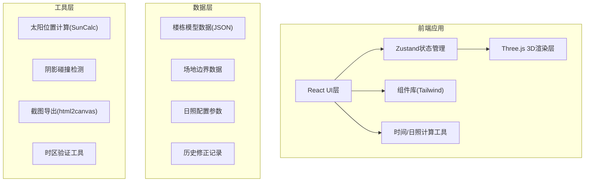
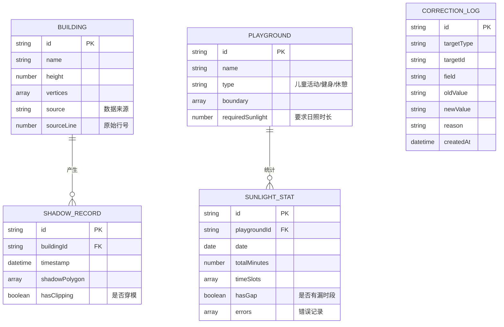

## 1. 架构设计



## 2. 技术描述

- **前端框架**: React@18 + TypeScript + Vite
- **3D引擎**: three@0.160 + @react-three/fiber@8 + @react-three/drei@9
- **状态管理**: zustand@4
- **样式方案**: tailwindcss@3
- **UI组件**: lucide-react@0.294
- **太阳计算**: suncalc@1.9
- **图表库**: recharts@2
- **截图导出**: html2canvas@1.4
- **后端**: 纯前端应用，无后端依赖
- **数据存储**: LocalStorage保存用户配置和修正记录

## 3. 路由定义

| 路由 | 用途 |
|-------|---------|
| / | 主工作台 - 3D视图 + 控制面板 |

## 4. 数据模型

### 4.1 数据模型定义



### 4.2 核心类型定义

```typescript
// 楼栋数据
interface Building {
  id: string;
  name: string;
  height: number;
  position: [number, number, number];
  dimensions: [number, number, number];
  source: string;
  sourceLine: number;
}

// 活动场地
interface Playground {
  id: string;
  name: string;
  type: 'children' | 'fitness' | 'rest';
  boundary: [number, number][];
  requiredSunlight: number; // 分钟
  color: string;
}

// 太阳位置
interface SunPosition {
  azimuth: number;
  altitude: number;
}

// 日照统计
interface SunlightStats {
  playgroundId: string;
  date: string;
  totalMinutes: number;
  timeSlots: { start: number; end: number; sunlight: boolean }[];
  gaps: { start: number; end: number; reason: string }[];
  is达标: boolean;
}

// 错误记录
interface ValidationError {
  type: 'timezone' | 'clipping' | 'gap' | 'data';
  message: string;
  source: string;
  sourceLine: number;
  severity: 'warning' | 'error';
}

// 修正记录
interface CorrectionLog {
  id: string;
  targetType: 'building' | 'playground' | 'setting';
  targetId: string;
  field: string;
  oldValue: string;
  newValue: string;
  reason: string;
  timestamp: number;
}
```

## 5. 核心模块结构

```
src/
├── components/
│   ├── Scene3D/          # 3D场景组件
│   │   ├── Buildings.tsx
│   │   ├── Ground.tsx
│   │   ├── Playgrounds.tsx
│   │   ├── SunLight.tsx
│   │   └── ShadowOverlay.tsx
│   ├── TimeControl/      # 时间控制组件
│   │   ├── TimeSlider.tsx
│   │   ├── DatePicker.tsx
│   │   ├── TimezoneSelector.tsx
│   │   └── PlayControls.tsx
│   ├── SidePanel/        # 侧边面板
│   │   ├── PlaygroundList.tsx
│   │   ├── SunlightStats.tsx
│   │   ├── ErrorList.tsx
│   │   └── SourceTrace.tsx
│   ├── StatsPanel/       # 统计面板
│   │   ├── BarChart.tsx
│   │   ├── Heatmap.tsx
│   │   └── ProgressBar.tsx
│   └── Export/           # 导出功能
│       ├── ScreenshotButton.tsx
│       └── AnnotationTool.tsx
├── hooks/
│   ├── useSunPosition.ts
│   ├── useShadowCalculation.ts
│   ├── useSunlightStats.ts
│   └── useValidation.ts
├── store/
│   ├── useSceneStore.ts
│   ├── useTimeStore.ts
│   └── useDataStore.ts
├── utils/
│   ├── suncalc.ts
│   ├── shadow.ts
│   ├── timezone.ts
│   └── validation.ts
├── data/
│   ├── buildings.json
│   ├── playgrounds.json
│   └── corrections.json
└── types/
    └── index.ts
```

## 6. 错误处理机制

### 6.1 时区错误检测
- 验证输入时区与系统时区差异
- 检测跨日期边界的时间计算
- 记录原始数据行号，错误提示包含溯源信息

### 6.2 阴影穿模检测
- 实时检测楼栋阴影是否穿透地面
- 检测相邻楼栋阴影重叠异常
- 标记问题区域并在3D视图高亮

### 6.3 时段漏检检测
- 检查日照统计时段连续性
- 标记数据缺口位置和时长
- 提供补全建议但不自动修正
