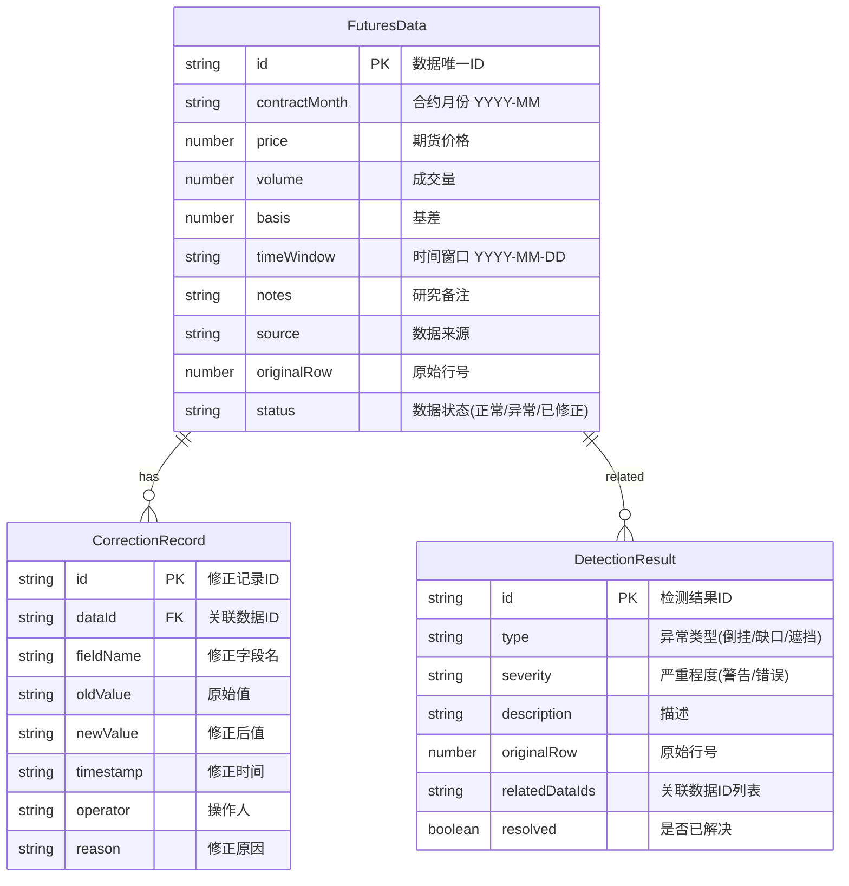

## 1. 架构设计

```mermaid
flowchart LR
    "UI层(React)" --> "状态层(Zustand)"
    "状态层(Zustand)" --> "3D渲染层(Three.js)"
    "状态层(Zustand)" --> "数据处理层(Utils)"
    "数据处理层(Utils)" --> "异常检测模块"
    "数据处理层(Utils)" --> "倒挂检测模块"
    "文件系统" --> "数据导入(PapaParse)"
    "数据导入(PapaParse)" --> "数据处理层(Utils)"
    "3D渲染层(Three.js)" --> "导出模块(Canvas截图)"
```

## 2. 技术说明
- **前端框架**：React@18 + TypeScript
- **构建工具**：Vite@5
- **3D引擎**：three@0.160 + @react-three/fiber@8 + @react-three/drei@9
- **后期处理**：@react-three/postprocessing + postprocessing
- **状态管理**：Zustand@4
- **样式**：TailwindCSS@3
- **数据解析**：PapaParse
- **UI组件**：自研（不依赖第三方UI库，保证设计自由度）
- **无后端**：纯前端应用，数据本地处理

## 3. 路由定义
| 路由 | 用途 |
|------|------|
| `/` | 主页面：3D隧道视图 + 侧边明细 + 工具栏 + 时间轴 |

## 4. 数据模型

### 4.1 数据模型定义



### 4.2 TypeScript 类型定义

```typescript
interface FuturesData {
  id: string;
  contractMonth: string;
  price: number;
  volume: number;
  basis: number;
  timeWindow: string;
  notes: string;
  source: string;
  originalRow: number;
  status: 'normal' | 'warning' | 'error' | 'corrected';
}

interface CorrectionRecord {
  id: string;
  dataId: string;
  fieldName: keyof FuturesData;
  oldValue: string;
  newValue: string;
  timestamp: string;
  operator: string;
  reason: string;
}

interface DetectionResult {
  id: string;
  type: 'backwardation' | 'month_gap' | 'volume_occlusion' | 'label_error' | 'parse_error';
  severity: 'warning' | 'error';
  description: string;
  originalRow: number;
  relatedDataIds: string[];
  resolved: boolean;
}

interface AppState {
  data: FuturesData[];
  corrections: CorrectionRecord[];
  detections: DetectionResult[];
  selectedDataId: string | null;
  timeWindowIndex: number;
  isPlaying: boolean;
  playSpeed: number;
  filters: {
    showBackwardation: boolean;
    showWarnings: boolean;
    volumeHeatmap: boolean;
  };
}
```

## 5. 项目结构

```
src/
├── components/
│   ├── Canvas3D/          # 3D画布组件
│   │   ├── TunnelScene.tsx    # 3D隧道主场景
│   │   ├── TermCurve.tsx      # 单条期限结构曲线
│   │   ├── Axes.tsx           # 坐标轴
│   │   ├── HoverTooltip.tsx   # 悬停提示
│   │   └── Controls.tsx       # 相机控制
│   ├── DetailPanel/       # 侧边明细面板
│   │   ├── ContractInfo.tsx   # 合约信息区
│   │   ├── NotesSection.tsx   # 研究备注区
│   │   ├── CorrectionHistory.tsx # 修正历史区
│   │   └── SourceInfo.tsx     # 数据来源区
│   ├── Toolbar/           # 顶部工具栏
│   ├── Timeline/          # 底部时间轴播放器
│   ├── AlertPanel/        # 异常提示面板
│   └── DataUpload/        # 数据上传模块
│       ├── FileUpload.tsx     # 文件上传
│       ├── FieldMapping.tsx   # 字段映射
│       └── ErrorReport.tsx    # 错误报告
├── store/
│   └── useStore.ts        # Zustand状态管理
├── utils/
│   ├── dataParser.ts      # 数据解析(CSV)
│   ├── backwardation.ts   # 倒挂检测算法
│   ├── anomaly.ts         # 异常检测(缺口/遮挡)
│   ├── geometry.ts        # 3D几何计算
│   └── export.ts          # 导出功能
├── types/
│   └── index.ts           # TypeScript类型定义
├── data/
│   └── mockData.ts        # 模拟数据
├── App.tsx
├── main.tsx
└── index.css
```

## 6. 核心算法说明

### 6.1 倒挂检测算法
- 对每个时间窗口，按合约月份排序，检查相邻合约价格
- 若近月价格 > 远月价格，标记为倒挂点
- 连续倒挂点形成倒挂区间，标注倒挂幅度（价差百分比）

### 6.2 月份缺口检测
- 检查每个时间窗口内的合约月份序列
- 若相邻月份间隔超过1个月（如1月→3月），标记为月份缺口
- 记录缺口位置和跨度

### 6.3 成交量遮挡检测
- 将成交量映射为3D空间中的球体半径或柱高
- 检查相邻月份的成交量几何体是否重叠（距离 < 半径之和）
- 重叠超过阈值的标记为遮挡

### 6.4 3D曲线生成
- 对每个时间窗口，生成一条3D Catmull-Rom曲线
- X坐标：合约月份序数（近月=0，远月递增）
- Y坐标：价格（归一化到可视范围）
- Z坐标：时间窗口索引
- 曲线通过TubeGeometry渲染，管半径根据成交量动态调整