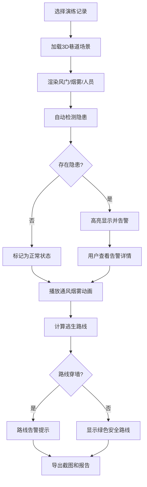

## 1. 产品概述
矿井通风逃生图Web3D系统是矿山安全培训的交互式工具，通过3D可视化技术展示巷道通风、烟雾扩散和逃生路线，帮助培训师直观演示并检测常见安全隐患。

- 目标用户：矿山安全培训师、安全管理人员、应急救援人员
- 核心价值：将抽象的通风理论转化为可视化3D场景，自动检测风门错误、烟雾倒流、路线穿墙等隐患并明确告警

## 2. 核心功能

### 2.1 用户角色
| 角色 | 注册方式 | 核心权限 |
|------|----------|----------|
| 培训师 | 无需注册 | 查看3D场景、筛选数据、查看告警、导出报告 |

### 2.2 功能模块
1. **3D巷道主场景**：巷道模型展示、视角控制、悬浮信息
2. **通风烟雾系统**：风门状态控制、风速风向模拟、烟雾扩散动画
3. **逃生路线规划**：人员位置标记、最优路径计算、路径穿墙检测
4. **告警系统**：隐患检测、状态标记、错误详情展示
5. **报告中心**：演练记录筛选、截图导出、修正痕迹保留
6. **数据控制面板**：记录切换、参数调整、来源追溯

### 2.3 页面详情
| 页面名称 | 模块名称 | 功能描述 |
|---------|----------|----------|
| 主场景页 | 3D视窗 | 可旋转缩放的巷道3D模型，支持鼠标悬停显示物体详情 |
| 主场景页 | 侧边控制面板 | 演练记录列表、筛选功能、数据来源展示 |
| 主场景页 | 告警面板 | 实时显示检测到的隐患，点击定位到问题位置 |
| 主场景页 | 底部操作栏 | 播放/暂停动画、截图、导出报告按钮 |
| 主场景页 | 信息悬浮窗 | 点击风门/烟雾源/人员显示详细参数和修正历史 |

## 3. 核心流程

## 4. 用户界面设计

### 4.1 设计风格
- **主色调**：深矿蓝色(#1a365d)作为主色，代表专业和工业感；警示红(#e53e3e)用于错误提示；安全绿(#38a169)用于正常状态
- **辅助色**：橙色(#dd6b20)用于烟雾；蓝色(#3182ce)用于通风气流
- **按钮风格**：圆角4px，带有微妙阴影，悬停时有轻微上浮效果
- **字体**：标题使用'Noto Sans SC Bold'，正文使用'Noto Sans SC Regular'，数字使用等宽字体
- **布局风格**：左侧面板固定宽度，右侧3D场景自适应，底部操作栏悬浮
- **图标风格**：线性图标，工业风，简洁明了

### 4.2 页面设计概述
| 页面名称 | 模块名称 | UI元素 |
|---------|----------|--------|
| 主场景页 | 3D视窗 | 深灰色背景，环境光模拟矿井灯光，物体选中时有轮廓高亮 |
| 主场景页 | 侧边面板 | 深色卡片式设计，记录列表带状态标记（绿/黄/红圆点） |
| 主场景页 | 告警面板 | 红色边框卡片，展开显示错误详情和修正建议 |
| 主场景页 | 底部操作栏 | 半透明深色背景，图标按钮横向排列 |
| 主场景页 | 悬浮信息窗 | 白色背景圆角卡片，带箭头指向对应3D物体 |

### 4.3 响应式
- 桌面端优先设计（1920×1080）
- 平板端：侧边面板可折叠收起
- 移动端：简化控制，以查看功能为主

### 4.4 3D场景指导
- **环境氛围**：模拟真实矿井，主光源来自巷道顶部的模拟矿灯，环境光偏暗，营造地下矿井感
- **灯光设置**：顶部主光源 + 巷道壁辅助光源，物体边缘光增强立体感
- **相机设置**：初始视角为巷道斜45度俯瞰，支持轨道控制、缩放、平移
- **核心元素**：
  - 巷道：深灰色墙体，有砖纹理
  - 风门：绿色(开启)/红色(关闭)可交互门体
  - 烟雾：橙色半透明粒子系统，随风向流动
  - 人员：蓝色小人模型，带方向指示
  - 逃生路线：发光的绿色/红色路径线
- **动画效果**：
  - 烟雾粒子缓慢飘动并扩散
  - 风门开关有平滑转动动画
  - 逃生路线有流光效果
  - 告警物体有脉冲闪烁效果
- **后处理**：轻微泛光效果，增强烟雾的真实感，抗锯齿处理
