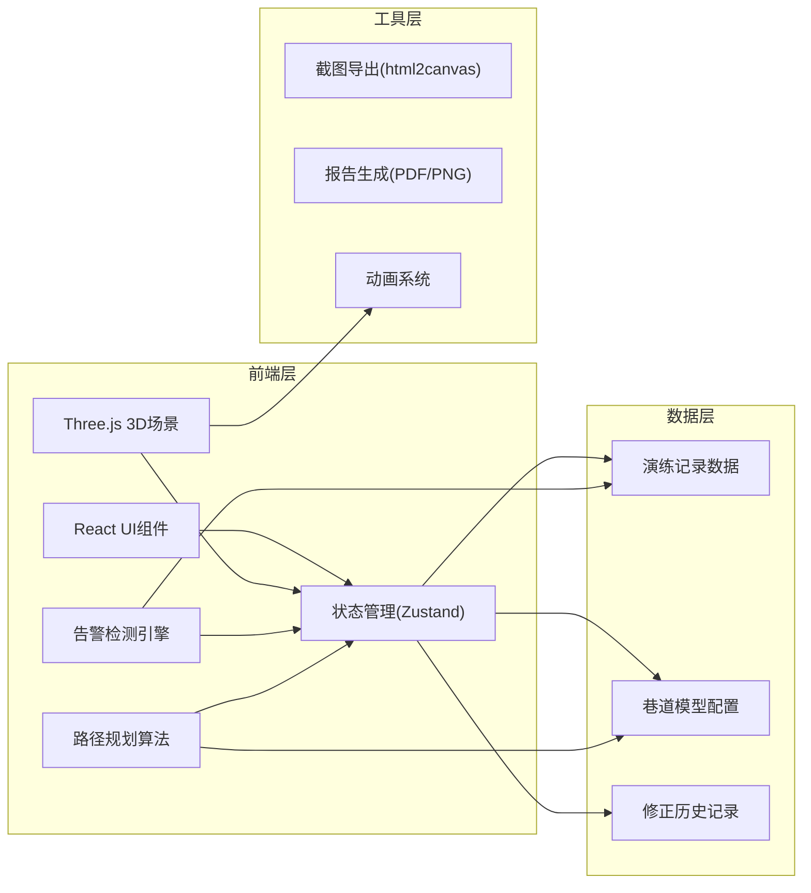

## 1. 架构设计



## 2. 技术描述

- **前端框架**: React@18 + TypeScript + Vite
- **3D引擎**: three@0.160 + @react-three/fiber@8.15 + @react-three/drei@9.92
- **状态管理**: zustand@4.4
- **样式方案**: tailwindcss@3.4
- **UI组件**: lucide-react@0.312 (图标库)
- **导出工具**: html2canvas@1.4 + jspdf@2.5
- **数据**: Mock数据内置，无需后端

## 3. 目录结构

```
src/
├── components/
│   ├── ui/                    # 基础UI组件
│   │   ├── Panel.tsx          # 面板容器
│   │   ├── Button.tsx         # 按钮
│   │   └── Alert.tsx          # 告警提示
│   ├── Sidebar/
│   │   ├── RecordList.tsx     # 演练记录列表
│   │   ├── FilterPanel.tsx    # 筛选面板
│   │   └── SourceInfo.tsx     # 数据来源信息
│   ├── Scene3D/
│   │   ├── MineScene.tsx      # 3D主场景
│   │   ├── Tunnel.tsx         # 巷道模型
│   │   ├── AirDoor.tsx        # 风门
│   │   ├── SmokeSystem.tsx    # 烟雾系统
│   │   ├── Person.tsx         # 人员模型
│   │   └── EscapeRoute.tsx    # 逃生路线
│   ├── AlertPanel/
│   │   └── AlertList.tsx      # 告警列表面板
│   ├── InfoTooltip/
│   │   └── ObjectTooltip.tsx  # 悬浮信息窗
│   └── BottomBar/
│       └── ControlBar.tsx     # 底部操作栏
├── store/
│   └── useMineStore.ts        # 全局状态管理
├── hooks/
│   ├── useAlertDetection.ts   # 告警检测hook
│   ├── usePathfinding.ts      # 路径规划hook
│   └── useSmokeSimulation.ts  # 烟雾模拟hook
├── data/
│   ├── mockRecords.ts         # 样例演练记录
│   ├── tunnelConfig.ts        # 巷道配置
│   └── revisionHistory.ts     # 修正历史
├── types/
│   └── index.ts               # 类型定义
├── utils/
│   ├── exporter.ts            # 导出工具
│   └── geometry.ts            # 几何计算工具
├── App.tsx
├── main.tsx
└── index.css
```

## 4. 核心类型定义

```typescript
// 演练记录状态
type RecordStatus = 'normal' | 'warning' | 'error';

// 风门状态
type DoorStatus = 'open' | 'closed';

// 巷道节点
interface TunnelNode {
  id: string;
  position: [number, number, number];
  connections: string[];
  isWall?: boolean;
}

// 风门
interface AirDoor {
  id: string;
  nodeId: string;
  position: [number, number, number];
  status: DoorStatus;
  expectedStatus: DoorStatus;
  name: string;
}

// 烟雾源
interface SmokeSource {
  id: string;
  position: [number, number, number];
  intensity: number;
  name: string;
}

// 人员
interface Person {
  id: string;
  position: [number, number, number];
  name: string;
}

// 风速风向
interface WindFlow {
  nodeId: string;
  direction: [number, number, number];
  speed: number;
}

// 逃生路线
interface EscapeRoute {
  id: string;
  personId: string;
  points: [number, number, number][];
  isValid: boolean;
  wallCrossings: number[]; // 穿墙的点索引
}

// 告警类型
type AlertType = 'door_error' | 'smoke_reverse' | 'route_cross_wall';

interface Alert {
  id: string;
  type: AlertType;
  severity: 'warning' | 'error';
  message: string;
  position?: [number, number, number];
  objectId?: string;
  suggestion: string;
}

// 演练记录
interface DrillRecord {
  id: string;
  name: string;
  status: RecordStatus;
  date: string;
  source: string;
  airDoors: AirDoor[];
  smokeSources: SmokeSource[];
  persons: Person[];
  windFlows: WindFlow[];
  escapeRoutes: EscapeRoute[];
  alerts: Alert[];
  revisionHistory: Revision[];
}

// 修正记录
interface Revision {
  id: string;
  timestamp: string;
  author: string;
  field: string;
  oldValue: string;
  newValue: string;
  reason: string;
}
```

## 5. 告警检测规则

### 5.1 风门状态错误检测
```typescript
// 检测逻辑：实际状态与预期状态不一致时告警
if (door.status !== door.expectedStatus) {
  severity = 'error';
  message = `风门"${door.name}"状态错误：应为${door.expectedStatus === 'open' ? '开启' : '关闭'}，实际为${door.status === 'open' ? '开启' : '关闭'}`;
}
```

### 5.2 烟雾倒流检测
```typescript
// 检测逻辑：烟雾扩散方向与风流方向夹角 > 135度时判定为倒流
const smokeDirection = calculateSmokeDirection(smokePos, time);
const windDirection = getWindAtPosition(smokePos);
const angle = calculateAngle(smokeDirection, windDirection);
if (angle > 135) {
  severity = 'error';
  message = '检测到烟雾倒流，通风系统可能异常';
}
```

### 5.3 路线穿墙检测
```typescript
// 检测逻辑：路径线段与巷道墙体碰撞检测
for (let i = 0; i < route.points.length - 1; i++) {
  const segment = [route.points[i], route.points[i + 1]];
  if (checkWallCollision(segment, tunnelWalls)) {
    severity = 'error';
    message = `逃生路线在第${i + 1}段穿墙`;
    wallCrossings.push(i);
  }
}
```

## 6. 样例数据设计

### 6.1 正常记录 (record-001)
- 风门：全部正确开启/关闭
- 烟雾：沿风流方向正常扩散
- 逃生路线：无穿墙，路径合理

### 6.2 边界记录 (record-002)
- 风门：1个风门处于临界状态（半开）
- 烟雾：接近倒流阈值（夹角130度）
- 逃生路线：紧贴墙体，接近穿墙边界

### 6.3 错误记录 (record-003)
- 风门：2个风门状态错误（应该关闭的开启了）
- 烟雾：明显倒流（夹角170度）
- 逃生路线：3处明显穿墙
