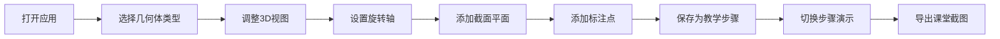

## 1. 产品概述
面向初中数学教师的3D交互式几何教学工具，解决传统几何教学中立体图形可视化难、学生空间想象能力培养难的问题。通过可拖拽的3D几何体、旋转轴、截面平面的交互式操作，帮助学生直观理解旋转、对称、截面等几何概念。

## 2. 核心功能

### 2.1 用户角色
| 角色 | 注册方式 | 核心权限 |
|------|----------|----------|
| 教师用户 | 无需注册，本地使用 | 创建/编辑几何体、保存场景、导出截图、管理题目步骤 |

### 2.2 功能模块
1. **3D几何场景**: 几何体渲染、旋转交互、截面切割、标注点展示
2. **参数控制面板**: 几何体选择、旋转轴设置、截面平面调整、标注点管理
3. **题目步骤管理**: 步骤添加、编辑、切换、保存
4. **场景管理**: 场景保存、加载、历史痕迹记录
5. **截图导出**: 当前视图截图、带标注导出

### 2.3 页面详情
| 页面名称 | 模块名称 | 功能描述 |
|---------|---------|----------|
| 主页面 | 3D视口 | 展示3D几何体，支持拖拽旋转、缩放、平移 |
| 主页面 | 左侧工具栏 | 几何体选择器、操作模式切换（选择/旋转/切割/标注） |
| 主页面 | 右侧属性面板 | 当前选中对象参数调整、旋转角度控制、截面参数 |
| 主页面 | 底部步骤栏 | 题目步骤列表、步骤切换、添加/编辑/删除步骤 |
| 主页面 | 顶部菜单栏 | 场景保存/加载、截图导出、帮助说明 |

## 3. 核心流程

## 4. 用户界面设计

### 4.1 设计风格
- 主色调：深蓝 `#1e3a8a`（学术稳重），辅助色：青蓝 `#0ea5e9`（科技感），警示色：橙红 `#f97316`（错误提示）
- 按钮风格：圆角8px，悬停有轻微上浮效果
- 字体：思源黑体（清晰易读，教学场景），标题20px，正文14px
- 布局风格：三栏布局（左工具、中3D视口、右属性面板
- 图标风格：线性简洁图标，配合几何图形符号

### 4.2 页面设计概述
| 页面名称 | 模块名称 | UI元素 |
|---------|---------|--------|
| 主页面 | 3D视口 | 深色背景、网格参考线、坐标轴指示器、选中高亮、错误状态红色边框提示 |
| 主页面 | 左侧工具栏 | 图标按钮组、工具提示、选中状态高亮 |
| 主页面 | 右侧属性面板 | 折叠面板、滑块控件、数值输入框、颜色选择器 |
| 主页面 | 底部步骤栏 | 卡片式步骤列表、步骤序号、激活状态高亮 |
| 主页面 | 顶部菜单栏 | 下拉菜单、快捷键提示 |

### 4.3 响应式
桌面端优先，平板适配，移动端简化功能

### 4.4 3D场景指引
- 环境：中性灰色背景 `#1a1a2e`，柔和环境光 + 方向光
- 光照：两盏方向光（主光+补光）+ 环境光
- 相机：透视相机，初始距离适中，可环绕观察
- 交互：鼠标左键旋转、滚轮缩放、右键平移
- 动画：平滑过渡动画0.3秒
- 后处理：抗锯齿、柔和阴影
- 资源：程序化生成几何体，无外部模型依赖
