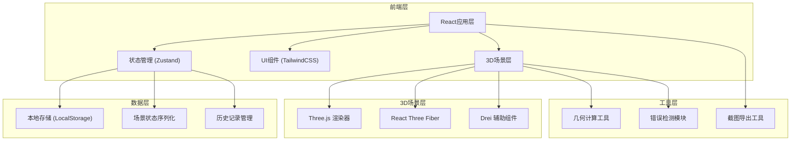

## 1. 架构设计



## 2. 技术描述
- 前端: React@18 + TypeScript + Vite
- 3D引擎: three@0.160 + @react-three/fiber@8 + @react-three/drei@9
- 状态管理: zustand@4
- 样式: tailwindcss@3 + framer-motion
- 存储: LocalStorage (场景数据) + Blob (截图)
- 无后端，纯前端应用

## 3. 路由定义
| 路由 | 用途 |
|------|------|
| / | 主应用页面（3D视口 + 控制面板） |

## 4. 数据模型

### 4.1 场景数据模型

```typescript
interface GeometryObject {
  id: string;
  type: 'cube' | 'pyramid' | 'cylinder' | 'cone' | 'sphere' | 'prism' | 'custom';
  position: [number, number, number];
  rotation: [number, number, number];
  scale: [number, number, number];
  color: string;
  opacity: number;
  visible: boolean;
}

interface RotationAxis {
  id: string;
  type: 'x' | 'y' | 'z' | 'custom';
  startPoint: [number, number, number];
  endPoint: [number, number, number];
  visible: boolean;
  draggable: boolean;
}

interface SectionPlane {
  id: string;
  position: [number, number, number];
  normal: [number, number, number];
  visible: boolean;
  showIntersection: boolean;
  intersectionColor: string;
}

interface AnnotationPoint {
  id: string;
  position: [number, number, number];
  label: string;
  color: string;
  connectedTo?: string; // 连接到几何体ID
}

interface ProblemStep {
  id: string;
  stepNumber: number;
  title: string;
  description: string;
  sceneSnapshot: SceneState;
  isActive: boolean;
}

interface SceneState {
  geometries: GeometryObject[];
  rotationAxes: RotationAxis[];
  sectionPlanes: SectionPlane[];
  annotations: AnnotationPoint[];
  camera: {
    position: [number, number, number];
    target: [number, number, number];
  };
}

interface ScenarioRecord {
  id: string;
  name: string;
  description: string;
  type: 'normal' | 'boundary' | 'error';
  createdAt: string;
  modifiedAt: string;
  scene: SceneState;
  steps: ProblemStep[];
  revisionHistory: RevisionEntry[];
}

interface RevisionEntry {
  timestamp: string;
  userId: string;
  action: string;
  description: string;
  previousState?: SceneState;
}
```

### 4.2 错误检测数据模型

```typescript
interface ValidationResult {
  isValid: boolean;
  errors: ValidationError[];
  warnings: ValidationWarning[];
}

interface ValidationError {
  type: 'section_missing' | 'angle_out_of_bounds' | 'annotation_misplaced';
  severity: 'error' | 'warning';
  message: string;
  objectId?: string;
  suggestion: string;
}
```

### 4.3 预置样例数据

```typescript
const SAMPLE_RECORDS: ScenarioRecord[] = [
  {
    id: 'sample-normal',
    name: '正方体截面演示',
    description: '正常的正方体截面教学演示，展示如何用平面切割正方体得到三角形截面',
    type: 'normal',
    // ... 完整场景数据
  },
  {
    id: 'sample-boundary',
    name: '旋转角度边界测试',
    description: '边界情况：旋转角度接近360度极限值，用于测试角度越界检测',
    type: 'boundary',
    // ... 边界场景数据
  },
  {
    id: 'sample-error',
    name: '截面丢失演示',
    description: '错误案例：截面平面与几何体无交点，触发错误提示',
    type: 'error',
    // ... 错误场景数据
  }
];
```
