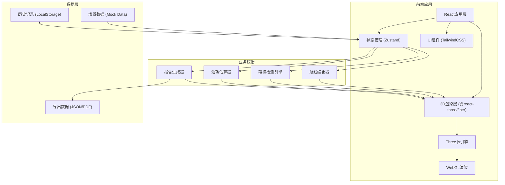

# 航空科普3D航线规划系统 - 技术架构

## 1. 架构设计



## 2. 技术选型描述

- **前端框架**: React 18 + TypeScript
- **构建工具**: Vite 5
- **3D引擎**: Three.js r160
- **React 3D封装**: @react-three/fiber 8, @react-three/drei 9
- **后期处理**: @react-three/postprocessing 2
- **状态管理**: Zustand 4
- **样式方案**: TailwindCSS 3
- **路由管理**: React Router 6
- **图标库**: Lucide React
- **数据持久化**: LocalStorage
- **导出功能**: jsPDF (PDF生成)

## 3. 目录结构

```
src/
├── components/           # React UI组件
│   ├── Toolbar.tsx       # 顶部工具栏
│   ├── InfoPanel.tsx     # 右侧信息面板
│   ├── WarningList.tsx   # 警告列表
│   ├── FlightReport.tsx  # 飞行报告预览
│   └── HistoryPanel.tsx  # 历史记录面板
├── three/                # 3D场景组件
│   ├── Earth.tsx         # 地球模型
│   ├── Route.tsx         # 航线渲染
│   ├── Waypoint.tsx      # 航点标记
│   ├── StormCloud.tsx    # 雷暴云团
│   ├── NoFlyZone.tsx     # 禁飞区
│   ├── Airport.tsx       # 机场标记
│   └── Scene.tsx         # 主场景
├── store/                # 状态管理
│   ├── useFlightStore.ts # 飞行数据store
│   └── useHistoryStore.ts # 历史记录store
├── engine/               # 业务逻辑引擎
│   ├── collision.ts      # 碰撞检测
│   ├── fuelCalculator.ts # 油耗计算
│   └── routeValidator.ts # 航线验证
├── data/                 # Mock数据
│   ├── airports.ts       # 机场数据
│   ├── storms.ts         # 雷暴数据
│   └── noFlyZones.ts     # 禁飞区数据
├── types/                # TypeScript类型定义
│   └── index.ts
├── utils/                # 工具函数
│   ├── geo.ts            # 地理计算
│   └── export.ts         # 导出工具
├── App.tsx
├── main.tsx
└── index.css
```

## 4. 路由定义

| 路由 | 页面/组件 | 功能说明 |
|-------|---------|---------|
| `/` | MainScene | 主3D场景页，包含航线编辑器 |
| `/history` | HistoryView | 历史记录列表与版本对比 |
| `/report/:id` | ReportView | 飞行报告预览与导出 |

## 5. 数据模型

### 5.1 核心数据类型

```typescript
// 航点
interface Waypoint {
  id: string;
  name: string;
  lat: number;      // 纬度
  lng: number;      // 经度
  alt: number;      // 海拔(米)
  type: 'airport' | 'waypoint' | 'alternate';
  iataCode?: string;
  isAlternate?: boolean;
}

// 雷暴云团
interface StormCloud {
  id: string;
  name: string;
  centerLat: number;
  centerLng: number;
  radius: number;    // 影响半径(公里)
  topAlt: number;    // 云顶高度(米)
  bottomAlt: number; // 云底高度(米)
  intensity: 'light' | 'moderate' | 'severe';
  forecastTime: string;
  dataSource: string;
}

// 禁飞区
interface NoFlyZone {
  id: string;
  name: string;
  type: 'restricted' | 'prohibited' | 'danger';
  polygon: Array<{lat: number; lng: number}>;
  minAlt: number;
  maxAlt: number;
  effectiveFrom: string;
  effectiveTo: string;
  dataSource: string;
}

// 航线
interface FlightRoute {
  id: string;
  name: string;
  waypoints: Waypoint[];
  cruiseAlt: number;    // 巡航高度(米)
  aircraftType: string;
  createdAt: string;
  updatedAt: string;
}

// 碰撞检测结果
interface CollisionResult {
  hasCollision: boolean;
  violations: Violation[];
}

interface Violation {
  type: 'storm' | 'noflyzone';
  severity: 'warning' | 'danger';
  message: string;
  location?: {lat: number; lng: number};
  affectedSegment?: [number, number]; // 受影响的航线段索引
}

// 油耗结果
interface FuelResult {
  totalDistance: number;      // 总距离(公里)
  totalFuel: number;          // 总油耗(吨)
  flightTime: number;         // 飞行时间(小时)
  fuelCapacity: number;       // 油箱容量(吨)
  isOverLimit: boolean;
  reserveFuel: number;        // 储备燃油(吨)
}

// 飞行报告
interface FlightReport {
  id: string;
  routeId: string;
  createdAt: string;
  route: FlightRoute;
  collisionResult: CollisionResult;
  fuelResult: FuelResult;
  hasAlternate: boolean;
  recommendations: string[];
  overallStatus: 'safe' | 'warning' | 'danger';
}

// 历史记录
interface HistoryRecord {
  id: string;
  timestamp: string;
  action: 'create' | 'update' | 'delete' | 'save';
  description: string;
  routeSnapshot: FlightRoute;
  operator: string;
}
```

### 5.2 Mock数据示例

```typescript
// 机场数据
export const airports: Waypoint[] = [
  {
    id: 'pek',
    name: '北京首都国际机场',
    lat: 40.0799,
    lng: 116.6031,
    alt: 35,
    type: 'airport',
    iataCode: 'PEK'
  },
  {
    id: 'sha',
    name: '上海虹桥国际机场',
    lat: 31.1979,
    lng: 121.3363,
    alt: 4,
    type: 'airport',
    iataCode: 'SHA'
  }
];

// 雷暴数据
export const storms: StormCloud[] = [
  {
    id: 'storm-001',
    name: '华东雷暴云团#01',
    centerLat: 32.5,
    centerLng: 118.0,
    radius: 120,
    topAlt: 12000,
    bottomAlt: 500,
    intensity: 'severe',
    forecastTime: '2026-05-27 14:00:00',
    dataSource: '中国气象局气象卫星数据'
  }
];
```

## 6. 核心算法说明

### 6.1 碰撞检测算法

1. **航线-雷暴云团检测**：
   - 将航线离散化为多个采样点
   - 对每个采样点，计算与雷暴中心的大圆距离
   - 判断采样点高度是否在云团高度范围内
   - 若距离小于半径且高度在范围内，则判定为穿云

2. **航线-禁飞区检测**：
   - 将航线采样点投影到二维平面
   - 使用射线法判断采样点是否在禁飞区多边形内
   - 检查采样点高度是否在禁飞区高度范围内

### 6.2 油耗估算算法

```
基础油耗公式：
燃油消耗率 (kg/h) = 推力 * 燃油消耗率系数
总飞行时间 = 大圆距离 / 巡航速度
总油耗 = 燃油消耗率 * 飞行时间 * 1.1 (含10%储备)
```

### 6.3 地理计算

- 使用Haversine公式计算两点间大圆距离
- 支持坐标与三维空间位置的相互转换

## 7. 性能优化策略

1. **3D渲染优化**：
   - 使用InstancedMesh渲染大量航点/机场标记
   - 航线使用LineSegments减少绘制调用
   - 云团使用ShaderMaterial实现体积光效果，避免真实体积渲染开销

2. **碰撞检测优化**：
   - 使用空间划分（四叉树）加速障碍物查询
   - 节流检测频率，避免每帧计算

3. **内存管理**：
   - 历史记录设置最大条数限制（默认50条）
   - 旧版本数据自动清理

## 8. 导出功能

支持两种导出格式：
1. **JSON格式**：完整导出航线数据、检测结果、报告内容，可重新导入
2. **PDF格式**：格式化飞行报告，包含航线图、参数表、警告信息、优化建议
