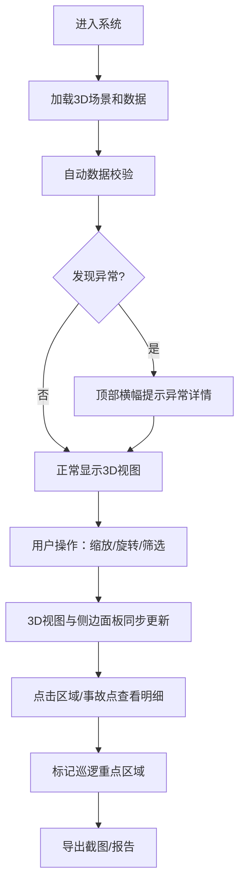

## 1. 产品概述

滑雪坡度风险图是面向雪场运营团队的Web3D交互式可视化工具，通过整合雪道地形、坡度分级、积雪深度、人流热力、事故点位和巡逻报告等多源数据，提供直观的风险评估视图，帮助运营人员精准安排巡逻资源，降低安全事故发生率。

- 核心解决问题：传统雪场安全管理依赖人工经验判断，坡度/人流/事故数据分散，风险识别滞后且容易漏判
- 目标用户：雪场安全主管、巡逻队调度员、运营经理
- 产品价值：将多源数据融合到统一3D视图，实现风险可视化、决策数据化、调度精准化

## 2. 核心功能

### 2.1 用户角色

| 角色 | 注册方式 | 核心权限 |
|------|----------|----------|
| 安全主管 | 系统账号登录 | 查看全局风险、导出报告、配置参数 |
| 巡逻调度员 | 系统账号登录 | 筛选区域、查看明细、标记巡逻点 |
| 运营经理 | 系统账号登录 | 查看历史数据、对比分析 |

### 2.2 功能模块

1. **3D地形主视图**：雪道地形模型、坡度颜色映射、积雪深度渲染、人流热力叠加
2. **侧边明细面板**：筛选条件、选中区域详情、事故点列表、巡逻报告
3. **风险高亮系统**：高风险区域闪烁标记、异常数据预警提示
4. **数据校验模块**：坡度颜色校验、轨迹重叠检测、事故点漏筛提醒
5. **历史追溯模块**：数据来源记录、修正痕迹保存、版本对比
6. **导出功能**：截图导出、数据报告导出

### 2.3 页面详情

| 页面名称 | 模块名称 | 功能描述 |
|---------|---------|----------|
| 主视图页面 | 3D场景渲染 | Three.js渲染雪道地形，支持缩放、旋转、拖拽平移 |
| 主视图页面 | 热力叠加层 | Canvas纹理实现人流密度热力图，可调节透明度 |
| 主视图页面 | 风险标记 | 高风险区域红色闪烁，事故点图标标记 |
| 侧边面板 | 筛选控件 | 按雪道、坡度等级、积雪深度、时间段筛选 |
| 侧边面板 | 区域详情 | 选中区域后显示坡度分布、积雪数据、人流统计 |
| 侧边面板 | 事故列表 | 显示筛选范围内的事故记录，点击定位到3D场景 |
| 侧边面板 | 数据校验 | 显示异常检测结果：颜色反转、轨迹重叠、漏筛提醒 |
| 历史记录页 | 版本列表 | 按时间展示数据版本，支持对比查看 |
| 历史记录页 | 修正痕迹 | 显示每次数据修正的内容、操作人、时间 |

## 3. 核心流程

用户进入系统后，默认加载最新的雪场3D视图和综合风险评估。用户可以通过筛选条件缩小关注范围，点击雪道区域查看详细数据。系统自动校验数据完整性，发现异常时在顶部横幅提示。巡逻调度员可根据风险等级标记巡逻重点区域，最后导出截图或报告存档。

## 4. 用户界面设计

### 4.1 设计风格

- **主色调**：深邃冰蓝 (#0A2463) 作为背景主色，体现冰雪环境
- **风险色系**：安全绿 (#2EC4B6) → 注意黄 (#FFE66D) → 警告橙 (#FF9F1C) → 危险红 (#E71D36) 四级梯度
- **辅助色**：冰雪白 (#F7FFF7)、深灰 (#1A1A2E)
- **字体**：标题使用 Noto Sans SC Bold，正文使用 Inter Regular，数字使用 JetBrains Mono
- **布局**：左侧固定筛选面板（320px），右侧3D场景全宽，顶部状态栏，底部时间轴
- **按钮风格**：微玻璃拟态（半透明背景 + 模糊 + 细边框），悬停时轻微上浮
- **图标**：使用 Lucide 线性图标，保持简约专业风格

### 4.2 页面设计概述

| 页面名称 | 模块名称 | UI Elements |
|---------|---------|-------------|
| 主视图页 | 顶部状态栏 | 雪场名称、当前时间、数据版本号、校验状态徽章、导出按钮 |
| 主视图页 | 左侧筛选面板 | 雪道多选、坡度滑块、积雪深度滑块、时间范围选择器、图例说明 |
| 主视图页 | 3D场景区 | 地形模型、热力叠加、风险标记、相机控制按钮 |
| 主视图页 | 右侧详情抽屉 | 区域统计卡片、事故列表、巡逻建议 |
| 主视图页 | 底部时间轴 | 24小时人流变化曲线，可拖动选择时间段 |
| 历史记录页 | 版本列表 | 卡片式时间线，显示每次数据更新的内容摘要 |
| 历史记录页 | 对比视图 | 左右分屏对比两个版本的3D视图差异 |

### 4.3 响应式设计

- 桌面端（≥1280px）：左侧固定面板 + 右侧3D场景的标准布局
- 平板端（768px-1280px）：筛选面板改为可折叠抽屉，3D场景全屏
- 移动端（<768px）：简化3D场景交互，优先展示数据列表和风险提示

### 4.4 3D场景指引

- **环境**：HDRI 晴天雪地环境，柔和自然光，避免过强阴影
- **光照**：半球光（天空蓝 + 雪地白）+ 方向光模拟太阳光，雪面使用轻微高光
- **相机**：默认45°俯视角度，支持轨道控制，限制最小/最大缩放距离
- **地形渲染**：雪道使用白色带微颗粒感材质，非雪道区域使用深灰色岩石材质
- **坡度着色**：使用顶点着色器根据坡度动态混合颜色，过渡平滑
- **热力叠加**：使用 CustomShaderMaterial 实现透明热力纹理叠加
- **风险标记**：事故点使用闪烁的发光球体，高风险区域使用脉动边框
- **性能预算**：三角形数量控制在50万以内，帧率不低于30fps
