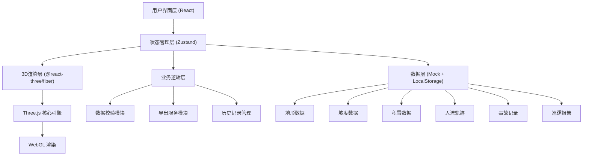

## 1. 架构设计



## 2. 技术描述

- **前端框架**：React@18 + TypeScript + Vite
- **3D引擎**：Three.js + @react-three/fiber + @react-three/drei
- **后处理**：@react-three/postprocessing（Bloom发光效果）
- **状态管理**：Zustand（轻量级，适合跨组件同步3D和UI状态）
- **样式方案**：TailwindCSS@3
- **UI组件**：自定义组件 + Lucide React 图标
- **数据存储**：Mock数据 + LocalStorage（历史记录持久化）
- **图表库**：Recharts（人流时间轴、坡度分布）
- **导出功能**：html2canvas + three.js截图
- **代码规范**：ESLint + Prettier

## 3. 目录结构

```
src/
├── components/
│   ├── layout/              # 布局组件
│   │   ├── Header.tsx       # 顶部状态栏
│   │   ├── Sidebar.tsx      # 左侧筛选面板
│   │   ├── DetailDrawer.tsx # 右侧详情抽屉
│   │   └── Timeline.tsx     # 底部时间轴
│   ├── three/               # 3D场景组件
│   │   ├── Scene.tsx        # 主场景容器
│   │   ├── Terrain.tsx      # 地形模型
│   │   ├── SlopeColors.tsx  # 坡度着色
│   │   ├── Heatmap.tsx      # 热力叠加层
│   │   ├── RiskMarkers.tsx  # 风险标记
│   │   └── CameraControls.tsx
│   ├── ui/                  # 通用UI组件
│   │   ├── Badge.tsx
│   │   ├── Button.tsx
│   │   ├── Slider.tsx
│   │   └── AlertBanner.tsx
│   └── charts/              # 图表组件
│       ├── SlopeChart.tsx
│       └── FlowTimeline.tsx
├── store/                   # Zustand状态管理
│   ├── useSceneStore.ts     # 3D场景状态
│   ├── useFilterStore.ts    # 筛选条件状态
│   └── useHistoryStore.ts   # 历史记录状态
├── data/                    # Mock数据
│   ├── terrain.ts           # 地形高度数据
│   ├── slopes.ts            # 坡度分级
│   ├── snowfall.ts          # 积雪深度
│   ├── trajectories.ts      # 人流轨迹
│   ├── accidents.ts         # 事故记录
│   └── patrols.ts           # 巡逻报告
├── services/                # 业务服务
│   ├── dataValidator.ts     # 数据校验服务
│   ├── exporter.ts          # 导出服务
│   └── historyManager.ts    # 历史管理服务
├── types/                   # TypeScript类型定义
│   ├── index.ts
│   └── three.d.ts
├── utils/                   # 工具函数
│   ├── color.ts             # 颜色处理
│   ├── geometry.ts          # 几何计算
│   └── storage.ts           # 本地存储
├── App.tsx
├── main.tsx
└── index.css
```

## 4. 路由定义

| 路由 | 用途 |
|-----|------|
| / | 主视图页面（3D场景 + 筛选 + 详情） |
| /history | 历史记录页面（版本列表 + 对比视图） |

## 5. 状态管理设计

### 5.1 场景状态 (useSceneStore)
```typescript
interface SceneState {
  cameraPosition: [number, number, number];
  selectedArea: Area | null;
  selectedAccident: Accident | null;
  heatmapOpacity: number;
  showRiskMarkers: boolean;
  showSlopeColors: boolean;
  validationErrors: ValidationError[];
  setCameraPosition: (pos: [number, number, number]) => void;
  selectArea: (area: Area | null) => void;
  selectAccident: (accident: Accident | null) => void;
}
```

### 5.2 筛选状态 (useFilterStore)
```typescript
interface FilterState {
  selectedSlopes: string[];
  slopeRange: [number, number];
  snowDepthRange: [number, number];
  timeRange: [Date, Date];
  riskLevels: RiskLevel[];
  setSelectedSlopes: (slopes: string[]) => void;
  setSlopeRange: (range: [number, number]) => void;
  applyFilters: () => void;
}
```

### 5.3 历史状态 (useHistoryStore)
```typescript
interface HistoryState {
  versions: DataVersion[];
  currentVersion: string;
  compareVersion: string | null;
  createVersion: (data: VersionData) => void;
  loadVersion: (id: string) => void;
  setCompareVersion: (id: string | null) => void;
}
```

## 6. 数据模型

### 6.1 核心数据实体

```mermaid
erDiagram
    SLOPE ||--o{ ACCIDENT : contains
    SLOPE ||--o{ TRAJECTORY : has
    SLOPE ||--o{ PATROL_REPORT : "patrolled by"
    SLOPE {
        string id
        string name
        number[] heightMap
        number averageSlope
        string difficulty
    }
    ACCIDENT {
        string id
        string slopeId
        [number, number, number] position
        string type
        Date time
        string severity
        string reporter
    }
    TRAJECTORY {
        string id
        string slopeId
        [number, number, number][] points
        Date startTime
        Date endTime
        number speed
    }
    PATROL_REPORT {
        string id
        string slopeId
        Date time
        string condition
        string notes
        string patrolId
    }
    DATA_VERSION {
        string id
        Date timestamp
        string source
        string changeLog
        object dataSnapshot
    }
```

### 6.2 数据校验规则

**坡度颜色校验**：
- 检查颜色映射是否与坡度等级对应（绿→低坡度，红→高坡度）
- 检测相邻区域颜色是否有异常跳变

**轨迹重叠检测**：
- 计算轨迹点之间的空间距离
- 同一时间段同一区域轨迹密度超过阈值则警告

**事故点漏筛提醒**：
- 检查筛选条件是否排除了高风险事故点
- 对比历史同期事故发生率，异常偏低时提醒

## 7. 核心交互流程

### 7.1 筛选联动流程
1. 用户在侧边面板调整筛选条件
2. FilterStore 更新状态并触发 applyFilters
3. SceneStore 接收新的筛选条件，更新3D场景可见性
4. 侧边详情面板根据筛选结果重新统计数据
5. 数据校验模块重新运行，更新异常提示

### 7.2 3D点击交互流程
1. 用户点击3D场景中的雪道/事故点
2. Raycaster 检测命中对象
3. SceneStore 更新 selectedArea/selectedAccident
4. 右侧详情抽屉滑出，显示对应数据
5. 相机平滑移动到选中位置

### 7.3 历史版本对比流程
1. 用户进入历史记录页，选择两个版本
2. HistoryStore 加载两个版本的数据快照
3. 左右分屏渲染两个3D场景
4. 差异对比模块高亮显示变化的区域
