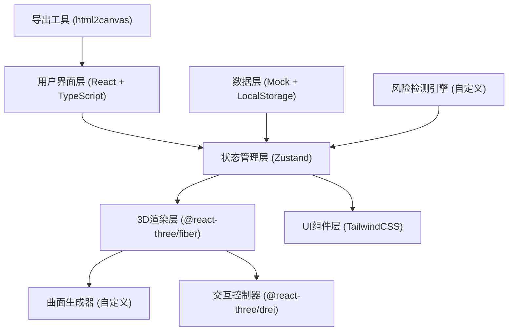

## 1. 架构设计



## 2. 技术描述

- **前端框架**：React@18 + TypeScript@5 + Vite@5
- **样式方案**：TailwindCSS@3.4
- **3D渲染**：three@0.160 + @react-three/fiber@8.15 + @react-three/drei@9.92 + @react-three/postprocessing@2.15
- **状态管理**：Zustand@4.5
- **图表辅助**：recharts@2.10（用于2D辅助图表）
- **数据持久化**：LocalStorage
- **导出功能**：html2canvas@1.4
- **图标**：lucide-react@0.294

## 3. 数据模型

### 3.1 核心数据结构

```typescript
// 项目基础信息
interface Project {
  id: string;
  name: string;
  startDate: string;
  endDate: string;
  totalBudget: number;
  createdAt: string;
  updatedAt: string;
}

// 预算计划
interface BudgetPlan {
  id: string;
  projectId: string;
  date: string;
  plannedBudget: number;
  category: string;
  owner: string;
  source: string;
  createdAt: string;
}

// 支出流水
interface Expense {
  id: string;
  projectId: string;
  date: string;
  amount: number;
  category: string;
  description: string;
  owner: string;
  source: string;
  isDuplicate?: boolean;
  revisionHistory: Revision[];
  createdAt: string;
}

// 收入预测
interface RevenueForecast {
  id: string;
  projectId: string;
  date: string;
  forecastAmount: number;
  actualAmount?: number;
  description: string;
  owner: string;
  source: string;
  isDelayed?: boolean;
  expectedDate?: string;
  revisionHistory: Revision[];
  createdAt: string;
}

// 里程碑
interface Milestone {
  id: string;
  projectId: string;
  name: string;
  plannedDate: string;
  actualDate?: string;
  status: 'pending' | 'completed' | 'delayed' | 'at_risk';
  owner: string;
  description: string;
  createdAt: string;
}

// 负责人
interface Owner {
  id: string;
  name: string;
  avatar: string;
  role: string;
}

// 修正历史
interface Revision {
  id: string;
  timestamp: string;
  field: string;
  oldValue: any;
  newValue: any;
  reason: string;
  operator: string;
}

// 风险项
interface Risk {
  id: string;
  type: 'revenue_delay' | 'expense_duplicate' | 'milestone_misalignment' | 'budget_overrun';
  severity: 'low' | 'medium' | 'high' | 'critical';
  relatedItemId: string;
  relatedItemType: 'expense' | 'revenue' | 'milestone';
  description: string;
  detectedAt: string;
  resolved: boolean;
}

// 燃尽数据点（用于3D曲面）
interface BurnDataPoint {
  date: string;
  budget: number;
  actualSpent: number;
  forecastRevenue: number;
  risks: Risk[];
}
```

## 4. 模块划分

```
src/
├── components/
│   ├── ThreeD/               # 3D相关组件
│   │   ├── BurnSurface.tsx   # 燃尽曲面主组件
│   │   ├── SurfaceGeometry.ts # 曲面几何体生成
│   │   ├── RiskMarker.tsx    # 风险标记组件
│   │   ├── Axis.tsx          # 坐标轴组件
│   │   └── GroundGrid.tsx    # 地面网格
│   ├── Layout/               # 布局组件
│   │   ├── Header.tsx        # 顶部工具栏
│   │   ├── LeftPanel.tsx     # 左侧风险面板
│   │   ├── RightPanel.tsx    # 右侧明细面板
│   │   └── Timeline.tsx      # 底部时间轴
│   ├── UI/                   # 通用UI组件
│   │   ├── RiskCard.tsx      # 风险卡片
│   │   ├── DataTable.tsx     # 数据表格
│   │   ├── OwnerFilter.tsx   # 负责人筛选器
│   │   └── TimeSlider.tsx    # 时间滑块
│   └── Charts/               # 2D辅助图表
├── store/                    # 状态管理
│   ├── useProjectStore.ts    # 项目数据store
│   ├── useViewStore.ts       # 视图状态store
│   └── useRiskStore.ts       # 风险检测store
├── utils/                    # 工具函数
│   ├── riskDetector.ts       # 风险检测引擎
│   ├── surfaceGenerator.ts   # 曲面数据生成器
│   ├── dataImporter.ts       # 数据导入工具
│   └── exporter.ts           # 导出工具
├── data/                     # Mock数据
│   ├── mockProject.ts
│   ├── mockExpenses.ts
│   ├── mockRevenues.ts
│   └── mockMilestones.ts
├── types/                    # TypeScript类型定义
│   └── index.ts
├── App.tsx
├── main.tsx
└── index.css
```

## 5. 核心算法

### 5.1 风险检测引擎
1. **收入延期检测**：比较预测日期与当前日期，检查actualAmount是否缺失
2. **支出重复检测**：基于金额、日期、描述的相似度算法识别重复支出
3. **里程碑错位检测**：比较里程碑计划日期与实际完成日期
4. **预算超支检测**：实时计算累计支出与预算线的偏差率

### 5.2 3D曲面生成
1. 将时间轴作为X轴，金额作为Y轴，数据类别作为Z轴
2. 使用Catmull-Rom样条曲线平滑连接数据点
3. 生成曲面网格并应用顶点颜色渐变
4. 支持根据风险级别动态调整曲面颜色透明度

## 6. 状态管理设计

```typescript
// useProjectStore - 项目核心数据
- project: Project | null
- budgetPlans: BudgetPlan[]
- expenses: Expense[]
- revenues: RevenueForecast[]
- milestones: Milestone[]
- owners: Owner[]
- actions: loadData, addExpense, updateRevenue, addRevision

// useViewStore - 视图状态
- timeSlice: number  // 当前时间切片位置 0-1
- selectedOwnerId: string | null
- selectedDataPoint: BurnDataPoint | null
- cameraPosition: [number, number, number]
- isPlaying: boolean  // 时间轴播放状态
- actions: setTimeSlice, setSelectedOwner, setSelectedPoint, togglePlay

// useRiskStore - 风险状态
- risks: Risk[]
- selectedRiskId: string | null
- actions: detectRisks, resolveRisk, selectRisk
```
