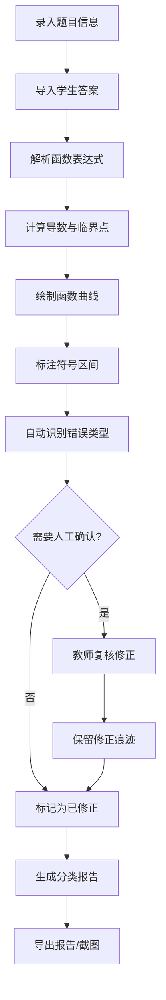

# 微积分错题曲线器 - 产品需求文档

## 1. 产品概述

微积分错题曲线器是专为数学教师设计的函数极值错题分析工具，帮助教师批量批改学生的微积分题目，通过可视化曲线展示导数符号与函数变化的对应关系，自动标记常见错误并生成可下载的分析报告。

- **核心价值**：将抽象的导数概念具象化，帮助学生理解函数极值与导数符号的关系
- **目标用户**：高中/大学数学教师、微积分学习者
- **解决问题**：人工批改效率低、学生难以理解导数与曲线变化的对应关系、常见错误（定义域遗漏、不可导点、极值拐点混淆）难以系统标注

## 2. 核心功能

### 2.1 用户角色

| 角色 | 注册方式 | 核心权限 |
|------|----------|----------|
| 教师用户 | 无需注册，直接使用 | 录入题目、批量分析、导出报告、查看错题详情 |

### 2.2 功能模块

1. **题目录入页**：函数表达式输入、定义域设置、临界点标注、学生答案上传、讲评截图导入
2. **曲线分析页**：函数图像绘制、导数符号区间可视化、临界点/极值点/拐点标注
3. **错因分析页**：错误类型识别、修正痕迹保留、异常情况高亮提示
4. **报告导出页**：分类统计（未处理/已修正/待确认）、图表导出、报告下载

### 2.3 页面详情

| 页面名称 | 模块名称 | 功能描述 |
|---------|----------|----------|
| 题目录入页 | 表达式解析器 | 支持数学表达式输入，实时语法校验，自动计算导数 |
| 题目录入页 | 定义域设置 | 区间输入、端点检查、特殊点标记（不可导点） |
| 题目录入页 | 学生答案管理 | 批量导入学生答案，支持手动输入和文件上传 |
| 曲线分析页 | 函数曲线绘制 | SVG/Canvas 绘制函数图像，支持缩放和拖拽 |
| 曲线分析页 | 符号区间展示 | 用颜色区分导数正负区间，直观显示单调性 |
| 曲线分析页 | 关键点标注 | 自动标注极值点、拐点、不可导点，支持交互查看 |
| 错因分析页 | 错误类型识别 | 自动检测定义域遗漏、不可导点忽略、极值拐点混淆等常见错误 |
| 错因分析页 | 修正痕迹管理 | 保留每次修改记录，支持版本回溯和对比 |
| 错因分析页 | 异常提示系统 | 红色高亮异常情况，提供详细解释和教学建议 |
| 报告导出页 | 分类统计 | 按未处理、已修正、待确认三类统计题目数量和详情 |
| 报告导出页 | 图表导出 | 支持导出曲线图为图片，嵌入报告 |
| 报告导出页 | 报告下载 | 生成 PDF/HTML 格式的完整分析报告 |

## 3. 核心流程

### 3.1 用户操作流程

教师录入题目信息（函数表达式、定义域、标准答案）→ 导入学生答案 → 系统自动计算并绘制曲线 → 系统识别常见错误并标注 → 教师人工复核修正 → 生成分类报告 → 导出报告分享给学生

### 3.2 流程图

## 4. 用户界面设计

### 4.1 设计风格

- **主色调**：深蓝 (#1e3a8a) - 代表学术严谨性
- **辅助色**：青绿 (#0d9488) - 代表正确/递增区间；红色 (#dc2626) - 代表错误/异常
- **中性色**：深灰 (#1f2937) 文本，浅灰 (#f3f4f6) 背景
- **按钮风格**：圆角矩形，微阴影，悬停时有轻微上浮效果
- **字体**：标题使用 'Noto Serif SC'（学术感），正文使用 'Noto Sans SC'（易读性）
- **布局风格**：左右分栏（左侧控制面板，右侧可视化区域），卡片式信息组织
- **图标风格**：线性图标，简洁数学符号

### 4.2 页面设计概述

| 页面名称 | 模块名称 | UI 元素 |
|---------|----------|---------|
| 题目录入页 | 表达式输入区 | LaTeX 预览，语法高亮，实时错误提示 |
| 题目录入页 | 定义域设置 | 区间滑块，端点输入框，特殊点添加按钮 |
| 曲线分析页 | 曲线绘制区 | SVG 画布，网格背景，图例说明 |
| 曲线分析页 | 关键点面板 | 可折叠卡片，颜色编码，点击高亮对应点 |
| 错因分析页 | 错误列表 | 时间线布局，修正痕迹对比，颜色区分状态 |
| 错因分析页 | 提示卡片 | 警告图标，详细说明，教学建议链接 |
| 报告导出页 | 统计面板 | 三色卡片（未处理/已修正/待确认），环形统计图 |
| 报告导出页 | 导出选项 | 格式选择，预览按钮，下载进度条 |

### 4.3 响应式

- **桌面优先**：主布局为左右分栏（30% 控制面板，70% 可视化区域）
- **平板适配**：上下布局，控制面板在上，可视化区域在下
- **移动端**：简化功能，重点展示曲线和分析结果，支持横向滚动查看大图

### 4.4 交互细节

- 曲线悬停显示坐标点和导数数值
- 错误点点击展开详细分析
- 平滑的页面切换动画
- 输入时的实时验证反馈
