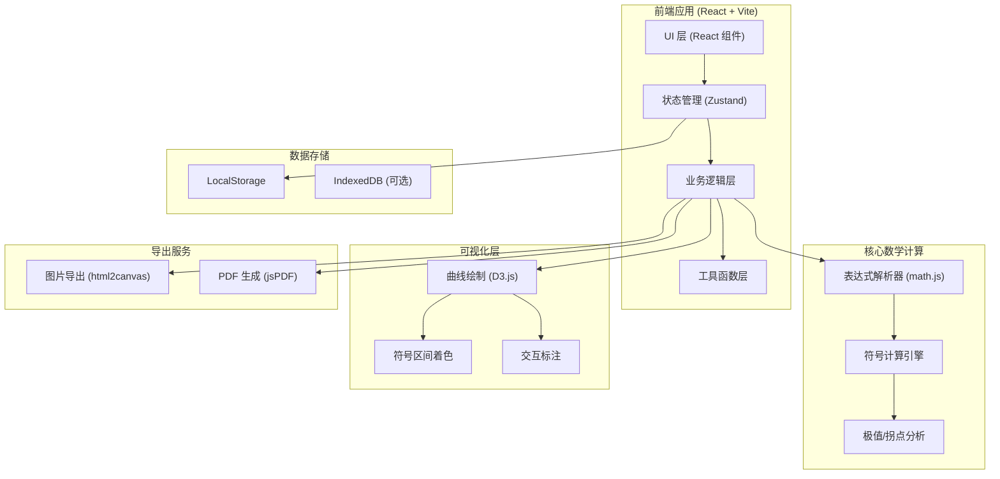
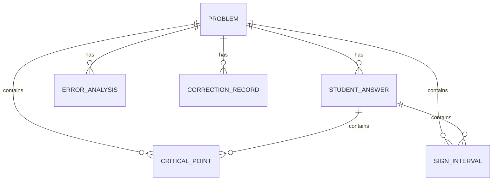

# 微积分错题曲线器 - 技术架构文档

## 1. 架构设计



## 2. 技术栈描述

### 2.1 核心技术

| 类别 | 技术选型 | 版本 | 用途说明 |
|------|----------|------|----------|
| 前端框架 | React | ^18.2.0 | 构建用户界面 |
| 构建工具 | Vite | ^5.0.0 | 快速开发构建 |
| 语言 | TypeScript | ^5.3.0 | 类型安全 |
| 样式方案 | Tailwind CSS | ^3.4.0 | 原子化 CSS |
| 数学计算 | math.js | ^12.0.0 | 表达式解析与数值计算 |
| 数据可视化 | D3.js | ^7.8.0 | 函数曲线绘制 |
| 状态管理 | Zustand | ^4.4.0 | 轻量级状态管理 |
| 图片导出 | html2canvas | ^1.4.0 | 截图导出 |
| PDF 导出 | jsPDF | ^2.5.0 | PDF 报告生成 |
| LaTeX 渲染 | KaTeX | ^0.16.0 | 数学公式渲染 |

### 2.2 初始化方式

使用 Vite 官方模板初始化 React + TypeScript 项目：
```bash
npm create vite@latest calculus-analyzer -- --template react-ts
```

## 3. 路由定义

| 路由路径 | 页面名称 | 主要功能 |
|---------|----------|----------|
| `/` | 首页/仪表盘 | 题目列表概览、快速入口 |
| `/problem/new` | 题目录入页 | 新建题目、输入函数信息 |
| `/problem/:id` | 题目详情页 | 曲线分析、错因标注 |
| `/problem/:id/analyze` | 分析页面 | 详细分析、学生答案对比 |
| `/report` | 报告中心 | 分类统计、报告导出 |

## 4. 核心数据模型

### 4.1 数据结构定义

```typescript
// 题目状态枚举
enum ProblemStatus {
  UNPROCESSED = 'unprocessed',    // 未处理
  CORRECTED = 'corrected',        // 已修正
  NEEDS_REVIEW = 'needs_review'   // 待人工确认
}

// 关键点类型
enum PointType {
  CRITICAL = 'critical',          // 临界点
  MAXIMUM = 'maximum',            // 极大值点
  MINIMUM = 'minimum',            // 极小值点
  INFLECTION = 'inflection',      // 拐点
  NON_DIFFERENTIABLE = 'non_differentiable'  // 不可导点
}

// 错误类型
enum ErrorType {
  DOMAIN_MISSING = 'domain_missing',              // 定义域遗漏
  NON_DIFFERENTIABLE_IGNORED = 'non_diff_ignored', // 不可导点忽略
  EXTREMA_INFLECTION_CONFUSED = 'extrema_inflection_confused', // 极值拐点混淆
  WRONG_SIGN_INTERVAL = 'wrong_sign_interval',    // 符号区间错误
  CALCULATION_ERROR = 'calculation_error'         // 计算错误
}

// 区间接口
interface Interval {
  start: number;
  end: number;
  startInclusive: boolean;
  endInclusive: boolean;
}

// 关键点接口
interface CriticalPoint {
  x: number;
  y: number;
  type: PointType;
  derivativeSign?: 'positive' | 'negative' | 'zero';
  secondDerivativeSign?: 'positive' | 'negative' | 'zero';
  isConfirmed: boolean;
}

// 符号区间接口
interface SignInterval {
  interval: Interval;
  sign: 'positive' | 'negative' | 'zero';
  derivativeLevel: 1 | 2;  // 一阶或二阶导数
}

// 学生答案接口
interface StudentAnswer {
  id: string;
  studentName: string;
  criticalPoints: CriticalPoint[];
  signIntervals: SignInterval[];
  submittedAt: Date;
}

// 修正记录接口
interface CorrectionRecord {
  id: string;
  timestamp: Date;
  field: string;
  oldValue: any;
  newValue: any;
  correctedBy: string;
  reason: string;
}

// 题目主接口
interface Problem {
  id: string;
  title: string;
  expression: string;           // 原函数表达式
  derivative?: string;          // 一阶导数
  secondDerivative?: string;    // 二阶导数
  domain: Interval[];           // 定义域
  nonDifferentiablePoints: number[];  // 不可导点
  criticalPoints: CriticalPoint[];
  signIntervals: SignInterval[];
  inflectionPoints: CriticalPoint[];
  studentAnswers: StudentAnswer[];
  errors: ErrorAnalysis[];
  status: ProblemStatus;
  correctionHistory: CorrectionRecord[];
  screenshotUrls: string[];     // 讲评截图
  source: string;               // 来源
  createdAt: Date;
  updatedAt: Date;
}

// 错误分析接口
interface ErrorAnalysis {
  id: string;
  type: ErrorType;
  description: string;
  location?: { x?: number; interval?: Interval };
  severity: 'high' | 'medium' | 'low';
  suggestion: string;
  isResolved: boolean;
}

// 报告统计接口
interface ReportStats {
  total: number;
  unprocessed: number;
  corrected: number;
  needsReview: number;
  byErrorType: Record<ErrorType, number>;
}
```

### 4.2 实体关系图



## 5. 核心算法模块

### 5.1 表达式解析模块

**文件位置**: `src/utils/math/expressionParser.ts`

主要功能：
- 将字符串表达式解析为可计算的数学函数
- 自动计算一阶和二阶导数
- 语法校验和错误提示

### 5.2 临界点计算模块

**文件位置**: `src/utils/math/criticalPoints.ts`

主要功能：
- 求解导数为零的点
- 检测不可导点
- 分类极大值、极小值、拐点

### 5.3 符号区间分析模块

**文件位置**: `src/utils/math/signAnalysis.ts`

主要功能：
- 分析导数符号变化区间
- 验证区间单调性
- 生成符号区间可视化数据

### 5.4 错因识别模块

**文件位置**: `src/utils/analysis/errorDetector.ts`

主要功能：
- 对比学生答案与标准答案
- 识别常见错误类型
- 生成错误分析和教学建议

## 6. 目录结构

```
src/
├── components/           # React 组件
│   ├── common/          # 通用组件
│   ├── problem/         # 题目相关组件
│   ├── chart/           # 图表组件
│   └── report/          # 报告相关组件
├── pages/               # 页面组件
├── store/               # Zustand 状态管理
├── utils/               # 工具函数
│   ├── math/            # 数学计算相关
│   ├── analysis/        # 分析相关
│   └── export/          # 导出相关
├── types/               # TypeScript 类型定义
├── hooks/               # 自定义 Hooks
├── styles/              # 全局样式
└── assets/              # 静态资源
```

## 7. 状态管理设计

使用 Zustand 管理全局状态，按功能模块划分：

```typescript
// src/store/problemStore.ts
interface ProblemState {
  problems: Problem[];
  currentProblemId: string | null;
  isLoading: boolean;
  
  // Actions
  addProblem: (problem: Omit<Problem, 'id' | 'createdAt' | 'updatedAt'>) => void;
  updateProblem: (id: string, updates: Partial<Problem>) => void;
  deleteProblem: (id: string) => void;
  addCorrection: (problemId: string, correction: Omit<CorrectionRecord, 'id' | 'timestamp'>) => void;
  updateStatus: (id: string, status: ProblemStatus) => void;
}
```
