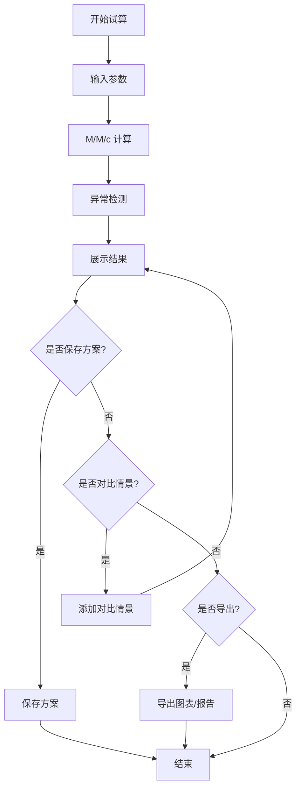

## 1. 产品概述

银行网点排队论柜台试算工具 —— 基于 M/M/c 排队论模型，帮助网点主管在午休时段科学估算最优柜台开放数量，平衡客户等待体验与人力成本。

- 解决痛点：传统靠表格和截图拼接方式低效、缺乏数据支撑、无法快速情景对比
- 目标用户：银行网点主管、运营管理人员
- 核心价值：通过排队论模型量化决策，降低排队风险和人力浪费

## 2. 核心功能

### 2.1 功能模块

1. **数据输入面板**：到达率、服务时长、柜台数量、排队阈值、午休时段配置
2. **排队论计算引擎**：M/M/c 模型计算，输出等待时间、队列长度、服务强度、利用率等指标
3. **情景对比**：多方案并排对比，标记最优方案
4. **图表可视化**：等待时间分布、队列长度随柜台数变化、利用率热力图
5. **方案管理**：保存/加载/导出方案，支持导入策略（忽略/覆盖/追加）
6. **异常检测**：到达率突增、服务时长尾、柜台切换成本，标记不可算入正常结果
7. **修正痕迹**：记录每次参数调整的来源和变更历史
8. **图表导出**：PNG/SVG 格式导出图表和试算报告

### 2.2 页面详情

| 页面名称 | 模块名称 | 功能描述 |
|----------|----------|----------|
| 试算工作台 | 数据输入面板 | 到达率、服务时长、柜台数、排队阈值、午休时段的表单输入 |
| 试算工作台 | 计算结果面板 | 显示 M/M/c 核心指标：平均等待时间、平均队列长度、服务强度、空闲概率 |
| 试算工作台 | 异常提示区 | 突出显示到达率突增、长尾、切换成本等异常，标注不可计入正常结果 |
| 试算工作台 | 修正痕迹面板 | 显示每次参数修正的来源、时间、修改内容 |
| 情景对比页 | 方案对比 | 多个方案并排展示，高亮最优方案 |
| 方案管理页 | 方案列表 | 保存/加载/删除/导入方案，支持导入策略选择 |
| 图表导出 | 导出面板 | 选择导出格式（PNG/SVG）、导出试算报告 |

## 3. 核心流程

用户在数据输入面板填写参数 → 系统执行 M/M/c 排队论计算 → 展示结果指标和图表 → 检测并标注异常情况 → 用户可保存方案或对比多情景 → 导出图表和报告

## 4. 用户界面设计

### 4.1 设计风格

- 主色调：深青 (#0D4F4F)、辅助色：琥珀金 (#D4A843)、中性色：深灰蓝 (#1A2332)
- 按钮风格：圆角 6px，微渐变背景，悬停态提升亮度
- 字体：Noto Sans SC（正文），思源宋体（标题数据展示）
- 布局风格：卡片式分区布局，左侧输入，右侧结果
- 图标：lucide-react 线性图标

### 4.2 页面设计概览

| 页面名称 | 模块名称 | UI 元素 |
|----------|----------|---------|
| 试算工作台 | 数据输入面板 | 表单卡片，分组折叠，数值输入带步进器 |
| 试算工作台 | 计算结果面板 | 数据卡片网格，大数字展示关键指标 |
| 试算工作台 | 异常提示区 | 警示图标 + 高亮边框，不可忽略标记 |
| 试算工作台 | 图表区 | ECharts 折线图/柱状图，悬浮交互 |
| 情景对比页 | 方案对比 | 表格行对比，最优行高亮 |
| 方案管理页 | 方案列表 | 卡片列表，悬浮操作按钮 |

### 4.3 响应式设计

- 桌面端优先（1280px+），适配窗口缩放
- 输入面板与结果面板在 < 960px 时堆叠排列
- 图表容器自适应宽度

### 4.4 设计氛围

- 金融科技感：深色背景配金色数据高亮，体现专业和信赖感
- 微交互动画：卡片进入时渐入，数值变化时数字滚动
- 数据可视化优先：图表占主要视觉权重，辅助文字精简
