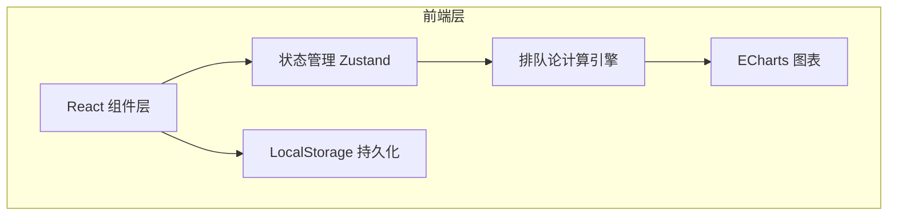

## 1. 架构设计



纯前端应用，无后端，数据通过 LocalStorage 持久化。

## 2. 技术选型

- 前端框架：React 18 + TypeScript
- 构建工具：Vite 5
- 样式方案：TailwindCSS 3 + CSS 变量
- 状态管理：Zustand
- 图表库：ECharts 5
- 路由：React Router 6
- 图标：lucide-react
- 数据持久化：LocalStorage
- 初始化模板：vite-init react-ts

## 3. 路由定义

| 路由 | 用途 |
|------|------|
| / | 试算工作台（主页面） |
| /scenarios | 情景对比页 |
| /schemes | 方案管理页 |

## 4. 数据模型

### 4.1 Scheme（方案）

```typescript
interface Scheme {
  id: string;
  name: string;
  createdAt: string;
  updatedAt: string;
  source: string;           // 数据来源说明
  params: SchemeParams;
  result: QueueResult;
  anomalies: Anomaly[];
  revisions: Revision[];
}

interface SchemeParams {
  arrivalRate: number;      // 到达率 λ (人/分钟)
  serviceRate: number;      // 服务率 μ (人/分钟)
  numCounters: number;      // 柜台数 c
  queueThreshold: number;   // 排队阈值 (人)
  lunchStart: string;       // 午休开始 HH:mm
  lunchEnd: string;         // 午休结束 HH:mm
  peakArrivalRate: number;  // 高峰到达率（异常检测用）
  avgServiceTime: number;   // 平均服务时长（分钟）
  maxServiceTime: number;   // 最长服务时长（分钟）
  switchCost: number;       // 柜台切换成本（分钟）
}

interface QueueResult {
  rho: number;              // 服务强度
  P0: number;               // 系统空闲概率
  Lq: number;               // 平均队列长度
  L: number;                // 系统平均顾客数
  Wq: number;               // 平均等待时间（分钟）
  W: number;                // 系统平均逗留时间（分钟）
  Pw: number;               // 顾客等待概率
  utilization: number;      // 柜台利用率
}

interface Anomaly {
  type: 'arrival_spike' | 'long_tail' | 'switch_cost';
  severity: 'warning' | 'critical';
  message: string;
  excludedFromNormal: boolean; // 是否排除在正常结果之外
}

interface Revision {
  id: string;
  timestamp: string;
  field: string;
  oldValue: string;
  newValue: string;
  source: string;           // 修正来源
  reason: string;           // 修正原因
}
```

## 5. 项目结构

```
src/
  components/
    InputPanel.tsx          # 数据输入面板
    ResultPanel.tsx         # 计算结果面板
    AnomalyAlert.tsx        # 异常提示
    RevisionTrace.tsx       # 修正痕迹
    ChartContainer.tsx      # 图表容器
    SchemeCard.tsx          # 方案卡片
    SchemeCompareTable.tsx  # 方案对比表
    ExportDialog.tsx        # 导出对话框
    ImportDialog.tsx        # 导入对话框
  hooks/
    useQueueEngine.ts       # 排队论计算 Hook
    useAnomalyDetector.ts   # 异常检测 Hook
    useSchemeStore.ts       # 方案状态管理
  pages/
    Workbench.tsx           # 试算工作台
    Scenarios.tsx           # 情景对比
    Schemes.tsx             # 方案管理
  utils/
    queueTheory.ts          # M/M/c 算法实现
    storage.ts              # LocalStorage 封装
    export.ts               # 图表导出
  types/
    index.ts                # 类型定义
```
