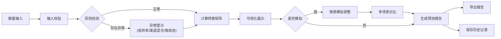

## 1. 产品概述
Markov留存预测面板是一款面向会员运营团队的数据分析工具，基于马尔可夫链模型对用户状态转移进行科学预测，解决传统表格+截图方式效率低下、仅能观察环比变化的问题。
- 核心目标：通过状态转移概率矩阵预测下月用户活跃与流失情况，支持情景模拟和多维度分析
- 目标用户：会员运营分析师、数据运营人员、产品运营经理

## 2. 核心功能

### 2.1 用户角色
| 角色 | 注册方式 | 核心权限 |
|------|----------|----------|
| 运营分析师 | 本地工具使用者 | 数据导入、模型计算、情景模拟、报告导出、历史查看 |

### 2.2 功能模块
1. **数据输入面板**：用户状态配置、转移次数录入、活动标签/渠道筛选、预测月份设置
2. **转移矩阵可视化**：状态转移概率热力图、状态流向桑基图、矩阵数值表格
3. **情景模拟中心**：手动调整转移概率、多场景对比、实时结果预览
4. **状态解释模块**：各状态业务含义、转移路径分析、关键节点识别
5. **风险检测提示**：低样本状态预警、渠道混合提醒、吸收态误用检测
6. **报告导出系统**：PDF/Excel报告生成、可配置报告模板、数据来源标注
7. **历史记录追踪**：版本管理、修改痕迹保留、数据对比校验

### 2.3 页面详情
| 页面名称 | 模块名称 | 功能描述 |
|----------|----------|----------|
| 主面板 | 数据输入区 | 支持粘贴/导入用户状态转移数据，包含输入校验和格式提示 |
| 主面板 | 转移矩阵区 | 热力图+表格双视图展示转移概率，支持点击查看详情 |
| 主面板 | 预测结果区 | 展示下月活跃/流失预测值，置信区间标注，结果文字解释 |
| 情景模拟页 | 参数调整区 | 滑块/输入框调整转移概率，支持保存多个场景 |
| 情景模拟页 | 对比分析区 | 多场景预测结果对比图表，差异高亮显示 |
| 报告导出页 | 报告配置区 | 选择导出内容、格式、模板，添加备注 |
| 历史记录页 | 版本列表区 | 展示历史计算记录，支持筛选、对比、恢复 |
| 历史记录页 | 痕迹详情区 | 显示每次修改的具体内容、修改人、时间戳 |

## 3. 核心流程
用户首先在数据输入面板导入或录入用户状态转移数据，系统自动进行输入校验和风险检测（低样本、渠道混合、吸收态），检测通过后计算马尔可夫转移矩阵并可视化展示；用户可在情景模拟页调整参数进行多场景分析，确认后生成包含数据来源和解释的完整报告；所有操作记录自动保存至历史记录，支持随时回溯和对比。

## 4. 用户界面设计

### 4.1 设计风格
- 主色调：专业深蓝 #165DFF 搭配科技感渐变，体现数据分析工具的专业性
- 辅助色：风险橙 #FF7D00（警告）、成功绿 #00B42A（正常）、警示红 #F53F3F（错误）
- 按钮风格：圆角8px，微阴影，悬停时有轻微上浮效果
- 字体：标题使用 Playfair Display 体现精致感，正文使用 Inter 保证可读性
- 布局风格：卡片式模块化布局，清晰的视觉层次，充足留白避免信息过载
- 图标风格：线性图标为主，关键数据使用微动画增强感知

### 4.2 页面设计概述
| 页面名称 | 模块名称 | UI Elements |
|----------|----------|-------------|
| 主面板 | 数据输入区 | 卡片容器、拖拽上传区、表格编辑、校验状态标签、悬停提示 |
| 主面板 | 转移矩阵区 | 热力图色块悬浮效果、点击交互、联动高亮、数值格式化 |
| 主面板 | 预测结果区 | 大数字卡片、趋势箭头、置信区间条、结果解读文案 |
| 情景模拟页 | 参数调整区 | 滑块组件、实时计算反馈、场景标签、保存/重置按钮 |
| 报告导出页 | 报告配置区 | 复选框组、格式切换、预览区域、导出进度条 |
| 历史记录页 | 版本列表区 | 时间轴布局、版本卡片、差异对比高亮 |

### 4.3 响应式
- Desktop-first设计，优先保障1440px以上大屏体验
- 平板端自动调整卡片布局，矩阵热力图自适应缩放
- 移动端简化为垂直滚动布局，保留核心数据输入和结果查看功能
- 所有交互元素确保触摸友好，最小点击区域44px

### 4.4 动效设计
- 页面加载：卡片依次淡入，矩阵热力图从低到高渐显
- 数据更新：数字滚动动画，图表平滑过渡
- 风险提示：轻微脉冲动画吸引注意力但不干扰操作
- 按钮交互：点击时缩放反馈，悬停时阴影加深
