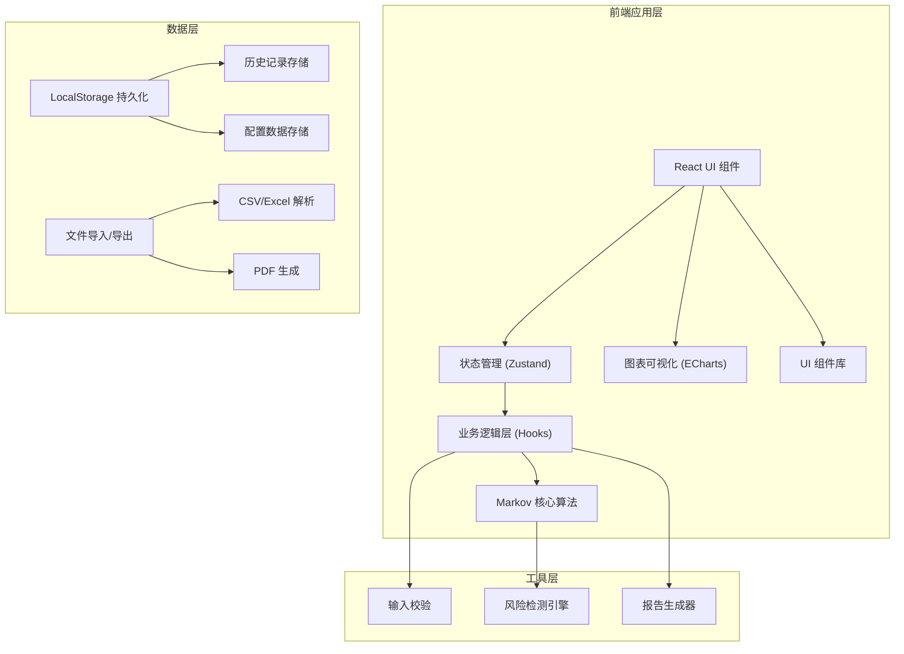

## 1. 架构设计



## 2. 技术描述

- **前端框架**: React@18 + TypeScript@5 + Vite@5
- **状态管理**: Zustand@4 (轻量、高性能，适合中小型应用)
- **样式方案**: TailwindCSS@3 + SCSS 变量
- **图表库**: ECharts@5 (热力图、桑基图、折线图、柱状图)
- **UI 组件**: 自研组件库 + Headless UI (确保设计独特性)
- **文件处理**: PapaParse (CSV), SheetJS (Excel), jsPDF (PDF)
- **工具库**: date-fns (日期处理), lodash-es (工具函数)
- **后端**: 纯前端应用，无后端依赖，所有数据本地存储
- **数据持久化**: LocalStorage + IndexedDB (大容量历史记录)

## 3. 路由定义

| 路由 | 页面名称 | 用途 |
|------|----------|------|
| / | 主面板 | 数据输入、转移矩阵展示、预测结果 |
| /simulation | 情景模拟 | 参数调整、多场景对比分析 |
| /report | 报告导出 | 报告配置、预览、导出 |
| /history | 历史记录 | 版本管理、修改痕迹、数据对比 |

## 4. 数据模型

### 4.1 核心数据结构

```typescript
// 用户状态定义
interface UserState {
  id: string;
  name: string;
  description: string;
  color: string;
  isAbsorbing?: boolean; // 是否为吸收态（如流失）
}

// 状态转移记录
interface TransitionRecord {
  fromState: string;
  toState: string;
  count: number;
  channel?: string;
  campaignTag?: string;
  period: string; // 月份 YYYY-MM
}

// 转移矩阵
interface TransitionMatrix {
  states: UserState[];
  matrix: number[][]; // 概率矩阵 [from][to]
  counts: number[][]; // 原始计数矩阵
  sampleSizes: number[]; // 各状态样本量
}

// 预测结果
interface PredictionResult {
  month: string;
  initialDistribution: number[];
  predictedDistribution: number[];
  activeRate: number;
  churnRate: number;
  confidenceInterval?: [number, number];
}

// 风险检测结果
interface RiskDetection {
  type: 'low_sample' | 'channel_mixed' | 'absorbing_misuse';
  severity: 'warning' | 'error';
  message: string;
  details: Record<string, any>;
}

// 历史记录
interface HistoryRecord {
  id: string;
  timestamp: number;
  operator: string;
  action: string;
  beforeData: any;
  afterData: any;
  source: string; // 数据来源
  remark?: string;
}

// 情景模拟
interface SimulationScenario {
  id: string;
  name: string;
  matrix: TransitionMatrix;
  createdAt: number;
  description?: string;
}
```

### 4.2 Store 状态结构

```typescript
interface AppState {
  // 数据状态
  states: UserState[];
  transitions: TransitionRecord[];
  matrix: TransitionMatrix | null;
  prediction: PredictionResult | null;
  
  // 过滤条件
  filters: {
    channels: string[];
    campaignTags: string[];
    targetMonth: string;
  };
  
  // 风险检测
  risks: RiskDetection[];
  
  // 历史记录
  history: HistoryRecord[];
  
  // 情景模拟
  scenarios: SimulationScenario[];
  activeScenario: string | null;
  
  // Actions
  setStates: (states: UserState[]) => void;
  addTransition: (record: TransitionRecord) => void;
  calculateMatrix: () => void;
  runPrediction: (months: number) => void;
  detectRisks: () => void;
  saveToHistory: (action: string, source: string) => void;
  addScenario: (scenario: SimulationScenario) => void;
  exportReport: (format: 'pdf' | 'excel') => Blob;
}
```

## 5. 核心算法模块

### 5.1 Markov 链计算模块 (`/src/utils/markov.ts`)

- `buildTransitionMatrix()`: 从转移记录构建概率矩阵
- `normalizeMatrix()`: 行归一化处理
- `predictNextState()`: 一步状态预测
- `predictNStates()`: N步状态预测
- `calculateSteadyState()`: 计算稳态分布
- `getConfidenceInterval()`: 置信区间计算

### 5.2 风险检测引擎 (`/src/utils/riskDetection.ts`)

- `detectLowSampleStates()`: 检测低样本状态（阈值可配置）
- `detectChannelMixing()`: 检测渠道混合问题
- `detectAbsorbingMisuse()`: 检测吸收态误用
- `generateRiskMessage()`: 生成风险提示文案

### 5.3 报告生成器 (`/src/utils/reportGenerator.ts`)

- `generateReportData()`: 整理报告数据
- `exportToExcel()`: Excel导出
- `exportToPDF()`: PDF导出
- `addSourceAnnotation()`: 添加数据来源标注

## 6. 组件层级结构

```
src/
├── components/
│   ├── layout/
│   │   ├── Header.tsx
│   │   ├── Sidebar.tsx
│   │   └── Container.tsx
│   ├── data-input/
│   │   ├── StateConfigPanel.tsx
│   │   ├── TransitionTable.tsx
│   │   ├── FileUploader.tsx
│   │   └── FilterBar.tsx
│   ├── matrix/
│   │   ├── MatrixHeatmap.tsx
│   │   ├── MatrixTable.tsx
│   │   └── SankeyChart.tsx
│   ├── prediction/
│   │   ├── ResultCard.tsx
│   │   ├── TrendChart.tsx
│   │   └── ExplanationPanel.tsx
│   ├── simulation/
│   │   ├── ParameterSlider.tsx
│   │   ├── ScenarioCard.tsx
│   │   └── ComparisonChart.tsx
│   ├── risk/
│   │   ├── RiskAlert.tsx
│   │   └── RiskBanner.tsx
│   └── common/
│       ├── Button.tsx
│       ├── Modal.tsx
│       └── Tabs.tsx
├── pages/
│   ├── Dashboard.tsx
│   ├── Simulation.tsx
│   ├── Report.tsx
│   └── History.tsx
├── store/
│   └── useAppStore.ts
├── hooks/
│   ├── useMarkov.ts
│   ├── useRiskDetection.ts
│   └── useHistory.ts
└── utils/
    ├── markov.ts
    ├── riskDetection.ts
    ├── reportGenerator.ts
    └── validation.ts
```

## 7. 关键技术点

1. **纯前端计算**: 所有Markov计算在浏览器端完成，确保数据隐私
2. **LocalStorage 持久化**: 自动保存输入数据和历史记录
3. **增量历史记录**: 仅存储变更差异，优化存储空间
4. **响应式图表**: ECharts 自适应容器大小，支持交互联动
5. **类型安全**: 完整的 TypeScript 类型定义，避免运行时错误
6. **性能优化**: 矩阵计算使用 Web Workers，避免阻塞UI线程
