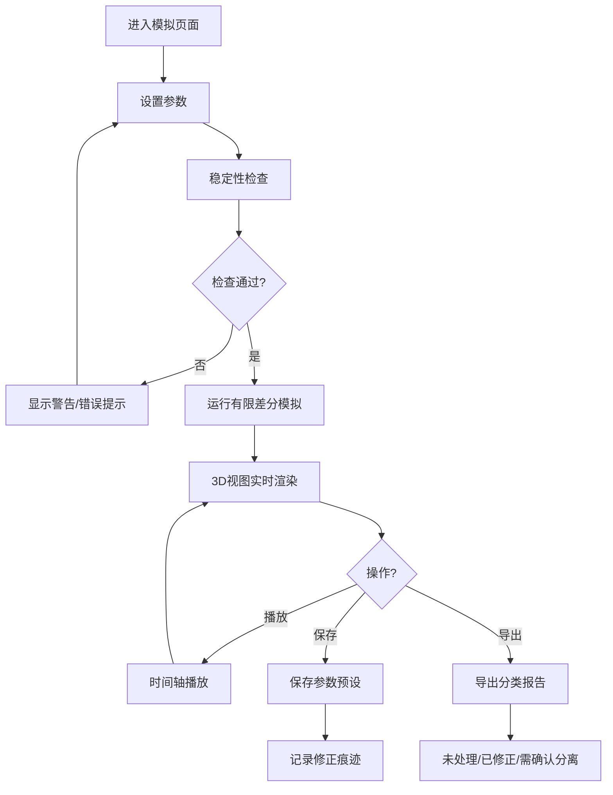

## 1. 产品概述

材料实验室热传导板温度模拟工具，用于比较不同边界条件下金属板的温度分布变化。解决传统数值模拟可视化不足、参数试错成本高、稳定性隐患隐蔽的问题。

- 目标用户：材料学研究生、实验室研究人员
- 核心价值：直观的3D热图交互 + 严谨的数值稳定性提示 + 可追溯的参数记录

## 2. 核心功能

### 2.1 功能模块

1. **主模拟页面**：3D温度分布视图、参数控制面板、稳定性提示区、时间轴播放控制
2. **参数管理模块**：参数预设保存、加载、修正痕迹记录
3. **报告导出模块**：模拟报告生成，分离未处理/已修正/需人工确认内容

### 2.2 页面详情

| 页面名称 | 模块名称 | 功能描述 |
|----------|----------|----------|
| 主模拟页面 | 3D温度视图 | Three.js渲染金属板3D模型，温度色阶映射，可旋转/缩放/平移 |
| 主模拟页面 | 参数控制面板 | 板材尺寸、导热系数、边界温度(4边)、网格步长、时间步长输入 |
| 主模拟页面 | 稳定性检查面板 | 实时显示Von Neumann稳定性条件、CFL数、边界条件冲突检测、网格精度警告 |
| 主模拟页面 | 时间轴播放 | 播放/暂停/步进/帧跳转，显示当前时间步温度快照 |
| 主模拟页面 | 侧边明细面板 | 选中网格点的温度、坐标、梯度信息 |
| 参数管理模块 | 预设列表 | 保存/加载/删除参数配置，显示修改时间和来源 |
| 参数管理模块 | 修正痕迹 | 记录每次参数修改的旧值、新值、修改原因、修改时间 |
| 报告导出模块 | 报告预览 | 分类显示未处理项、已修正项、需确认项 |
| 报告导出模块 | 报告导出 | 导出JSON/CSV格式报告，包含完整模拟参数和结果统计 |

## 3. 核心流程

用户打开页面 → 设置板材和物理参数 → 系统自动检查稳定性 → 若有警告显示在提示区 → 用户确认后运行模拟 → 模拟过程中可随时暂停查看温度分布 → 播放时间轴观察温度演变 → 选择参数预设或保存当前配置 → 导出分类报告

## 4. 用户界面设计

### 4.1 设计风格

- 主色：深蓝灰 `#1a2332`（实验室专业感）
- 强调色：温度渐变（冷蓝 `#2563eb` → 青绿 `#10b981` → 琥珀 `#f59e0b` → 赤红 `#ef4444`）
- 警告色：橙黄 `#f59e0b`，错误色：赤红 `#dc2626`
- 按钮风格：圆角矩形，微阴影，hover时加深
- 字体：JetBrains Mono（数值显示）+ Noto Sans SC（中文界面）
- 布局：左侧参数面板(280px) + 中央3D视图(自适应) + 右侧明细面板(260px) + 底部时间轴

### 4.2 页面设计概览

| 页面名称 | 模块名称 | UI元素 |
|----------|----------|--------|
| 主模拟页面 | 3D温度视图 | Three.js场景，轨道控制器，颜色图例，悬浮信息卡 |
| 主模拟页面 | 参数控制面板 | 分组折叠面板，数字输入框+滑块，实时验证提示 |
| 主模拟页面 | 稳定性检查 | 状态指示灯（绿/黄/红），数值指标，可展开详情 |
| 主模拟页面 | 时间轴 | 播放控制按钮，进度条，帧显示，速度调节 |
| 参数管理 | 预设列表 | 卡片式列表，选中高亮，操作按钮组 |
| 参数管理 | 修正痕迹 | 时间线样式，diff显示（旧值→新值），来源标注 |

### 4.3 响应式

- 桌面端优先设计（1200px+）
- 平板端：右侧明细面板折叠为抽屉
- 移动端：参数面板折叠为底部sheet

### 4.4 3D场景指引

- 环境：深色背景，弱环境光，平行光主光源
- 金属板：半透明边缘，温度色阶通过顶点颜色或片元着色器实现
- 相机：PerspectiveCamera，初始角度45°俯视
- 交互：OrbitControls，支持选中网格点高亮
- 后处理：Bloom发光（高温区域微微发光），轻微色调映射
