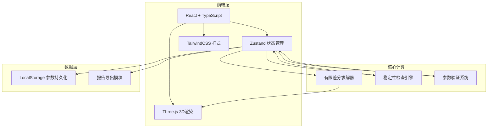
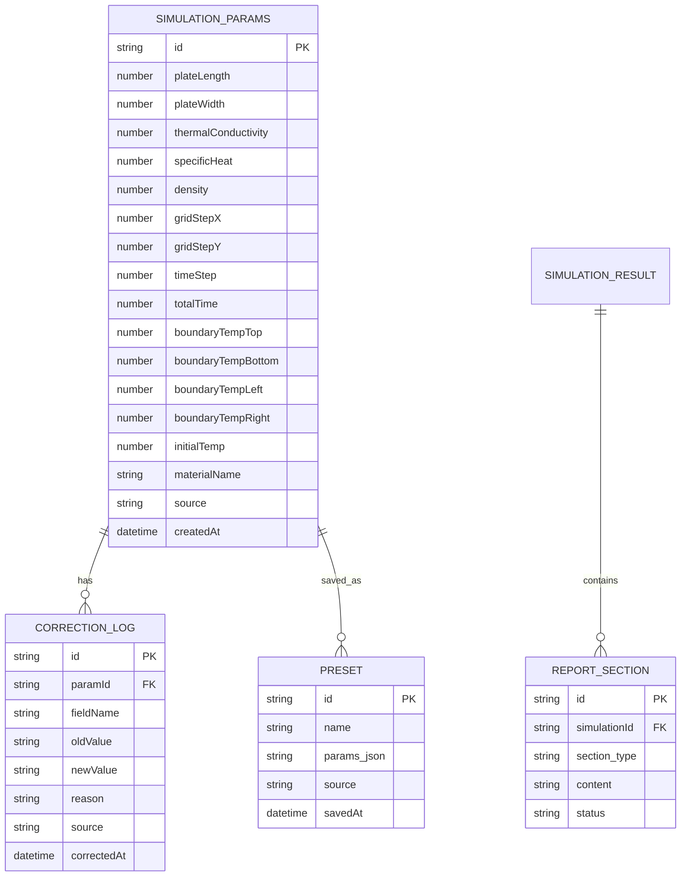

## 1. 架构设计



## 2. 技术说明

- 前端：React 18 + TypeScript + Vite
- 3D渲染：Three.js + @react-three/fiber + @react-three/drei
- 状态管理：Zustand
- 样式：TailwindCSS 3
- 图表可视化：自定义Canvas/SVG（热图、色阶条）
- 后端：无（纯前端应用）
- 数据存储：LocalStorage（参数预设、修正痕迹）
- 初始化工具：vite-init，模板选择 react-ts

## 3. 路由定义

| 路由 | 用途 |
|------|------|
| / | 主模拟页面（默认路由，包含所有功能） |

## 4. 数据模型

### 4.1 数据模型定义



### 4.2 Zustand Store 结构

```typescript
interface SimulationState {
  // 参数
  params: SimulationParams;
  // 模拟结果
  temperatureField: number[][][]; // [timeStep][y][x]
  currentTimeStep: number;
  isRunning: boolean;
  // 稳定性
  stabilityCheck: StabilityResult;
  warnings: Warning[];
  errors: ErrorItem[];
  // 预设
  presets: Preset[];
  // 修正日志
  correctionLogs: CorrectionLog[];
  // 选中信息
  selectedPoint: { x: number; y: number } | null;
  // 操作
  setParams: (params: Partial<SimulationParams>) => void;
  runSimulation: () => void;
  pauseSimulation: () => void;
  stepForward: () => void;
  stepBackward: () => void;
  savePreset: (name: string) => void;
  loadPreset: (id: string) => void;
  exportReport: () => ReportData;
  checkStability: () => StabilityResult;
}
```

## 5. 有限差分法核心算法

### 5.1 控制方程

二维瞬态热传导方程：
∂T/∂t = α(∂²T/∂x² + ∂²T/∂y²)

其中 α = k/(ρ·c) 为热扩散系数

### 5.2 差分格式

显式欧拉法（Forward Euler）：
T[i][j][n+1] = T[i][j][n] + r_x·(T[i+1][j][n] - 2T[i][j][n] + T[i-1][j][n])
                    + r_y·(T[i][j+1][n] - 2T[i][j][n] + T[i][j-1][n])

其中 r_x = α·Δt/Δx², r_y = α·Δt/Δy²

### 5.3 稳定性条件（Von Neumann）

r_x + r_y ≤ 0.5 时显式格式稳定

即：α·Δt·(1/Δx² + 1/Δy²) ≤ 0.5

### 5.4 边界条件处理

Dirichlet边界条件：四边温度固定
初始条件：全域初始温度均匀

## 6. 报告分类规则

报告分为三个区域：

1. **未处理项**：用户未修改的默认参数，系统使用的标准值
2. **已修正项**：系统自动修正的不稳定参数（如时间步长过大自动缩小），附修正原因
3. **需确认项**：可能影响结果精度的参数选择（如网格过粗、边界温度极端），需用户确认后使用
