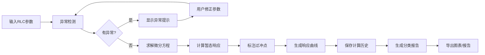

## 1. 产品概述

电路暂态响应分析工具是为电子课教师和学生设计的专业计算分析平台，解决传统手工绘图效率低、易出错的问题。通过输入RLC参数自动计算暂态响应、生成可视化图表，并提供智能异常检测和详细报告。

- 核心目标：自动化RLC电路暂态响应计算与可视化
- 目标用户：电子课教师、电气专业学生、电路设计工程师
- 核心价值：减少手工计算错误、提高教学效率、保留计算追溯性

## 2. 核心功能

### 2.1 用户角色

| 角色 | 注册方式 | 核心权限 |
|------|----------|----------|
| 普通用户 | 无需注册，本地使用 | 完整使用所有计算和分析功能 |

### 2.2 功能模块

1. **参数输入模块**：RLC参数输入、波形选择、初始条件设置
2. **计算引擎模块**：微分方程求解、阻尼状态判断、过冲计算
3. **图表展示模块**：暂态响应曲线、过冲标注、交互缩放
4. **异常检测模块**：单位混用检测、欠阻尼误判警示、初始条件遗漏提醒
5. **历史记录模块**：计算历史保存、版本追溯、修正痕迹
6. **报告生成模块**：分类统计报告、导出功能、可追溯说明

### 2.3 页面详情

| 页面名称 | 模块名称 | 功能描述 |
|---------|----------|----------|
| 主页面 | 参数输入区 | RLC参数输入、单位选择、波形类型选择、初始条件设置 |
| 主页面 | 实时计算区 | 自动计算阻尼系数、特征根、响应类型判断 |
| 主页面 | 图表展示区 | 暂态响应曲线绘制、过冲点标注、交互操作 |
| 主页面 | 异常提示区 | 单位混用警示、欠阻尼误判提示、初始条件遗漏提醒 |
| 主页面 | 历史记录区 | 计算历史列表、版本对比、恢复功能 |
| 主页面 | 报告面板 | 未处理/已修正/需确认分类统计、导出报告 |

## 3. 核心流程

用户输入RLC参数和初始条件 → 系统自动检测异常并提示 → 用户确认或修正参数 → 系统求解微分方程并计算响应 → 生成交互式图表并标注过冲 → 保存计算历史 → 生成分类报告并支持导出

## 4. 用户界面设计

### 4.1 设计风格

- **主色调**：深蓝科技风 (#0F172A) 搭配电气蓝 (#3B82F6)，营造专业工程感
- **辅助色**：警示橙 (#F59E0B)、错误红 (#EF4444)、成功绿 (#10B981)
- **按钮风格**：圆角矩形、悬浮微动画、清晰的状态层次
- **字体**：JetBrains Mono（代码/数值）+ Inter（正文）
- **布局风格**：左右分栏卡片式布局，左侧参数输入，右侧图表展示
- **图标风格**：线性科技风图标，配合电路主题元素

### 4.2 页面设计概览

| 页面名称 | 模块名称 | UI 元素 |
|---------|----------|---------|
| 主页面 | 参数输入卡片 | 分组输入框、单位下拉、波形选择器、初始条件开关 |
| 主页面 | 计算结果卡片 | 阻尼状态标签、特征根数值、响应类型说明 |
| 主页面 | 异常提示条 | 彩色警示条、可展开详情、一键修正按钮 |
| 主页面 | 图表区域 | Canvas绘制曲线、过冲点标注、缩放控制、图例 |
| 主页面 | 历史记录面板 | 时间线布局、版本标签、恢复按钮 |
| 主页面 | 报告面板 | 分类统计卡片、进度条、导出按钮 |

### 4.3 响应式

- 桌面端（≥1200px）：左右双栏布局，参数区40% + 图表区60%
- 平板端（768-1199px）：上下堆叠布局，参数区在上，图表区在下
- 移动端（<768px）：垂直流式布局，优化触摸交互，简化输入控件

### 4.4 动效设计

- 页面加载：元素渐入 + 轻微上浮动画
- 参数变化：实时计算结果数字滚动动画
- 异常提示：滑入动画 + 呼吸灯效果
- 图表绘制：曲线从左到右逐步绘制动画
- 按钮交互：按下缩放 + 颜色渐变过渡
