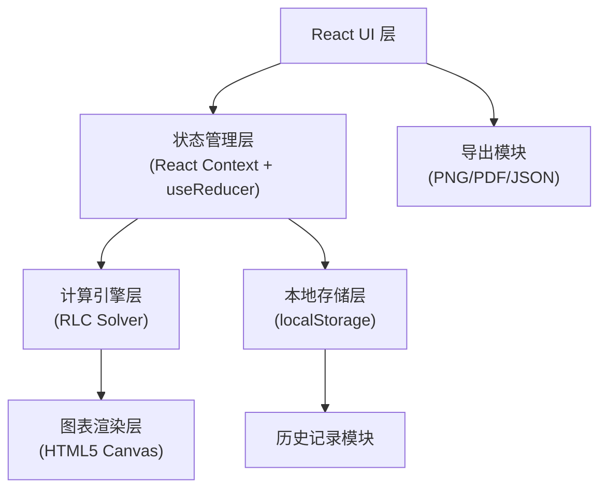

## 1. 架构设计



## 2. 技术选型说明

- **前端框架**: React@18 + TypeScript
- **构建工具**: Vite
- **样式方案**: TailwindCSS@3 + CSS Variables
- **图表绘制**: HTML5 Canvas API (原生实现，避免额外依赖)
- **状态管理**: React Context + useReducer
- **本地存储**: localStorage (IndexedDB 备选用于大数据量)
- **数学计算**: 原生 JavaScript Math API + 自定义数值方法

## 3. 目录结构

```
src/
├── components/
│   ├── ParameterInput/      # 参数输入组件
│   ├── ChartDisplay/        # 图表展示组件
│   ├── AlertPanel/          # 异常提示组件
│   ├── HistoryPanel/        # 历史记录组件
│   └── ReportPanel/         # 报告面板组件
├── engine/
│   ├── rlcSolver.ts         # RLC微分方程求解器
│   ├── dampingAnalyzer.ts   # 阻尼状态分析器
│   └── unitConverter.ts     # 单位转换与校验
├── hooks/
│   ├── useRLCCalculation.ts # 计算逻辑Hook
│   └── useHistory.ts        # 历史记录Hook
├── types/
│   └── index.ts             # TypeScript类型定义
├── utils/
│   ├── chartRenderer.ts     # 图表渲染工具
│   └── exportUtils.ts       # 导出工具
├── store/
│   └── AppContext.tsx       # 全局状态管理
├── App.tsx
└── main.tsx
```

## 4. 核心数据模型

### 4.1 RLC 参数模型

```typescript
interface RLCParameters {
  id: string;
  timestamp: number;
  source: 'manual' | 'history' | 'template';
  
  resistance: {
    value: number;
    unit: 'ohm' | 'kohm' | 'mohm';
    rawInput: string;
  };
  
  inductance: {
    value: number;
    unit: 'h' | 'mh' | 'uh';
    rawInput: string;
  };
  
  capacitance: {
    value: number;
    unit: 'f' | 'uf' | 'nf' | 'pf';
    rawInput: string;
  };
  
  inputWaveform: {
    type: 'step' | 'pulse' | 'sinusoidal';
    amplitude: number;
    frequency?: number;
    pulseWidth?: number;
  };
  
  initialConditions: {
    inductorCurrent: number;
    capacitorVoltage: number;
    enabled: boolean;
  };
  
  corrections: CorrectionRecord[];
}

interface CorrectionRecord {
  timestamp: number;
  field: string;
  oldValue: string;
  newValue: string;
  reason: string;
  autoCorrected: boolean;
}
```

### 4.2 计算结果模型

```typescript
interface CalculationResult {
  dampingRatio: number;
  naturalFrequency: number;
  dampingType: 'underdamped' | 'critically_damped' | 'overdamped' | 'undamped';
  characteristicRoots: [number, number];
  
  response: {
    timePoints: number[];
    voltagePoints: number[];
    currentPoints: number[];
    samplingRate: number;
    totalTime: number;
  };
  
  overshoot: {
    exists: boolean;
    value: number;
    percentage: number;
    time: number;
  };
  
  steadyStateValue: number;
  riseTime: number;
  settlingTime: number;
}
```

### 4.3 异常检测模型

```typescript
interface AnomalyAlert {
  id: string;
  type: 'warning' | 'error' | 'info';
  category: 'unit_mismatch' | 'damping_misjudgment' | 'missing_initial' | 'invalid_range';
  message: string;
  details: string;
  suggestion: string;
  autoFixable: boolean;
  status: 'pending' | 'fixed' | 'ignored' | 'manual_confirm';
  affectedFields: string[];
}
```

### 4.4 报告模型

```typescript
interface AnalysisReport {
  generatedAt: number;
  summary: {
    totalRecords: number;
    unprocessed: number;
    autoCorrected: number;
    needManualConfirm: number;
    completed: number;
  };
  records: ReportRecord[];
}

interface ReportRecord {
  parameterId: string;
  timestamp: number;
  status: 'unprocessed' | 'auto_corrected' | 'manual_confirm' | 'completed';
  anomalies: string[];
  corrections: string[];
  dampingType: string;
  overshoot: number;
}
```

## 5. 核心算法说明

### 5.1 RLC 电路微分方程求解

二阶RLC串联电路的微分方程：
```
L * d²i/dt² + R * di/dt + (1/C) * i = dVs/dt
```

求解策略：
1. 计算阻尼比 ζ = R/(2*√(L/C))
2. 计算固有角频率 ω₀ = 1/√(LC)
3. 根据 ζ 判断阻尼类型并选择求解方法
4. 使用四阶龙格-库塔法 (RK4) 进行数值积分

### 5.2 过冲计算

对于欠阻尼情况 (0 < ζ < 1)：
- 过冲百分比 = e^(-ζπ/√(1-ζ²)) × 100%
- 峰值时间 = π/(ω₀√(1-ζ²))

### 5.3 异常检测规则

| 异常类型 | 检测条件 | 处理方式 |
|---------|----------|----------|
| 单位混用 | 电阻用kΩ但电容用F，量级不匹配 | 提示并建议统一量级 |
| 欠阻尼误判 | ζ接近0.95-1.05临界区间 | 高亮警示，建议微调参数验证 |
| 初始条件遗漏 | 初始电流/电压非零但未启用 | 提示用户确认是否需要设置 |
| 参数越界 | R/L/C超出合理物理范围 | 错误提示，阻止计算 |

## 6. 导出功能

- **图表导出**: Canvas toDataURL() → PNG 图片
- **数据导出**: JSON 格式，包含完整参数和计算结果
- **报告导出**: Markdown 格式报告，可复制或下载
