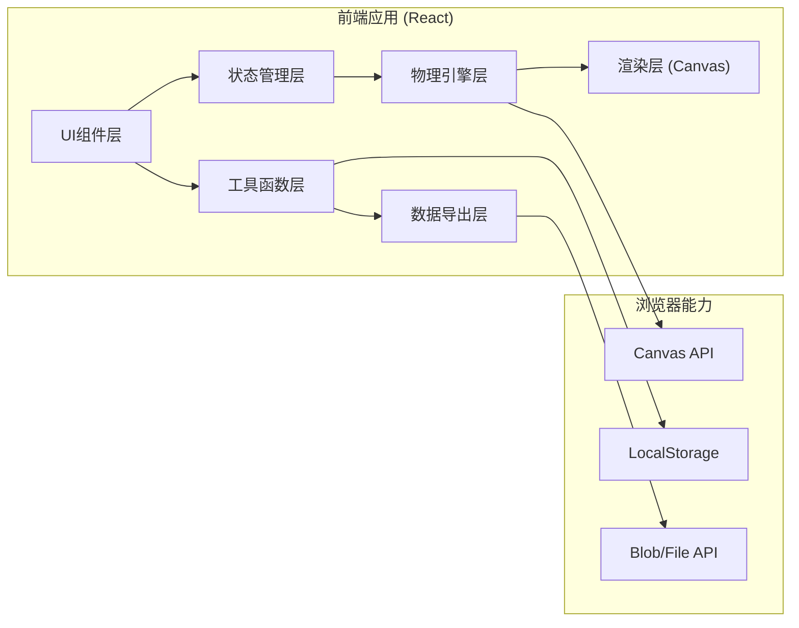

## 1. 架构设计



## 2. 技术描述

- **前端框架**：React@18 + TypeScript
- **构建工具**：Vite@5
- **样式方案**：TailwindCSS@3
- **物理引擎**：自定义2D物理引擎（简化版，专注碰撞恢复系数计算）
- **状态管理**：React useState/useReducer（轻量场景）
- **数据持久化**：LocalStorage
- **截图导出**：html2canvas + Canvas toDataURL

## 3. 目录结构

```
src/
├── components/          # UI组件
│   ├── Canvas.tsx       # 物理画布
│   ├── ControlPanel.tsx # 控制面板
│   ├── DataTable.tsx    # 数据表格
│   ├── Alert.tsx        # 异常提示
│   └── ExportModal.tsx  # 导出弹窗
├── hooks/               # 自定义Hooks
│   ├── usePhysics.ts    # 物理引擎Hook
│   ├── useDrag.ts       # 拖动Hook
│   └── useReplay.ts     # 回放Hook
├── physics/             # 物理引擎
│   ├── engine.ts        # 核心引擎
│   ├── ball.ts          # 小球类
│   └── collision.ts     # 碰撞检测
├── utils/               # 工具函数
│   ├── validation.ts    # 参数校验
│   ├── export.ts        # 导出功能
│   └── storage.ts       # 本地存储
├── types/               # 类型定义
│   └── index.ts
└── App.tsx              # 主应用
```

## 4. 核心数据类型

```typescript
// 实验参数
interface ExperimentParams {
  ballMass: number;        // 小球质量 (kg)
  dropHeight: number;      // 下落高度 (m)
  groundMaterial: string;  // 地面材质
  restitution: number;     // 预设恢复系数 (0-1)
}

// 实验结果
interface ExperimentResult {
  id: string;
  timestamp: number;
  params: ExperimentParams;
  bounceHeight: number;    // 反弹高度 (m)
  calculatedRestitution: number; // 计算得到的恢复系数
  anomalies: string[];     // 异常记录
  isAnomaly: boolean;      // 是否有异常
}

// 物理状态
interface PhysicsState {
  position: { x: number; y: number };
  velocity: { x: number; y: number };
  isDragging: boolean;
  isPlaying: boolean;
  hasBounced: boolean;
}

// 异常类型
type AnomalyType = 
  | 'ENERGY_INCREASE'      // 能量增加
  | 'MATERIAL_OUT_OF_BOUNDS' // 材质参数越界
  | 'COLLISION_PENETRATION'; // 碰撞穿透
```

## 5. 物理引擎核心逻辑

### 5.1 恢复系数计算公式
```
恢复系数 e = 反弹高度 / 下落高度 的平方根
e = √(h2 / h1)

其中:
- h1: 下落高度
- h2: 反弹高度
- e ∈ [0, 1]
```

### 5.2 能量校验
```
下落前势能: E1 = m * g * h1
反弹后势能: E2 = m * g * h2

正常情况: E2 < E1 (能量损失)
异常情况: E2 >= E1 (能量增加)
```

### 5.3 碰撞检测
- 连续碰撞检测 (CCD) 防止穿透
- 碰撞时速度反向并乘以恢复系数
- 穿透深度校正

## 6. 输入校验规则

| 参数 | 合法范围 | 异常提示 |
|------|----------|----------|
| 小球质量 | 0.001kg - 10kg | 质量必须在0.001kg到10kg之间 |
| 下落高度 | 0.01m - 10m | 高度必须在0.01m到10m之间 |
| 恢复系数 | 0 - 1 | 恢复系数必须在0到1之间 |
| 地面材质 | 预设材质列表 | 请选择有效的地面材质 |

## 7. 关键技术点

1. **Canvas渲染优化**：requestAnimationFrame + 脏矩形渲染
2. **慢放回放**：帧记录 + 时间缩放因子
3. **截图导出**：Canvas toDataURL + 附加信息绘制
4. **异常检测**：每帧物理校验 + 异常栈记录
5. **数据持久化**：LocalStorage + 版本迁移机制
