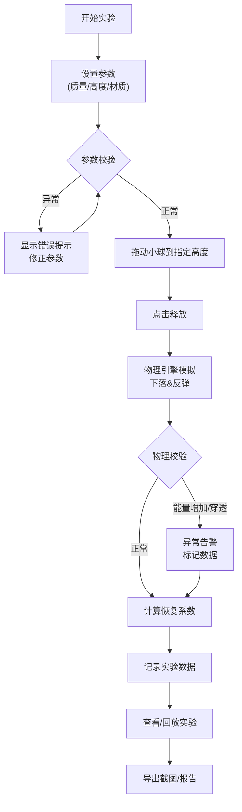

## 1. 产品概述

碰撞恢复系数游戏是一个物理教学互动工具，让学生通过拖动小球高度、观察反弹动画来理解和计算恢复系数。工具包含完整的输入校验、异常提示、实验记录、数据导出功能。

- **核心目的**：让物理社团学生通过互动实验理解恢复系数概念，培养物理实验思维
- **目标用户**：物理社团学生、物理教师、对物理实验感兴趣的学生
- **产品价值**：将抽象的物理概念转化为可视化互动实验，降低学习门槛，提高实验趣味性

## 2. 核心功能

### 2.1 用户角色
| 角色 | 注册方式 | 核心权限 |
|------|----------|----------|
| 学生用户 | 无需注册 | 使用所有实验功能、记录数据、导出报告 |

### 2.2 功能模块
1. **主实验页面**：物理引擎画布、小球高度拖动、实时反弹动画、恢复系数计算
2. **控制面板**：参数设置（质量、材质）、慢放控制、回放功能
3. **数据记录区**：实验历史记录、数据表展示、数据筛选
4. **报告导出区**：结果截图、实验报告生成、数据导出

### 2.3 页面详情
| 页面名称 | 模块名称 | 功能描述 |
|-----------|-------------|---------------------|
| 主实验页面 | 物理画布 | Canvas实现小球下落反弹动画，支持拖动调整初始高度 |
| 主实验页面 | 参数面板 | 设置小球质量、地面材质、下落高度，实时校验输入 |
| 主实验页面 | 播放控制 | 开始/暂停/重置、慢放速度调节（0.1x-1x）、帧步进 |
| 主实验页面 | 数据表格 | 记录每次实验的参数和计算结果，支持删除和清空 |
| 主实验页面 | 异常提示 | 能量增加、材质越界、碰撞穿透等异常情况醒目提示 |
| 主实验页面 | 截图导出 | 一键导出实验截图和完整实验报告 |

## 3. 核心流程

## 4. 用户界面设计

### 4.1 设计风格
- **主色调**：深蓝色 (#1e3a5f) 代表科学严谨，搭配亮青色 (#00d4ff) 作为交互强调色
- **辅助色**：橙色 (#ff6b35) 用于警告/异常提示，绿色 (#22c55e) 用于正常状态
- **按钮风格**：圆角矩形，微立体感，hover时有轻微上浮动画
- **字体**：标题使用 Orbitron（科技感字体），正文使用 JetBrains Mono（等宽字体便于数据展示）
- **布局风格**：左主实验区 + 右控制面板，卡片式设计，清晰的功能分区
- **图标风格**：线性图标，统一2px线宽，物理实验相关的具象图标

### 4.2 页面设计概述
| 页面名称 | 模块名称 | UI元素 |
|-----------|-------------|-------------|
| 主实验页面 | 物理画布 | 深色背景、网格参考线、带阴影的小球、地面材质纹理、高度标尺 |
| 主实验页面 | 参数面板 | 卡片容器、滑块+数值输入框、材质选择下拉、实时校验反馈 |
| 主实验页面 | 播放控制 | 播放/暂停/重置按钮组、慢放滑块、帧步进按钮 |
| 主实验页面 | 数据表格 | 斑马纹表格、滚动容器、操作按钮列、异常数据高亮 |
| 主实验页面 | 异常提示 | 顶部通知条、红色边框、警告图标、详细错误说明 |

### 4.3 响应式
- 桌面端优先设计（1280px+）：左右分栏布局
- 平板端（768px-1279px）：上下布局，实验区在上，控制区在下
- 移动端（<768px）：单列布局，重点保留实验区和核心控制按钮
- 触摸优化：增大可点击区域，支持触摸拖动小球

### 4.4 动画与交互
- 小球拖动：实时跟随鼠标，显示高度指示线
- 下落动画：物理引擎驱动，带运动模糊效果
- 碰撞效果：碰撞瞬间有轻微闪光和地面震动反馈
- 数据记录：新数据行滑入动画，高亮显示2秒
- 异常提示：抖动动画+渐变背景，吸引注意力
