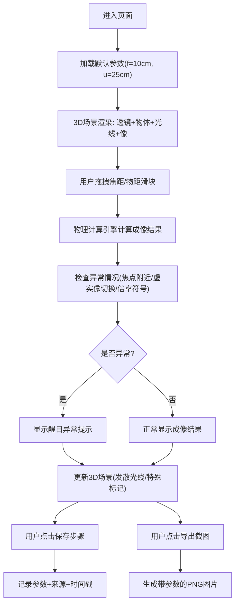

## 1. 产品概述
光学薄透镜成像器是面向初中物理教学的Web3D交互工具，通过可视化方式展示薄透镜成像原理，解决传统教学中依赖表格和截图的痛点。
- 核心价值：让学生通过拖拽参数直观理解物距、焦距与成像的关系，显著提升光学概念的学习效果
- 目标用户：初中物理教师、学生

## 2. 核心 Features

### 2.1 用户角色
| 角色 | 权限说明 |
|------|----------|
| 教师/学生 | 拖拽参数、观察成像、保存步骤、导出截图 |

### 2.2 Feature 模块
1. **3D成像场景**：透镜、物体、光线追迹、实像/虚像显示
2. **参数控制面板**：焦距、物距拖拽调节，参数保护机制
3. **信息展示层**：悬浮参数、放大率、像距、异常情况提示
4. **数据管理层**：步骤保存、来源记录、修正痕迹
5. **导出功能**：截图导出、参数记录

### 2.3 页面详情
| 页面名称 | 模块名称 | 功能描述 |
|---------|---------|----------|
| 主页面 | 3D场景区 | 实时渲染透镜、物体、光线、像，支持视角旋转缩放 |
| 主页面 | 参数控制区 | 焦距/物距滑块拖拽，数值显示，参数范围保护 |
| 主页面 | 信息面板 | 物距u、焦距f、像距v、放大率m、虚实像状态 |
| 主页面 | 步骤管理 | 保存当前参数配置，记录修改痕迹，支持回退 |
| 主页面 | 导出工具 | 一键导出当前场景截图，附带参数信息 |

## 3. 核心流程

## 4. 用户界面设计

### 4.1 设计风格
- **主色调**：深蓝科技感背景(#0a1628) + 光学蓝色(#3b82f6) + 警示橙(#f97316)
- **交互元素**：玻璃拟态控制面板，圆角8px，半透明背景
- **字体**：标题用思源黑体Bold，参数显示用等宽字体JetBrains Mono
- **布局**：左侧3D场景区(75%) + 右侧控制面板(25%)，底部步骤条
- **视觉标识**：实像用绿色实线，虚像用橙色虚线，光线用黄色渐变

### 4.2 页面设计概览
| 模块 | UI元素 | 设计说明 |
|------|--------|----------|
| 3D场景 | 透镜(半透明玻璃)、物体(红色箭头)、像(绿/橙色箭头)、光线(黄线) | 支持鼠标拖拽旋转、滚轮缩放 |
| 参数面板 | 两个滑块(焦距/物距)、数值输入框、重置按钮 | 滑块有刻度标记，数值实时同步 |
| 信息面板 | 卡片式布局，关键参数高亮显示 | 异常参数用红色边框+警示图标 |
| 步骤条 | 横向时间轴，每个节点显示缩略参数 | 点击可快速回退到历史状态 |
| 导出按钮 | 悬浮在右上角，相机图标 | 点击后显示下载进度 |

### 4.3 响应式设计
- 桌面端(≥1200px)：左右分栏布局
- 平板端(768-1199px)：上下布局，控制面板在下方
- 移动端(<768px)：全屏3D场景，控制面板可展开收起

### 4.4 3D场景指南
- **环境**：深色渐变背景，轻微雾化效果，突出光学元件
- **光照**：两盏平行光 + 环境光，确保透镜和光线清晰可见
- **相机**：初始位置在场景正前方，透视投影，视野角60度
- **动画**：参数变化时光线平滑过渡，物体移动有缓动效果
- **后处理**：轻微泛光效果增强光线视觉，抗锯齿处理
