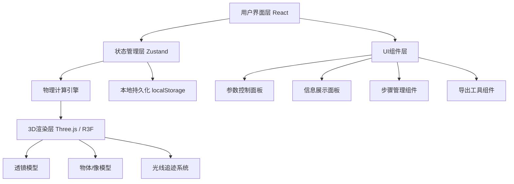

## 1. 架构设计



## 2. 技术选型

- **前端框架**: React@18 + TypeScript
- **构建工具**: Vite@5
- **3D渲染**: Three.js@0.160 + @react-three/fiber@8 + @react-three/drei@9
- **状态管理**: Zustand@4
- **样式**: TailwindCSS@3 + framer-motion@11
- **图标**: lucide-react@0.294
- **截图导出**: html2canvas@1.4

## 3. 目录结构

```
src/
├── components/
│   ├── Scene3D/           # 3D场景组件
│   │   ├── Lens.tsx       # 透镜组件
│   │   ├── ObjectArrow.tsx # 物体/像箭头
│   │   ├── LightRays.tsx  # 光线追迹
│   │   └── index.tsx      # 3D场景入口
│   ├── ControlPanel/      # 控制面板
│   │   ├── Slider.tsx     # 拖拽滑块
│   │   └── index.tsx
│   ├── InfoPanel/         # 信息面板
│   │   ├── ParameterCard.tsx
│   │   └── index.tsx
│   ├── StepManager/       # 步骤管理
│   │   ├── StepTimeline.tsx
│   │   └── index.tsx
│   └── ExportButton.tsx   # 导出按钮
├── store/
│   └── useLensStore.ts    # 状态管理
├── physics/
│   └── lensCalculator.ts  # 薄透镜物理计算
├── types/
│   └── index.ts           # TypeScript类型定义
├── utils/
│   └── export.ts          # 导出工具函数
├── App.tsx
├── main.tsx
└── index.css
```

## 4. 核心数据模型

```typescript
interface LensState {
  focalLength: number;      // 焦距 f (cm)
  objectDistance: number;   // 物距 u (cm)
  imageDistance: number;    // 像距 v (cm)
  magnification: number;    // 放大率 m
  isRealImage: boolean;     // 实像/虚像
  isAtFocus: boolean;       // 是否在焦点上
  objectHeight: number;     // 物体高度
  imageHeight: number;      // 像高度
}

interface StepRecord {
  id: string;
  timestamp: number;
  state: LensState;
  source: 'user' | 'preset' | 'auto';
  note?: string;
}

interface ValidationResult {
  isValid: boolean;
  warnings: Warning[];
}

interface Warning {
  type: 'focus' | 'virtual' | 'magnification' | 'range';
  message: string;
  severity: 'info' | 'warning' | 'critical';
}
```

## 5. 薄透镜计算公式

1. **透镜公式**: 1/f = 1/u + 1/v
2. **放大率**: m = -v/u = h_i/h_o
3. **符号规则**（笛卡尔符号法则）:
   - 物距u: 实物为正
   - 焦距f: 凸透镜为正，凹透镜为负
   - 像距v: 实像为正，虚像为负
   - 放大率m: 正表示正立，负表示倒立

## 6. 光线追迹实现

实现三条典型光线：
1. 平行于主光轴的光线 → 经过像方焦点
2. 经过光心的光线 → 方向不变
3. 经过物方焦点的光线 → 平行于主光轴出射

## 7. 异常检测规则

| 异常类型 | 触发条件 | 提示级别 |
|---------|---------|---------|
| 焦点附近 | |u - f| < 2cm | critical |
| 虚像 | v < 0 | warning |
| 倍率符号 | m > 0 (正立) | info |
| 参数超限 | u < 1cm 或 f < 1cm | critical |
| 不成像 | u ≈ f | critical |
