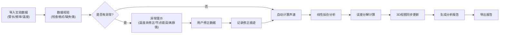

## 1. 产品概述

声速测量误差分析系统是为物理实验员设计的专业数据处理与可视化工具，用于共鸣管实验数据的导入、自动计算声速、误差来源分析与可视化展示。系统解决了实验数据口径不一致、温度未修正、节点编号错误、离群值干扰等痛点，帮助实验人员快速定位问题并生成专业报告。

## 2. 核心特性

### 2.1 用户角色
| 角色 | 登录方式 | 核心权限 |
|------|----------|----------|
| 物理实验员 | 本地登录/无需登录 | 数据导入、参数调整、3D交互、误差分析、报告导出 |
| 学生用户 | 本地登录/无需登录 | 查看自己的实验数据、误差分析结果 |

### 2.2 功能模块
1. **数据导入面板**：支持CSV/手动输入实验数据，包含管长、频率、温度、测量次数、学生备注
2. **3D可视化视图**：共鸣管实验的3D交互式展示，实时反映参数变化
3. **误差分析侧边栏**：线性拟合图表、温度校正状态、离群值提示、误差分解明细
4. **数据修正记录**：保留所有修正痕迹，可追溯每次修改的来源和原因
5. **报告导出**：一键生成包含完整分析过程的PDF/HTML报告

### 2.3 页面详情
| 页面名称 | 模块名称 | 功能描述 |
|---------|----------|----------|
| 主工作台 | 数据导入区 | 拖拽上传CSV文件或手动输入实验数据，支持批量导入多组实验 |
| 主工作台 | 3D共鸣管视图 | 可旋转缩放的3D共鸣管模型，显示驻波节点、管长标记、温度指示 |
| 主工作台 | 误差分析面板 | 线性拟合图表、温度校正开关、离群值高亮标记、误差来源饼图 |
| 主工作台 | 修正记录时间线 | 显示每次数据修正的时间、操作人员、修改内容、原因备注 |
| 主工作台 | 报告导出区 | 选择导出格式、自定义报告内容、一键下载完整分析报告 |

## 3. 核心流程

## 4. 用户界面设计

### 4.1 设计风格
- **主色调**：深蓝科技感 (#0F172A) 搭配 青色高亮 (#06B6D4)，体现物理实验的专业性
- **辅助色**：橙色警告 (#F97316) 用于异常提示，绿色正常 (#10B981) 用于确认状态
- **按钮风格**：圆角矩形，轻微阴影，hover时有平滑过渡动画
- **字体**：标题使用 JetBrains Mono (等宽字体，体现科学感)，正文使用 Inter
- **布局风格**：三栏布局，左侧数据区 + 中间3D视图 + 右侧分析面板，卡片式模块化设计
- **图标风格**：线性简洁图标，配合微妙的渐变效果

### 4.2 页面设计概览
| 页面名称 | 模块名称 | UI元素 |
|---------|----------|--------|
| 主工作台 | 数据导入区 | 拖拽上传区、表格输入、导入进度条、格式提示 |
| 主工作台 | 3D共鸣管视图 | 可交互3D模型、坐标轴、驻波动画、参数悬浮提示 |
| 主工作台 | 误差分析面板 | 拟合曲线图、误差饼图、状态指示灯、修正建议卡片 |
| 主工作台 | 修正记录时间线 | 时间轴节点、差异对比、操作人标签、回滚按钮 |
| 主工作台 | 报告导出区 | 格式选择器、预览缩略图、下载进度、分享链接 |

### 4.3 响应式设计
- 桌面端 (>=1280px)：三栏完整布局，所有模块同时可见
- 平板端 (768px-1279px)：左右两栏，3D视图占主要空间，分析面板可折叠
- 移动端 (<768px)：单栏滚动布局，3D视图简化为2D示意图，核心功能优先展示

### 4.4 3D场景设计
- **环境**：深色渐变背景，轻微网格地面，营造实验室氛围
- **光照**：三光源设置，主光+补光+轮廓光，突出3D物体的立体感
- **相机**：透视相机，默认45度俯视角，支持轨道控制、缩放、平移
- **交互**：点击节点显示详细数据，拖动滑块实时改变管长/频率参数
- **动画**：驻波形成过程动画，温度变化时的颜色渐变，离群值的脉冲闪烁
- **后期处理**：轻微泛光效果，增强科技感；抗锯齿处理，保证边缘平滑
