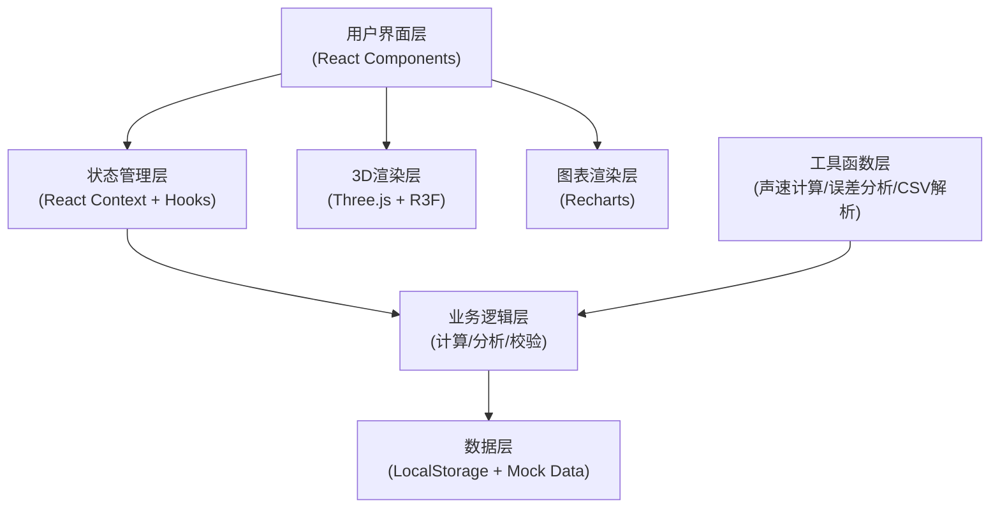

## 1. 架构设计



## 2. 技术选型说明

- **前端框架**: React@18 + TypeScript + Vite@5
  - 选择理由：组件化开发、类型安全、构建速度快
- **样式方案**: TailwindCSS@3
  - 选择理由：快速构建UI，响应式设计，与设计系统对齐
- **3D渲染**: three@0.160 + @react-three/fiber@8 + @react-three/drei@9
  - 选择理由：React生态中最成熟的3D方案，支持声明式3D场景构建
- **图表库**: recharts@2
  - 选择理由：React原生图表库，支持线性拟合图、饼图等多种图表
- **状态管理**: React Context + useReducer
  - 选择理由：轻量级状态管理，适合中等复杂度应用，无需额外依赖
- **数据持久化**: LocalStorage
  - 选择理由：纯前端方案，无需后端，数据本地存储，保护实验数据隐私

## 3. 目录结构

```
src/
├── components/          # UI组件
│   ├── DataImport/      # 数据导入模块
│   ├── ThreeDView/      # 3D可视化模块
│   ├── ErrorAnalysis/   # 误差分析面板
│   ├── HistoryTimeline/ # 修正记录时间线
│   └── ReportExport/    # 报告导出模块
├── context/             # React Context
│   └── ExperimentContext.tsx
├── hooks/               # 自定义Hooks
│   ├── useSoundSpeed.ts
│   ├── useErrorAnalysis.ts
│   └── useDataHistory.ts
├── utils/               # 工具函数
│   ├── soundSpeed.ts    # 声速计算
│   ├── errorAnalysis.ts # 误差分析
│   ├── csvParser.ts     # CSV解析
│   └── linearFit.ts     # 线性拟合
├── types/               # TypeScript类型定义
│   └── index.ts
├── data/                # Mock数据
│   └── mockExperiments.ts
├── App.tsx
└── main.tsx
```

## 4. 核心数据模型

### 4.1 实验数据类型

```typescript
interface ExperimentData {
  id: string;
  studentName: string;
  experimentDate: string;
  temperature: number;      // 室温 (摄氏度)
  frequency: number;        // 声源频率 (Hz)
  measurements: Measurement[];
  notes: string;
  createdAt: string;
  updatedAt: string;
}

interface Measurement {
  id: string;
  nodeNumber: number;       // 节点编号
  tubeLength: number;       // 管长 (cm)
  isOutlier: boolean;       // 是否为离群值
  isTemperatureCorrected: boolean; // 是否已温度修正
  createdAt: string;
}

interface CalculationResult {
  soundSpeed: number;       // 计算得到的声速 (m/s)
  theoreticalSpeed: number; // 理论声速 (m/s)
  relativeError: number;    // 相对误差 (%)
  linearFitResult: LinearFitResult;
  errorBreakdown: ErrorBreakdown;
  warnings: Warning[];
}

interface LinearFitResult {
  slope: number;
  intercept: number;
  rSquared: number;
  points: { x: number; y: number }[];
}

interface ErrorBreakdown {
  temperatureError: number;     // 温度引起的误差
  measurementError: number;     // 测量误差
  frequencyError: number;       // 频率误差
  outlierInfluence: number;     // 离群值影响
  otherErrors: number;          // 其他误差
}

interface Warning {
  type: 'temperature' | 'nodeNumber' | 'outlier' | 'missingData';
  message: string;
  severity: 'low' | 'medium' | 'high';
  measurementId?: string;
}

interface HistoryRecord {
  id: string;
  timestamp: string;
  operator: string;
  changeType: 'create' | 'update' | 'delete' | 'correct';
  before: Partial<ExperimentData>;
  after: Partial<ExperimentData>;
  reason: string;
}
```

### 4.2 声速计算公式

1. **理论声速 (温度修正)**：
   ```
   v₀ = 331.45 * sqrt(1 + T/273.15)
   其中 T 为摄氏温度
   ```

2. **共鸣管法测声速**：
   ```
   v = f * λ
   相邻节点间距 = λ/2
   所以 v = 2f * ΔL
   通过线性拟合 L-n 图，斜率 k = λ/2 = v/(2f)
   因此 v = 2f * k
   ```

3. **误差传递公式**：
   ```
   Δv/v = Δf/f + Δk/k
   ```

## 5. 核心功能实现要点

### 5.1 离群值检测
- 使用格拉布斯检验法 (Grubbs' Test) 或 IQR方法
- 标记离群值但不自动删除，需用户确认后才排除
- 离群值在图表中以橙色高亮显示，并有脉冲动画

### 5.2 温度修正
- 默认启用温度修正，可手动开关查看对比
- 未修正时显示明显警告标识
- 修正前后的声速值并列显示

### 5.3 线性拟合
- 使用最小二乘法进行线性回归
- 显示拟合方程、R²值、残差
- 可选择排除离群值后重新拟合

### 5.4 误差分解
- 将总误差分解为温度、测量、频率、离群值等来源
- 以饼图可视化各误差来源占比
- 提供每项误差的量化数值和改进建议

### 5.5 修正痕迹保留
- 每次数据修改都记录到历史记录
- 支持回滚到任意历史版本
- 导出报告时自动包含修正历史

## 6. 性能优化

1. **3D性能**：
   - 简化3D模型面数
   - 使用InstancedMesh渲染重复元素
   - 离屏时暂停渲染

2. **图表性能**：
   - 数据量大时启用采样
   - 使用Canvas渲染而非SVG

3. **状态更新**：
   - 使用useMemo/useCallback避免不必要重渲染
   - 计算密集型操作使用Web Worker

## 7. 部署方案

- 纯前端静态应用，可部署到任何静态托管服务
- 推荐：Vercel / Netlify / GitHub Pages
- 数据完全本地存储，无后端依赖
