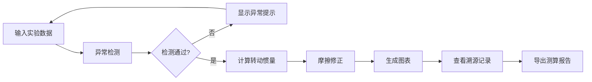

## 1. 产品概述

刚体转动惯量测算系统 - 专为机械实验教学设计的专业数据处理工具，帮助学生和教师快速准确地完成转盘转动惯量实验数据的分析、可视化和报告生成。

- **核心价值**：解决传统手动计算易出错、单位混淆、摩擦补偿漏算等问题
- **目标用户**：机械课教师、大学物理实验学生、科研人员
- **差异化**：实时异常检测、完整数据溯源、图表联动分析

## 2. 核心功能

### 2.1 用户角色
| 角色 | 注册方式 | 核心权限 |
|------|----------|----------|
| 实验人员 | 无需注册 | 数据输入、计算分析、图表导出、报告生成 |

### 2.2 功能模块
1. **数据输入面板**：转盘参数、砝码参数、时间序列数据输入
2. **实时计算引擎**：转动惯量计算、摩擦修正、单位自动换算
3. **异常检测系统**：单位错误检测、数据倒序检测、摩擦补偿检测
4. **图表分析模块**：角速度-时间曲线、转动惯量趋势图、误差分析
5. **数据溯源系统**：操作历史记录、修正痕迹保留、来源标注
6. **报告生成模块**：测算报告导出、评分明细、异常说明

### 2.3 页面详情
| 页面名称 | 模块名称 | 功能描述 |
|----------|----------|----------|
| 主工作区 | 数据输入面板 | 转盘半径/质量、砝码质量、时间/角速度数据表格 |
| 主工作区 | 实时计算结果 | 转动惯量、摩擦系数、修正后结果显示 |
| 主工作区 | 异常提示区 | 醒目标红显示检测到的异常及修正建议 |
| 主工作区 | 图表联动区 | 多图表联动显示，支持数据点高亮 |
| 主工作区 | 操作历史面板 | 记录所有数据修改和修正操作的时间线 |
| 主工作区 | 报告导出区 | 生成可下载的测算报告，包含评分和明细 |

## 3. 核心流程

用户输入实验参数 → 系统实时检测异常并提示 → 用户确认或修正数据 → 系统执行转动惯量计算和摩擦修正 → 生成可视化图表 → 查看数据溯源和评分明细 → 导出完整测算报告

## 4. 用户界面设计

### 4.1 设计风格
- **主色调**：深蓝 #1a365d（专业科技感）+ 青色 #38b2ac（数据可视化）
- **警示色**：深红 #c53030（异常）、橙色 #dd6b20（警告）、绿色 #2f855a（正常）
- **按钮风格**：微立体、圆角 4px、悬停有阴影过渡
- **字体**：JetBrains Mono（数据显示）+ Noto Sans SC（中文文本）
- **布局风格**：面板式三栏布局，左侧输入、中间图表、右侧历史
- **图标风格**：线性简约图标，保持科技感

### 4.2 页面设计概述
| 页面名称 | 模块名称 | UI 元素 |
|----------|----------|---------|
| 主工作区 | 数据输入面板 | 分组表单、数据表格、单位选择器、实时验证反馈 |
| 主工作区 | 计算结果卡片 | 大号数值显示、单位标注、修正前后对比 |
| 主工作区 | 异常提示条 | 全屏宽度警示条、图标+文字说明、快速修复按钮 |
| 主工作区 | 图表区域 | 双图表上下排列、联动悬停效果、导出按钮 |
| 主工作区 | 操作历史 | 时间线样式、可折叠、颜色区分操作类型 |
| 主工作区 | 报告预览 | 模态框、分页预览、打印/导出按钮 |

### 4.3 响应式
- **桌面优先**：三栏等高布局
- **平板适配**：两栏布局，历史面板折叠到底部
- **手机适配**：单栏流式布局，图表可全屏查看

### 4.4 交互动效
- 数据输入时实时计算，结果平滑过渡更新
- 异常出现时警示条滑入动画
- 图表数据点悬停高亮联动
- 操作历史新增项滑入效果
- 报告生成加载动画
