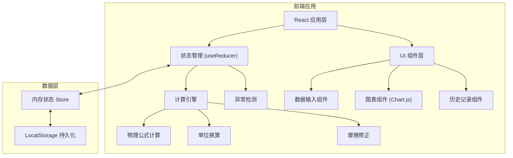
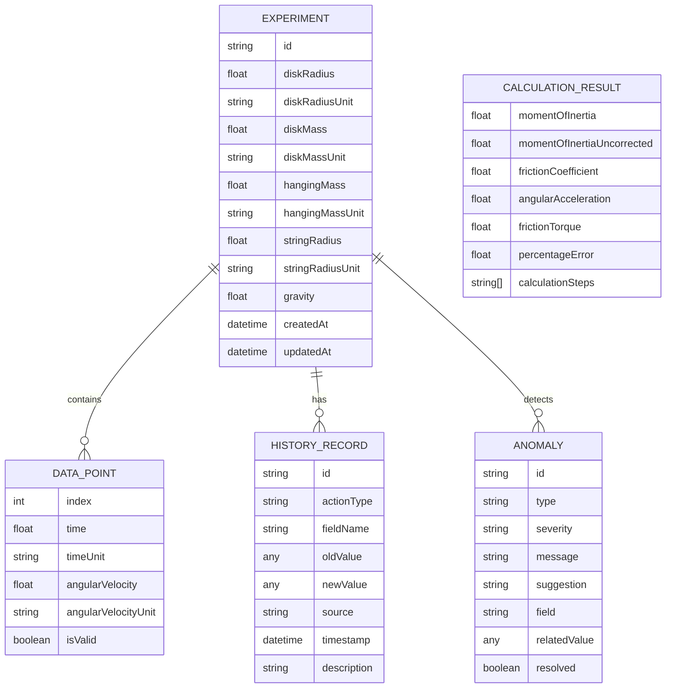

## 1. 架构设计



## 2. 技术描述

- **前端框架**：React@18 + TypeScript
- **构建工具**：Vite@5
- **样式方案**：TailwindCSS@3
- **图表库**：Chart.js + react-chartjs-2
- **状态管理**：React useReducer + Context
- **数据持久化**：LocalStorage
- **图标库**：Lucide React

## 3. 路由定义

| 路由 | 用途 |
|------|------|
| / | 主工作区 - 数据输入、计算、图表、历史记录 |

## 4. 数据模型

### 4.1 数据结构定义



### 4.2 TypeScript 类型定义

```typescript
interface DiskParams {
  radius: number;
  radiusUnit: 'm' | 'cm' | 'mm';
  mass: number;
  massUnit: 'kg' | 'g';
}

interface HangingMass {
  mass: number;
  massUnit: 'kg' | 'g';
  stringRadius: number;
  stringRadiusUnit: 'm' | 'cm' | 'mm';
}

interface DataPoint {
  index: number;
  time: number;
  timeUnit: 's' | 'ms';
  angularVelocity: number;
  angularVelocityUnit: 'rad/s' | 'rpm' | 'deg/s';
  isValid: boolean;
}

interface Anomaly {
  id: string;
  type: 'unit_error' | 'data_reversed' | 'friction_missing' | 'outlier';
  severity: 'error' | 'warning' | 'info';
  message: string;
  suggestion: string;
  field?: string;
  relatedValue?: any;
  resolved: boolean;
}

interface HistoryRecord {
  id: string;
  actionType: 'input' | 'correction' | 'unit_change' | 'calculation';
  fieldName?: string;
  oldValue?: any;
  newValue?: any;
  source: 'user' | 'auto_correction' | 'system';
  timestamp: Date;
  description: string;
}

interface CalculationResult {
  momentOfInertia: number;
  momentOfInertiaUncorrected: number;
  frictionCoefficient: number;
  angularAcceleration: number;
  frictionTorque: number;
  theoreticalValue?: number;
  percentageError?: number;
  calculationSteps: string[];
}

interface ExperimentState {
  diskParams: DiskParams;
  hangingMass: HangingMass;
  dataPoints: DataPoint[];
  anomalies: Anomaly[];
  history: HistoryRecord[];
  result: CalculationResult | null;
  gravity: number;
}
```

## 5. 核心算法模块

### 5.1 单位换算模块
```typescript
// 长度单位换算
const convertLength = (value: number, from: string, to: string): number => {
  const toMeters: Record<string, number> = { m: 1, cm: 0.01, mm: 0.001 };
  return value * toMeters[from] / toMeters[to];
};

// 质量单位换算
const convertMass = (value: number, from: string, to: string): number => {
  const toKg: Record<string, number> = { kg: 1, g: 0.001 };
  return value * toKg[from] / toKg[to];
};

// 角速度单位换算
const convertAngularVelocity = (value: number, from: string, to: string): number => {
  const toRadPerSec: Record<string, number> = { 
    'rad/s': 1, 
    'rpm': Math.PI / 30, 
    'deg/s': Math.PI / 180 
  };
  return value * toRadPerSec[from] / toRadPerSec[to];
};
```

### 5.2 转动惯量计算模块
```typescript
// 角加速度计算 (线性回归)
const calculateAngularAcceleration = (points: DataPoint[]): number => {
  // 使用最小二乘法进行线性回归
  // ω(t) = ω₀ + αt
  // 返回斜率 α 作为角加速度
};

// 未修正转动惯量
const calculateUncorrectedMoment = (
  hangingMass: number,
  stringRadius: number,
  angularAcceleration: number,
  gravity: number = 9.8
): number => {
  // I_uncorrected = m * r * (g/r - α) / α = m * (g - α * r) / α
};

// 摩擦修正
const calculateFrictionCorrection = (
  decelerationPoints: DataPoint[],
  diskRadius: number
): { frictionTorque: number; frictionCoefficient: number } => {
  // 从减速阶段计算摩擦转矩
  // τ_friction = I * α_deceleration
};

// 修正后转动惯量
const calculateCorrectedMoment = (
  uncorrectedMoment: number,
  frictionTorque: number,
  angularAcceleration: number
): number => {
  // I_corrected = I_uncorrected - τ_friction / α
};
```

### 5.3 异常检测模块
```typescript
// 检测数据是否倒序
const detectDataReversal = (points: DataPoint[]): Anomaly | null => {
  // 检查时间序列是否递增
  // 检查角速度变化趋势是否合理
};

// 检测角速度单位合理性
const detectAngularVelocityUnit = (points: DataPoint[]): Anomaly | null => {
  // 根据数值范围判断单位是否合理
  // 例如: 如果数值在 0-100 之间可能是 rad/s
  // 如果数值在 0-6000 之间可能是 rpm
};

// 检测摩擦补偿是否需要
const detectFrictionCompensation = (points: DataPoint[]): Anomaly | null => {
  // 检查是否有减速阶段数据用于摩擦计算
};

// 检测离群值
const detectOutliers = (points: DataPoint[]): Anomaly[] => {
  // 使用 IQR 方法检测离群值
};
```

## 6. 组件结构

```
src/
├── components/
│   ├── DiskParamsForm.tsx      # 转盘参数输入
│   ├── HangingMassForm.tsx     # 砝码参数输入
│   ├── DataPointsTable.tsx     # 数据点表格
│   ├── UnitSelector.tsx        # 单位选择器
│   ├── ResultCard.tsx          # 计算结果卡片
│   ├── AnomalyBanner.tsx       # 异常提示条
│   ├── ChartSection.tsx        # 图表区域
│   ├── HistoryTimeline.tsx     # 历史时间线
│   └── ReportModal.tsx         # 报告导出模态框
├── hooks/
│   ├── useCalculator.ts        # 计算逻辑 hook
│   ├── useAnomalyDetector.ts   # 异常检测 hook
│   └── useHistory.ts           # 历史记录 hook
├── utils/
│   ├── unitConversion.ts       # 单位换算
│   ├── physics.ts              # 物理公式
│   └── export.ts               # 导出工具
├── types/
│   └── index.ts                # 类型定义
├── context/
│   └── ExperimentContext.tsx   # 全局状态
├── App.tsx
└── main.tsx
```
