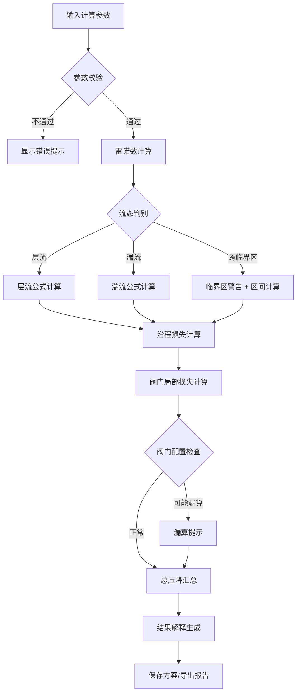

## 1. 产品概述

流体管路压降API计算工具，为暖通工程师提供专业的管路压降计算服务，解决不同管径、流量、管长、粗糙度及阀门配置下的压降快速比较问题，为改造方案提供数据依据。

- **核心价值**：精准计算、流态智能判别、局部损失完整核算、多方案对比、专业报告导出
- **目标用户**：暖通工程师、管道设计人员、流体系统分析师

## 2. 核心功能

### 2.1 用户角色

| 角色 | 注册方式 | 核心权限 |
|------|----------|----------|
| 工程师用户 | 无需注册，直接使用 | 压降计算、方案管理、报告导出、数据导入 |

### 2.2 功能模块

1. **压降计算页**：参数输入、实时计算、结果展示、异常提示
2. **方案对比页**：多方案并排对比、差异分析、最优推荐
3. **报告中心页**：历史报告列表、报告详情、导出下载
4. **数据导入页**：批量材料导入、冲突处理策略选择

### 2.3 页面详情

| 页面名称 | 模块名称 | 功能描述 |
|----------|----------|----------|
| 压降计算页 | 参数输入区 | 管径、流量、管长、粗糙度、阀门配置表单，带单位切换 |
| 压降计算页 | 实时计算区 | 压降结果、雷诺数、流态判别、沿程损失、局部损失分项展示 |
| 压降计算页 | 异常提示区 | 雷诺数跨区警告、单位混用提醒、阀门漏算提示、边界情况说明 |
| 压降计算页 | 结果解释区 | 公式说明、参数敏感性分析、物理意义解释 |
| 方案对比页 | 方案列表区 | 已保存方案卡片、添加/删除方案 |
| 方案对比页 | 对比表格区 | 多方案参数与结果并排对比、差异高亮 |
| 方案对比页 | 分析图表区 | 压降-流量曲线、管径-压降关系图 |
| 报告中心页 | 报告列表区 | 历史报告时间线、来源标注、修正痕迹 |
| 报告中心页 | 报告详情区 | 完整计算过程、参数溯源、结果解释 |
| 数据导入页 | 文件上传区 | 支持CSV/Excel批量导入材料数据 |
| 数据导入页 | 冲突处理区 | 重复数据策略选择：忽略/覆盖/追加 |

## 3. 核心流程

## 4. 用户界面设计

### 4.1 设计风格
- **主色调**：工程蓝 (#1E40AF) 代表专业可靠，搭配警示橙 (#F97316) 用于异常提示
- **辅色调**：中性灰系列保证信息层级清晰
- **按钮风格**：圆角矩形，主按钮采用蓝色渐变，hover时有微阴影效果
- **字体**：标题使用思源黑体 Bold，正文使用思源黑体 Regular，数字等宽字体提升可读性
- **布局风格**：卡片式布局，左侧参数输入，右侧结果展示，信息分区明确
- **图标风格**：线性图标，保持工程软件的专业感

### 4.2 页面设计概览

| 页面名称 | 模块名称 | UI 元素 |
|----------|----------|----------|
| 压降计算页 | 顶部导航 | Logo、页面切换、帮助按钮 |
| 压降计算页 | 参数卡片 | 分组表单、单位下拉框、实时校验反馈 |
| 压降计算页 | 结果卡片 | 大字号压降数值、分项指标、状态标签 |
| 压降计算页 | 警告区域 | 橙色边框、图标醒目、说明文字清晰 |
| 压降计算页 | 解释区域 | 折叠面板、公式展示、可展开详情 |
| 方案对比页 | 方案卡片 | 缩略数据、对比按钮、删除操作 |
| 方案对比页 | 对比表格 | 固定表头、差异高亮、可排序 |
| 方案对比页 | 图表区域 | 交互式折线图、悬停显示数据 |
| 报告中心页 | 时间线 | 报告列表、来源标签、版本标记 |
| 报告中心页 | 报告预览 | 分页展示、导出按钮 |
| 数据导入页 | 上传区域 | 拖拽上传、文件预览、格式说明 |
| 数据导入页 | 策略选择 | 单选卡片、策略说明、确认按钮 |

### 4.3 响应式
- 桌面端：左右分栏布局，参数区30% + 结果区70%
- 平板端：上下堆叠，参数区在上，结果区在下
- 移动端：垂直流式布局，卡片堆叠，优化触摸操作

### 4.4 动画设计
- 页面加载：卡片淡入上移，交错0.1s延迟
- 计算触发：结果数字滚动动画从0到实际值
- 警告出现：边框呼吸闪烁效果（低频率不刺眼）
- 方案切换：平滑过渡动画0.3s
