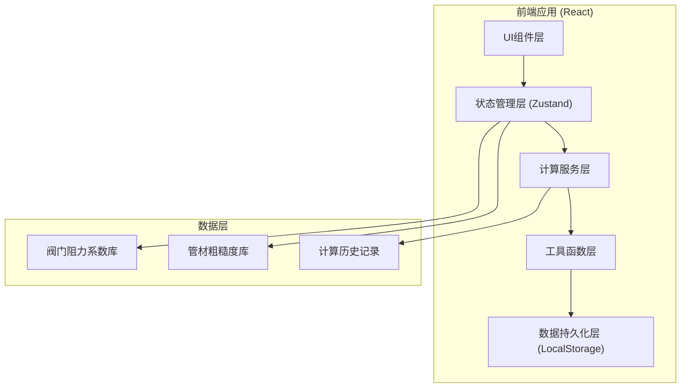
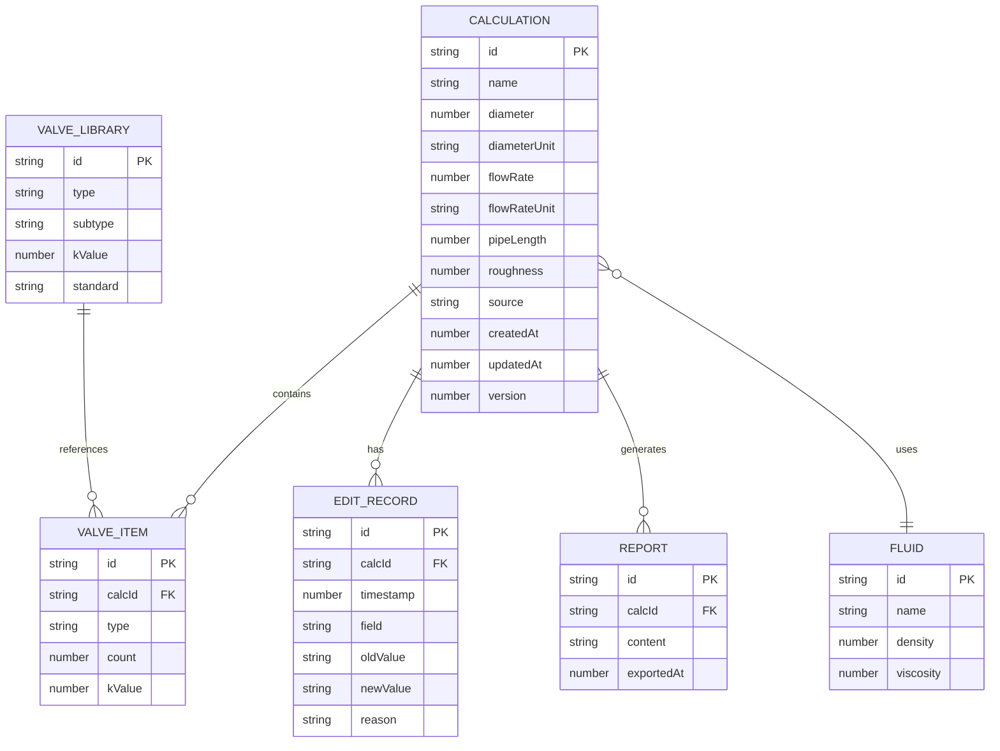

## 1. 架构设计



## 2. 技术选型

| 类别 | 技术栈 | 说明 |
|------|--------|------|
| 前端框架 | React 18 + TypeScript | 类型安全，组件化开发 |
| 构建工具 | Vite 5 | 快速开发，热更新 |
| 样式方案 | Tailwind CSS 3 | 原子化CSS，快速构建UI |
| 状态管理 | Zustand | 轻量级，简单易用 |
| 图表库 | Recharts | React生态，交互式图表 |
| 图标库 | Lucide React | 线性图标，专业风格 |
| 数据存储 | LocalStorage | 前端持久化，无需后端 |
| 导出功能 | html2canvas + jsPDF | 报告导出为PDF |
| 表格处理 | Papa Parse | CSV解析，批量导入 |

## 3. 目录结构

```
src/
├── components/          # 组件目录
│   ├── layout/         # 布局组件
│   ├── calculator/     # 计算相关组件
│   ├── compare/        # 方案对比组件
│   ├── reports/        # 报告相关组件
│   └── import/         # 数据导入组件
├── store/              # 状态管理
│   └── useStore.ts
├── services/           # 业务逻辑服务
│   ├── calculationService.ts
│   ├── reportService.ts
│   └── importService.ts
├── utils/              # 工具函数
│   ├── formulas.ts     # 计算公式
│   ├── validators.ts   # 参数校验
│   ├── units.ts        # 单位转换
│   └── constants.ts    # 常量定义
├── data/               # 静态数据
│   ├── valves.ts       # 阀门库
│   └── materials.ts    # 材料库
├── types/              # TypeScript类型定义
│   └── index.ts
├── pages/              # 页面组件
└── App.tsx
```

## 4. 路由定义

| 路由 | 页面 | 功能 |
|------|------|------|
| / | 压降计算页 | 核心计算功能 |
| /compare | 方案对比页 | 多方案对比分析 |
| /reports | 报告中心页 | 历史报告管理 |
| /import | 数据导入页 | 批量数据导入 |

## 5. 核心计算模型

### 5.1 数据类型定义

```typescript
// 计算参数
interface CalculationParams {
  id: string;
  name: string;
  diameter: number;        // 管径 (mm)
  diameterUnit: 'mm' | 'm' | 'in';
  flowRate: number;        // 流量 (m³/h)
  flowRateUnit: 'm3_h' | 'l_s' | 'm3_s';
  pipeLength: number;      // 管长 (m)
  pipeLengthUnit: 'm' | 'km' | 'ft';
  roughness: number;       // 绝对粗糙度 (mm)
  roughnessUnit: 'mm' | 'm';
  fluid: FluidProperties;  // 流体属性
  valves: ValveItem[];     // 阀门列表
  source?: string;         // 数据来源
  createdAt: number;
  updatedAt: number;
  version: number;
  editHistory: EditRecord[];
}

// 阀门项
interface ValveItem {
  type: string;
  count: number;
  diameter: number;
  kValue: number;          // 阻力系数
}

// 计算结果
interface CalculationResult {
  reynolds: number;        // 雷诺数
  flowRegime: 'laminar' | 'transitional' | 'turbulent' | 'critical';
  frictionFactor: number;  // 摩擦系数
  velocity: number;        // 流速 (m/s)
  headLoss: number;        // 沿程损失 (m)
  localLoss: number;       // 局部损失 (m)
  totalPressureDrop: number; // 总压降 (Pa)
  warnings: Warning[];
  explanation: string;
}

// 警告类型
interface Warning {
  type: 'reynolds_critical' | 'unit_mixed' | 'valve_missing' | 'boundary';
  severity: 'warning' | 'error';
  message: string;
  suggestion: string;
}

// 编辑记录
interface EditRecord {
  timestamp: number;
  field: string;
  oldValue: any;
  newValue: any;
  reason?: string;
}
```

### 5.2 核心计算公式

```typescript
// 雷诺数计算
Re = (v * D) / ν
// v: 流速 (m/s), D: 管径 (m), ν: 运动粘度 (m²/s)

// 沿程损失 - 达西-魏斯巴赫公式
hf = f * (L/D) * (v²/(2g))
// f: 摩擦系数, L: 管长, g: 重力加速度

// 层流摩擦系数 (Re < 2300)
f = 64 / Re

// 湍流摩擦系数 - 柯尔布鲁克公式
1/√f = -2 * log10(ε/(3.7D) + 2.51/(Re√f))
// ε: 绝对粗糙度

// 局部损失
hl = Σ(K * v²/(2g))
// K: 局部阻力系数

// 总压降
ΔP = ρ * g * (hf + hl)
// ρ: 流体密度
```

### 5.3 流态判别阈值

| 流态 | 雷诺数范围 | 说明 |
|------|-----------|------|
| 层流 | Re < 2300 | 稳定层流，使用层流公式 |
| 临界区 | 2300 ≤ Re < 4000 | 过渡不稳定，需特别提示 |
| 湍流光滑区 | 4000 ≤ Re < 10⁵ | 使用布拉修斯公式 |
| 湍流粗糙区 | Re ≥ 10⁵ | 使用柯尔布鲁克公式 |

## 6. 数据模型

### 6.1 实体关系图



### 6.2 数据持久化

使用LocalStorage存储以下数据：
- 计算方案列表（最多保存50个）
- 阀门库配置
- 用户偏好设置（单位默认值等）
- 报告历史记录

数据导出采用JSON格式，包含完整的计算参数、结果、编辑历史。

## 7. API接口设计（前端服务层）

### 7.1 计算服务

```typescript
interface CalculationService {
  calculate(params: CalculationParams): CalculationResult;
  validateParams(params: Partial<CalculationParams>): ValidationError[];
  detectWarnings(params: CalculationParams, result: CalculationResult): Warning[];
  generateExplanation(params: CalculationParams, result: CalculationResult): string;
}
```

### 7.2 报告服务

```typescript
interface ReportService {
  generateReport(calc: CalculationParams, result: CalculationResult): Report;
  exportToPDF(report: Report): Promise<void>;
  exportToJSON(calc: CalculationParams): string;
  importFromJSON(json: string): CalculationParams;
}
```

### 7.3 导入服务

```typescript
interface ImportService {
  parseCSV(file: File): Promise<ImportResult>;
  parseExcel(file: File): Promise<ImportResult>;
  resolveConflicts(existing: CalculationParams[], imported: CalculationParams[], strategy: 'skip' | 'overwrite' | 'append'): CalculationParams[];
}
```
