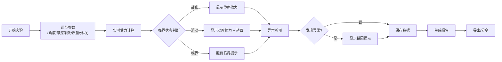
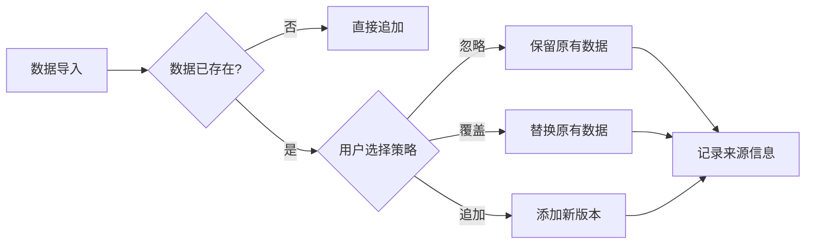

## 1. 产品概述

摩擦斜面实验面板是一款面向高中物理教学的交互式实验模拟工具，帮助学生通过调节斜面角度和摩擦系数等参数，直观观察物块滑动状态并进行受力分析。解决传统表格和截图拼接效率低、临界角误判等问题。

- **核心问题**: 高中物理实验数据处理繁琐、临界角误判、角度单位混淆、力方向理解困难
- **目标用户**: 高中物理教师、学生
- **产品价值**: 可视化物理过程、智能异常检测、自动化报告生成

## 2. 核心功能

### 2.1 用户角色

| 角色 | 核心功能 |
|------|----------|
| 教师 | 导入实验样例、批改学生作业、导出报告 |
| 学生 | 调节参数观察现象、分析受力、完成实验报告 |

### 2.2 功能模块

1. **实验模拟面板**: 斜面动画演示、参数调节、实时受力分析
2. **数据导入模块**: 批量导入实验数据、来源追溯、版本控制
3. **异常检测模块**: 临界角误判检测、角度单位验证、力方向检查
4. **报告生成模块**: PDF导出、截图嵌入、异常标注

### 2.3 页面详情

| 页面名称 | 模块名称 | 功能描述 |
|-----------|-------------|---------------------|
| 主面板 | 斜面动画区 | Canvas绘制斜面、物块、受力矢量图，支持动画演示滑动过程 |
| 主面板 | 参数控制区 | 滑块调节斜面角、摩擦系数、物块质量、外力大小和方向 |
| 主面板 | 受力分析区 | 显示重力、支持力、摩擦力、外力的分解计算 |
| 主面板 | 临界状态区 | 计算临界角、判断当前状态（静止/滑动/临界） |
| 数据管理 | 导入面板 | 支持Excel/JSON导入，处理重复数据策略选择（忽略/覆盖/追加） |
| 数据管理 | 历史记录 | 显示所有导入数据的来源、时间、修改痕迹 |
| 报告生成 | 报告预览 | 整合实验数据、异常标注、截图、计算结果 |
| 报告生成 | 导出面板 | PDF/PNG格式导出，支持自定义报告内容 |
| 错误提示 | 异常提示框 | 醒目显示临界角误判、角度单位错误、力方向混淆的原因和修正建议 |

## 3. 核心流程

## 4. 用户界面设计

### 4.1 设计风格
- **主题**: 科技学术风，深蓝+橙色配色
- **主色调**: #1e3a5f（深蓝）代表严谨，#f97316（橙色）代表活力
- **辅助色**: #10b981（绿色-正常）、#ef4444（红色-异常）、#f59e0b（黄色-警告）
- **按钮风格**: 圆角8px，微立体效果，hover时有轻微上浮
- **字体**: 使用思源宋体（标题）+ JetBrains Mono（数值/公式），体现学术感
- **布局**: 卡片式布局，左中右三栏结构
- **图标**: Lucide图标库，线性风格

### 4.2 页面设计概览

| 页面名称 | 模块名称 | UI元素 |
|-----------|-------------|-------------|
| 主面板 | 斜面动画区 | Canvas画布、网格背景、渐变色斜面、带阴影物块、矢量箭头动画 |
| 主面板 | 参数控制区 | 范围滑块、数值输入框、单位切换器（度/弧度） |
| 主面板 | 受力分析区 | 公式排版、彩色数值标注、受力矢量图解 |
| 数据管理 | 导入面板 | 拖拽上传区、策略选择单选组、来源输入框 |
| 报告生成 | 报告预览 | 分页预览、截图缩略图、异常标注高亮 |
| 错误提示 | 异常提示框 | 红色边框闪烁、问题-原因-解决方案三段式 |

### 4.3 响应式设计
- **桌面端**: 三栏布局（参数区-动画区-分析区）
- **平板端**: 上下布局，动画区占满宽度
- **移动端**: 垂直滚动布局，折叠次要面板

### 4.4 动画交互
- 物块滑动: 平滑过渡动画，速度与加速度关联
- 受力箭头: 渐入渐出，根据力的大小调整长度
- 异常提示: 脉冲式高亮，引起注意
- 页面加载: 元素依次淡入，营造层次感

## 5. 功能优先级

### 必须实现 (P0)
1. 斜面角和摩擦系数调节
2. 实时受力分解计算
3. 临界状态判断与提示
4. 物块滑动动画演示
5. 临界角误判检测提示
6. 角度单位切换与验证

### 重要功能 (P1)
1. 数据导入功能
2. 异常数据标注
3. 截图导出
4. 重复数据策略处理
5. 力方向混淆提示

### 增强功能 (P2)
1. PDF报告生成
2. 历史版本记录
3. 外力参数调节
4. 物块质量调节
5. 实验步骤记录
