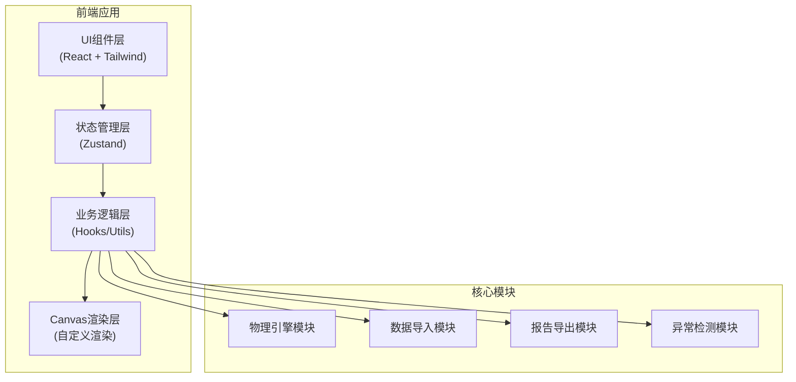

## 1. 架构设计



## 2. 技术选型

- **前端框架**: React@18 + TypeScript
- **构建工具**: Vite@5
- **样式方案**: TailwindCSS@3
- **状态管理**: Zustand@4
- **图表渲染**: HTML5 Canvas API (自定义实现)
- **图标库**: lucide-react
- **导出功能**: html2canvas (截图), jsPDF (PDF导出)

## 3. 目录结构

```
src/
├── components/           # UI组件
│   ├── ControlPanel/     # 参数控制面板
│   ├── InclineCanvas/    # 斜面动画画布
│   ├── ForceAnalysis/    # 受力分析面板
│   ├── DataImport/       # 数据导入模块
│   ├── ReportExport/     # 报告导出模块
│   ├── ErrorAlert/       # 错误提示组件
│   └── common/           # 通用组件
├── hooks/                # 自定义Hooks
│   ├── usePhysics.ts     # 物理计算Hook
│   ├── useAnimation.ts   # 动画控制Hook
│   ├── useImport.ts      # 数据导入Hook
│   └── useDetect.ts      # 异常检测Hook
├── store/                # 状态管理
│   └── useExperimentStore.ts
├── utils/                # 工具函数
│   ├── physics.ts        # 物理公式计算
│   ├── validation.ts     # 数据验证
│   ├── export.ts         # 导出工具
│   └── detection.ts      # 异常检测逻辑
├── types/                # TypeScript类型定义
│   └── index.ts
├── pages/                # 页面
│   └── ExperimentPage.tsx
└── App.tsx
```

## 4. 核心数据模型

### 4.1 实验参数模型

```typescript
interface ExperimentParams {
  id: string;
  angle: number;           // 斜面角度 (度)
  angleUnit: 'degree' | 'radian';
  frictionCoefficient: number;  // 摩擦系数
  mass: number;            // 物块质量 (kg)
  externalForce: number;   // 外力大小 (N)
  externalForceAngle: number;  // 外力与斜面夹角
  externalForceDirection: 'up' | 'down' | 'horizontal';
}
```

### 4.2 受力分析结果

```typescript
interface ForceAnalysis {
  gravity: number;         // 重力 G = mg
  normalForce: number;     // 支持力 N
  gravityParallel: number; // 沿斜面向下的分力
  gravityPerpendicular: number;  // 垂直斜面的分力
  frictionForce: number;   // 摩擦力
  externalForceParallel: number;  // 外力沿斜面分量
  externalForcePerpendicular: number;  // 外力垂直斜面分量
  netForce: number;        // 沿斜面合力
  acceleration: number;    // 加速度
  status: 'static' | 'sliding' | 'critical';  // 状态
}
```

### 4.3 实验记录模型

```typescript
interface ExperimentRecord {
  id: string;
  version: number;
  params: ExperimentParams;
  analysis: ForceAnalysis;
  source: string;          // 数据来源
  createdAt: Date;
  updatedAt: Date;
  anomalies: Anomaly[];    // 检测到的异常
  screenshot?: string;     // 截图数据 (base64)
  steps?: string[];        // 实验步骤
  notes?: string;          // 备注
}

interface Anomaly {
  type: 'critical_angle' | 'angle_unit' | 'force_direction' | 'data_conflict';
  severity: 'warning' | 'error';
  message: string;
  suggestion: string;
  detectedAt: Date;
}
```

### 4.4 导入策略

```typescript
type ImportStrategy = 'ignore' | 'overwrite' | 'append';

interface ImportResult {
  success: boolean;
  totalRecords: number;
  importedRecords: number;
  skippedRecords: number;
  overwrittenRecords: number;
  anomalies: Anomaly[];
}
```

## 5. 核心算法

### 5.1 临界角计算

```
临界角 θ_c = arctan(μ)
- 当 θ > θ_c 时，物块将下滑
- 当 θ = θ_c 时，处于临界状态
- 当 θ < θ_c 时，物块静止
```

### 5.2 受力分解公式

沿斜面方向合力:
```
F_net = mg·sinθ ± F_ext·cosα - f
其中:
- mg·sinθ: 重力沿斜面分量
- F_ext·cosα: 外力沿斜面分量
- f: 摩擦力 (f = μN 或最大静摩擦)
```

垂直斜面方向:
```
N = mg·cosθ ∓ F_ext·sinα
N: 支持力
```

### 5.3 异常检测规则

**临界角误判检测**:
- 检测输入的判断结果与理论计算是否一致
- 误差超过5%时标记异常

**角度单位检测**:
- 检测数值合理性（弧度值通常 < 2π）
- 如果输入值 > 360 且标注为弧度，触发警告

**力方向检测**:
- 检测外力方向设定对合力的影响
- 如果方向设置导致不符合预期结果，给出提示

## 6. 状态管理设计

```typescript
interface ExperimentState {
  currentParams: ExperimentParams;
  analysisResult: ForceAnalysis | null;
  records: ExperimentRecord[];
  selectedRecordId: string | null;
  importStrategy: ImportStrategy;
  isAnimating: boolean;
  animationSpeed: number;
  
  // Actions
  setParams: (params: Partial<ExperimentParams>) => void;
  calculateForces: () => void;
  saveRecord: () => void;
  importRecords: (data: ExperimentRecord[], strategy: ImportStrategy) => ImportResult;
  exportReport: (format: 'pdf' | 'png') => void;
  toggleAnimation: () => void;
  detectAnomalies: () => Anomaly[];
}
```
