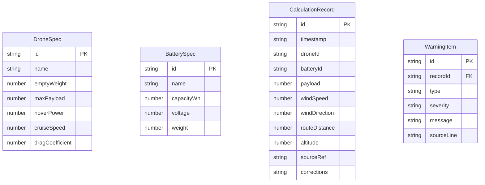

## 1. 架构设计
```mermaid
flowchart TD
    "Frontend" --> "React18 + TypeScript"
    "React18 + TypeScript" --> "Zustand"
    "Zustand" --> "UI State"
    "React18 + TypeScript" --> "Three.js"
    "Three.js" --> "@react-three/fiber"
    "@react-three/fiber" --> "@react-three/drei"
    "@react-three/drei" --> "@react-three/postprocessing"
    "React18 + TypeScript" --> "Tailwind CSS 3"
    "React18 + TypeScript" --> "Energy Model Module"
    "Energy Model Module" --> "BatteryCalc"
    "BatteryCalc" --> "WarningEngine"
    "WarningEngine" --> "RecordManager"
    "RecordManager" --> "ExportUtils"
```

## 2. 技术说明
- **前端框架**：React 18 + TypeScript
- **构建工具**：Vite
- **样式方案**：Tailwind CSS 3
- **状态管理**：Zustand
- **3D渲染**：Three.js + @react-three/fiber + @react-three/drei + @react-three/postprocessing
- **图标库**：lucide-react
- **初始化工具**：vite-init
- **后端**：无（纯前端应用，数据存储使用 localStorage）
- **数据库**：无（使用浏览器 localStorage 持久化记录）

## 3. 路由定义
| 路由 | 用途 |
|-----|-----|
| `/` | 主页面，3D飞行场景 + 参数控制 + 续航明细 |

## 4. 数据模型

### 4.1 数据模型定义


### 4.2 数据结构（TypeScript接口）
```typescript
interface DroneSpec {
  id: string;
  name: string;
  emptyWeight: number;      // kg
  maxPayload: number;       // kg
  hoverPower: number;       // W (悬停功耗)
  cruiseSpeed: number;      // m/s (巡航速度)
  frontalArea: number;      // m² (迎风面积)
  dragCoefficient: number;  // 风阻系数
}

interface BatterySpec {
  id: string;
  name: string;
  capacityWh: number;       // Wh
  voltage: number;          // V
  weight: number;           // kg
  dischargeEfficiency: number; // 0~1
}

interface CalcParams {
  droneId: string;
  batteryId: string;
  payload: number;          // kg
  windSpeed: number;        // m/s
  windDirection: number;    // degrees, 0=顺风, 180=逆风
  routeDistance: number;    // m
  altitude: number;         // m
  returnReserveRatio: number; // 0~1, 默认0.25
}

interface CalcResult {
  totalEnergyNeeded: number;  // Wh
  hoverEnergy: number;
  cruiseOutEnergy: number;
  cruiseBackEnergy: number;
  climbEnergy: number;
  windPenalty: number;         // Wh, 逆风额外消耗
  payloadPenalty: number;      // Wh, 超重额外消耗
  reserveEnergy: number;       // Wh, 返航余量
  remainingEnergy: number;     // Wh
  flightTime: number;          // minutes
  warnings: Warning[];
}

interface Warning {
  id: string;
  type: 'headwind' | 'overload' | 'low_reserve';
  severity: 'error' | 'warning';
  message: string;
  sourceLine: string;          // 来源行号或字段标识
}

interface CalcRecord {
  id: string;
  timestamp: string;
  params: CalcParams;
  result: CalcResult;
  sourceRef: string;           // 数据来源
  corrections: string;         // 修正痕迹
}
```

## 5. 能耗模型说明

能耗计算采用分段累加模型：

1. **悬停能耗**：`hoverPower × hoverTime × (grossWeight / emptyWeight)`，其中grossWeight = emptyWeight + batteryWeight + payload
2. **前飞能耗（去程）**：`(hoverPower × (1 + cruiseSpeed² / 100)) × outTime × windFactor_out`，windFactor考虑逆风增速
3. **前飞能耗（回程）**：同上，windFactor不同
4. **爬升能耗**：`hoverPower × 1.5 × climbTime`
5. **风场修正**：逆风时 `windFactor = 1 + (windSpeed / cruiseSpeed) × cos(angle)`，顺风时 `windFactor = 1 - (windSpeed / cruiseSpeed) × cos(angle)`
6. **返航余量**：`totalEnergy × returnReserveRatio`，至少占总能耗25%

## 6. 告警规则

| 告警类型 | 条件 | 严重程度 |
|---------|------|---------|
| 逆风漏算 | 逆风风速 ≥ 巡航速度 × 0.5 | error |
| 载重超限 | 实际载重 > 最大载重 | error |
| 载重超限(预警) | 实际载重 > 最大载重 × 0.9 | warning |
| 返航余量不足 | 返航余量 < 总能耗 × 0.2 | error |
| 返航余量偏低 | 返航余量 < 总能耗 × 0.25 | warning |
| 电池不足 | 所需能耗 > 电池容量 | error |

## 7. 记录与导出

- 记录持久化：`localStorage` 存储，键名 `droneCalcRecords`
- 导出格式：CSV，包含参数、能耗明细、告警列表
- 修正痕迹：每次保存时记录与前次的差异字段及变化量
