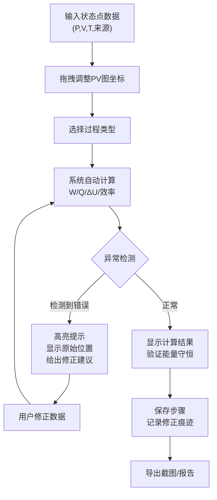

## 1. 产品概述
热力学循环教学器是面向大学热学课程的交互式教学工具，帮助学生通过PV图直观理解热力学过程，自动计算功、热量和效率，检测常见错误并提供可追溯的异常说明。

- 核心目标：解决热力学循环教学中计算繁琐、错误隐蔽、概念混淆等问题
- 目标用户：热学教师、大学物理系学生
- 产品价值：将抽象的热力学过程可视化，让错误可追溯、可解释

## 2. 核心功能

### 2.1 功能模块

1. **PV图交互区**：可拖动的状态点、过程曲线绘制、实时坐标显示
2. **过程计算引擎**：支持等温、等压、等容、绝热、多方过程，自动计算功、热量、内能变化
3. **循环分析**：闭合路径检测、循环效率计算、能量守恒验证
4. **异常检测系统**：单位换算错误、等温绝热混淆、闭合路径错误、数据矛盾检测
5. **步骤追踪**：操作历史记录、来源标注、修正痕迹保留
6. **导出功能**：截图导出、计算报告生成

### 2.2 页面详情

| 页面名称 | 模块名称 | 功能描述 |
|-----------|-------------|---------------------|
| 主工作台 | PV图交互区 | Canvas绘制状态点和过程曲线，支持拖拽交互，显示坐标网格 |
| 主工作台 | 状态点面板 | 显示/编辑状态点的P、V、T参数，标注来源信息 |
| 主工作台 | 过程配置面板 | 选择过程类型（等温/等压/等容/绝热/多方），设置过程参数 |
| 主工作台 | 计算结果区 | 实时显示功W、热量Q、内能变化ΔU，标注计算公式 |
| 主工作台 | 异常提示区 | 高亮显示错误类型、原始位置、修正建议，保留错误痕迹 |
| 主工作台 | 历史记录面板 | 时间线展示操作历史，支持回退，记录每次修改的来源 |

## 3. 核心流程

## 4. 用户界面设计

### 4.1 设计风格
- **主色调**：深海蓝 (#1e3a5f) 作为主色，代表科学与严谨
- **辅助色**：橙红色 (#e07a5f) 用于错误提示，薄荷绿 (#81b29a) 用于正常状态
- **字体**：JetBrains Mono 用于数值显示（等宽便于对齐），Noto Sans SC 用于中文说明
- **布局风格**：三栏布局 - 左侧控制面板、中间PV图、右侧计算结果与历史
- **图标风格**：简洁的线性图标，避免过度装饰

### 4.2 页面设计概述

| 页面名称 | 模块名称 | UI元素 |
|-----------|-------------|-------------|
| 主工作台 | PV图交互区 | 深色背景、浅色网格、可拖拽的圆点状态点、彩色过程曲线、悬浮坐标提示 |
| 主工作台 | 状态点面板 | 卡片式布局、输入框带单位选择、来源标注字段、修改时间戳 |
| 主工作台 | 异常提示区 | 错误卡片带错误码、原始数据行号引用、修正前后对比、可折叠详情 |
| 主工作台 | 历史记录 | 垂直时间线、每次操作的缩略描述、点击可回退、颜色区分正常/修正操作 |

### 4.3 响应式
- 桌面端优先（教学场景主要使用PC）
- 平板端自适应：左右面板可折叠
- 移动端：简化为上下布局，PV图全屏显示

## 5. 关键交互细节

### 5.1 拖拽交互
- 状态点拖拽时实时显示P、V数值
- 吸附到网格线（可开关）
- 拖拽过程中高亮相关的过程曲线

### 5.2 错误提示
- 错误不自动修正，仅高亮并给出建议
- 显示原始输入的行号/位置
- 保留错误历史，不覆盖

### 5.3 能量守恒验证
- 每个过程后显示ΔU = Q + W的验证结果
- 循环闭合后显示净功、净热量、效率
- 不满足守恒时用红色边框警示
