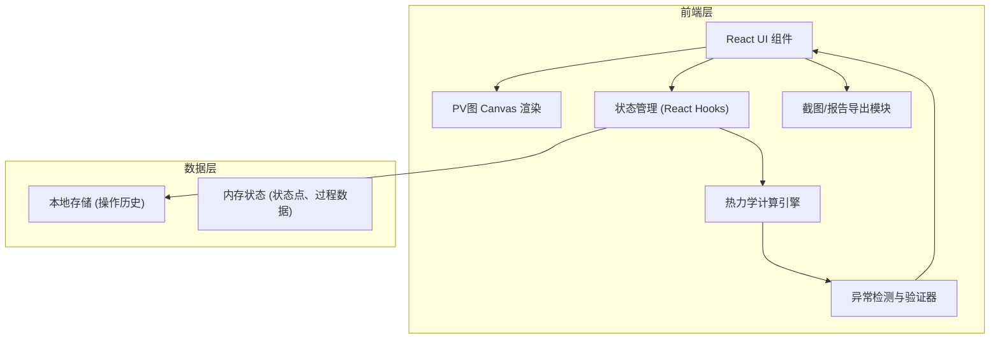

## 1. 架构设计



## 2. 技术描述

- **前端框架**：React@18 + TypeScript + Vite
- **样式方案**：TailwindCSS@3 + CSS Variables
- **图形渲染**：HTML5 Canvas API（自定义实现，无需额外库）
- **状态管理**：React Hooks (useState, useReducer, useRef)
- **图标**：Lucide React
- **导出功能**：html2canvas（截图）、原生Canvas toDataURL
- **数据存储**：LocalStorage（历史记录持久化）

## 3. 目录结构

```
src/
├── components/
│   ├── PVDiagram/          # PV图组件
│   │   ├── Canvas.tsx      # Canvas渲染
│   │   ├── StatePoint.tsx  # 状态点交互
│   │   └── ProcessCurve.tsx # 过程曲线
│   ├── ControlPanel/       # 左侧控制面板
│   │   ├── StatePointForm.tsx
│   │   └── ProcessSelector.tsx
│   ├── ResultPanel/        # 右侧结果面板
│   │   ├── CalculationResult.tsx
│   │   ├── ErrorDisplay.tsx
│   │   └── HistoryTimeline.tsx
│   └── common/             # 通用组件
├── engine/
│   ├── thermodynamics.ts   # 热力学计算核心
│   ├── units.ts            # 单位换算
│   └── validator.ts        # 异常检测
├── types/
│   └── index.ts            # TypeScript类型定义
├── hooks/
│   ├── useThermoState.ts   # 状态管理Hook
│   └── useHistory.ts       # 历史记录Hook
├── utils/
│   ├── export.ts           # 导出工具
│   └── format.ts           # 格式化工具
├── App.tsx
└── main.tsx
```

## 4. 核心数据模型

### 4.1 状态点 (StatePoint)

```typescript
interface StatePoint {
  id: string;
  label: string;        // 如 A, B, C...
  P: number;            // 压强 (Pa)
  V: number;            // 体积 (m³)
  T: number;            // 温度 (K)
  n?: number;           // 物质的量 (mol)
  source?: string;      // 数据来源
  createdAt: number;    // 创建时间戳
  updatedAt: number;    // 修改时间戳
}
```

### 4.2 过程 (Process)

```typescript
type ProcessType = 'isothermal' | 'isobaric' | 'isochoric' | 'adiabatic' | 'polytropic';

interface Process {
  id: string;
  from: string;         // 起始状态点ID
  to: string;           // 结束状态点ID
  type: ProcessType;
  gamma?: number;       // 绝热指数
  n?: number;           // 多方指数
  W: number;            // 功 (J)
  Q: number;            // 热量 (J)
  deltaU: number;       // 内能变化 (J)
  source?: string;      // 过程来源说明
}
```

### 4.3 异常 (Anomaly)

```typescript
type AnomalyType = 
  | 'unit_mismatch'      // 单位不匹配
  | 'path_not_closed'    // 路径未闭合
  | 'isothermal_adiabatic_confusion' // 等温绝热混淆
  | 'energy_conservation_violation'  // 能量守恒违反
  | 'invalid_state'      // 无效状态点
  | 'data_contradiction'; // 数据矛盾

interface Anomaly {
  id: string;
  type: AnomalyType;
  severity: 'warning' | 'error';
  message: string;
  sourceRef: {           // 来源引用
    type: 'state_point' | 'process' | 'input';
    id?: string;
    lineNumber?: number;
    originalValue?: string;
  };
  suggestion?: string;   // 修正建议
  timestamp: number;
}
```

### 4.4 历史记录 (HistoryEntry)

```typescript
interface HistoryEntry {
  id: string;
  action: string;        // 操作描述
  type: 'create' | 'update' | 'delete' | 'calculate';
  before: any;           // 修改前数据
  after: any;            // 修改后数据
  source?: string;       // 操作来源
  timestamp: number;
}
```

## 5. 热力学计算核心

### 5.1 功的计算
- 等压过程：W = P × ΔV
- 等容过程：W = 0
- 等温过程：W = nRT × ln(V₂/V₁)
- 绝热过程：W = (P₁V₁ - P₂V₂) / (γ - 1)
- 多方过程：W = (P₁V₁ - P₂V₂) / (n - 1)

### 5.2 内能变化
- 理想气体：ΔU = nCvΔT
- Cv = (f/2)R，f为自由度

### 5.3 热量
- 热力学第一定律：Q = ΔU - W

### 5.4 循环效率
- η = W_net / Q_in × 100%
- W_net为循环净功，Q_in为吸收的总热量

## 6. 异常检测规则

| 异常类型 | 检测条件 |
|---------|---------|
| 单位不匹配 | 输入单位与计算预期单位不符，或数值超出合理范围 |
| 路径未闭合 | 循环起点与终点状态点不重合 |
| 等温绝热混淆 | 等温过程中ΔT≠0，或绝热过程中Q≠0 |
| 能量守恒违反 | |ΔU - Q - W| > 允许误差 |
| 数据矛盾 | PV/T ≠ 常数（理想气体状态方程不满足） |
| 无效状态 | P、V、T中出现负值或零值 |
